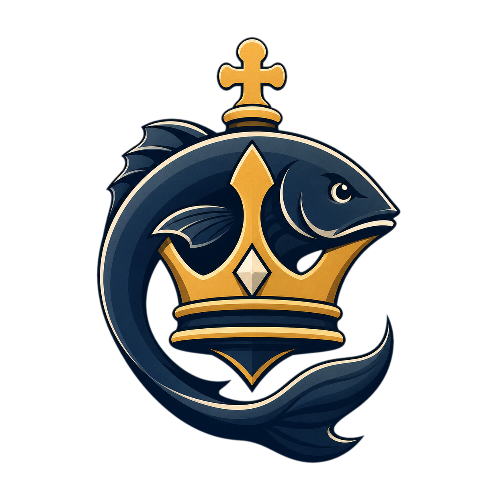
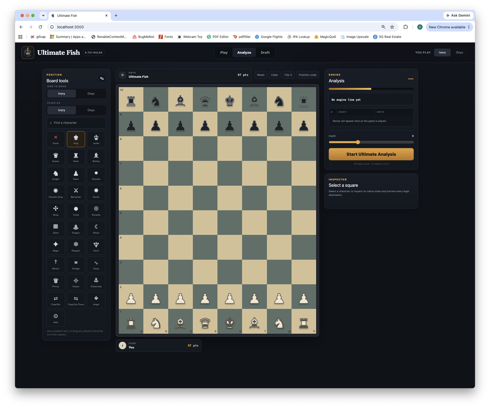

<p align="center">
  
</p>

# Ultimate Fish

Ultimate Fish is a standalone engine for the rules of Chess Ultimate 5.731. It
includes the native draft, the complete 8×10 character roster, lossless custom
positions, hidden-information search, a local macOS play/analysis workbench,
and deterministic Android automation used for conformance and strength tests.

The engine began as a Fairy-Stockfish fork, but Ultimate Fish has its own
protocol, rule implementation, search, tests, controller, and development
roadmap. Fairy-Stockfish and Stockfish remain credited in [`AUTHORS`](AUTHORS),
and the project is distributed under GPLv3 in [`Copying.txt`](Copying.txt).

## Build and test

Prerequisites:

- Apple Clang or another C++17 compiler
- GNU Make
- Python 3.10 or newer for the controller/evolution tools
- Node.js 22.13 or newer for the optional UI

From the repository root:

```bash
make -C src ultimatefish
make -C src ultimate-test
python3 tests/test_ultimate_phone.py
python3 tests/test_evolve_ultimate_army.py
tools/benchmark_ultimate.sh
```

`make -C src ultimate-rules-test` runs the rule, search, belief, and undo
regressions without the exact probes that require locally generated `.uftb`
artifacts. `ultimate-test` remains the complete gate when those artifacts are
present.

`src/ultimatefish` is a self-contained command-line engine. It accepts lossless
Ultimate Position Notation (UPN), `position upn ...`, `go depth N`, `go nodes
N`, `go movetime N`, `moves`, `perft N`, and the native draft commands exposed
by `help`. Public-history clients can use `history start <observer>
<enemy-king-known-0|1> <initial-deployment-known-0|1>
[kc=<square,...>] <upn>`, replay
authoritative actions with `history move <move>`, and call
`history go ...`; the concrete record selects observation buckets but is never
selected as the search world. `kc=` carries the exact enemy royal squares from
the first Ranked pick group that may still be the real King.

## Workbench

The default workflow remains local: build the engine, install the UI packages,
and run the bridge and development server in separate terminals:

```bash
cd ui && npm install
cd ui && npm run engine
cd ui && npm run dev
```

Open `http://localhost:3000`. The bridge binds only to `127.0.0.1:3001` and
launches `../src/ultimatefish`. Set `ULTIMATE_FISH_BINARY` to use another engine
binary. The workbench supports native drafting, play against Ultimate Fish,
position editing, legal-move previews, move history, and continuously refreshed
analysis.

<p align="center">
  
</p>

## Rules and notation

Rule fidelity has priority over playing strength. Recovered behavior is recorded
as a native conformance fixture before it is optimized. The current specification
and reverse-engineering trail are in:

- [`docs/rules/native-spec.md`](docs/rules/native-spec.md)
- [`docs/rules/README.md`](docs/rules/README.md)
- [`docs/reverse-engineering.md`](docs/reverse-engineering.md)
- [`docs/benchmarks/ultimate-search.md`](docs/benchmarks/ultimate-search.md)

UPN preserves every search-relevant state field, including continuations,
cooldowns, freeze, visibility, attachments, Giant footprints, and the exact
en-passant victim.

## Setup evolution and engine matches

The setup optimizer evolves both roster and placement and evaluates candidates
through alternating-color Ultimate Fish games:

```bash
python3 tools/evolve_ultimate_army.py --population 32 --generations 20 \
  --nodes 10000 --final-nodes 50000 --workers 4
```

Use a fixed seed for reproducibility. `tools/selfplay_ultimate.py` compares two
engine binaries on a color-balanced fixture suite, while
`tools/benchmark_ultimate.sh` provides fixed performance and perft checks.
`tools/benchmark_ultimate_draft_search.py` separately exercises the short Ban
and longer Pick analysis budgets. Live defaults can be tuned with
`ULTIMATE_DRAFT_BAN_SECONDS`, `ULTIMATE_DRAFT_PICK_SECONDS`, and
`ULTIMATE_DRAFT_LEAF_NODES`; deadline expiry always returns the best fully
searched policy-ordered action instead of risking a native auto-pick/ban.
Re-rank saved finalists at a larger budget with
`python3 tools/validate_ultimate_armies.py RESULTS.json --nodes 10000`.

Exact moved-piece three-character endgames can be generated locally with:

```bash
tools/tablebases/generate_ultimate_tablebases.sh
```

The generator performs complete retrograde WDL/DTW propagation and then
Bellman-verifies every state. Ultimate Fish automatically probes files in
`tablebases/`; set colon-separated `ULTIMATE_TABLEBASE_PATH` to load them from
another location. Only closed stateless classes are accepted: stateful pieces
are intentionally rejected until their cooldown/power/attachment transitions
are represented exactly.

### Experimental Ultimate NNUE

Ultimate Fish includes an opt-in sparse neural residual evaluator designed for
the native 8x10 board and all 30 character/state types. It does not reuse the
incompatible orthodox 64-square Fairy-Stockfish network. Generate deep-search
records and train a versioned `.ufnn` file with:

```bash
python3 -m pip install -r tools/requirements-nnue.txt
python3 tools/generate_ultimate_nnue_data.py src/ultimatefish training/run.jsonl \
  --games 200 --nodes 50000 --overwrite
python3 tools/train_ultimate_nnue.py training/run.jsonl \
  --output networks/ultimate-local.ufnn --verify-engine src/ultimatefish
```

Run an experimental network by setting `ULTIMATE_NNUE_FILE`. Networks are
strictly validated and invalid/missing files fall back to handcrafted
evaluation:

```bash
ULTIMATE_NNUE_FILE=networks/ultimate-local.ufnn src/ultimatefish
```

The production default remains handcrafted until a candidate wins both
fixed-node and wall-clock matches. `make -C src ultimate-nnue-reference` and
`tools/verify_ultimate_nnue_incremental.py` compare incremental accumulators
against full refresh across the complete fixture suite.

Ranked needs a separate coevolution because each opponent changes the available
roster through six interleaved bans and publicly revealed locked groups. The
draft-policy league executes those twelve native windows before every game and
evolves pick, repeat, denial, and self-preservation values:

```bash
python3 tools/evolve_ultimate_draft.py --population 12 --generations 8 \
  --nodes 2000 --final-nodes 12000 --workers 4 \
  --output docs/benchmarks/evolved-draft.json
```

The reproducible 2026-08-05 league checkpoint is stored in
[`docs/benchmarks/evolved-army-2026-08-05.json`](docs/benchmarks/evolved-army-2026-08-05.json),
with deeper common-pool validation in
[`docs/benchmarks/evolved-army-validation-2026-08-05.json`](docs/benchmarks/evolved-army-validation-2026-08-05.json).
An adversarial follow-up added a live five-Sniper/off-corner-King roster to the
coevolution league; its full checkpoint is
[`docs/benchmarks/evolved-army-adversarial-2026-08-05.json`](docs/benchmarks/evolved-army-adversarial-2026-08-05.json).
The selected finalist scored 17W-10D-1L, then beat the earlier live setup in a
deeper common pool (11W-3D-0L versus 9W-4D-1L). It subsequently won three of
three newly supervised Very Hard CPU games by forced checkmate:

```text
king,a1;queen,h3;queen,b3;queen,c3;queen,b2;pawn,a2;pawn,h2;
giant,e1;giant,c1;pawn,g2;pawn,h1;pawn,b1;dragon,g1
```

After the 2026-08-06 search acceleration, four higher-budget continuation
generations and 20,000-node finalist matches produced
[`docs/benchmarks/evolved-army-optimized-2026-08-06.json`](docs/benchmarks/evolved-army-optimized-2026-08-06.json).
The new champion scored 20W-13D-3L (73.6%) in its 36-game finalist pool and
won both supervised Very Hard CPU validations, one with a forced mate in three
and the other by immediate King capture:

```text
king,a1;queen,h3;queen,b3;queen,c3;queen,b2;pawn,a2;pawn,h2;
giant,e1;giant,c1;pawn,g2;pawn,e3;pawn,a3;dragon,g1
```

## Android conformance and live validation

[`tools/ultimate_phone.py`](tools/ultimate_phone.py) controls a USB-debuggable
Android device without an LLM in the move loop. It uses the local engine for
decisions, native lifecycle logs for synchronization, and a conservative public
board probe where structured state is unavailable. Hidden enemy Ghost locations
and King/Jester identities are sanitized into public-information belief sets.

Examples:

```bash
python3 tools/ultimate_phone.py cpu --device SERIAL --depth 20 --movetime-ms 10000 --games 3
python3 tools/ultimate_phone.py unranked --device SERIAL --depth 20 --movetime-ms 10000
python3 tools/ultimate_phone.py ranked --device SERIAL --depth 20 --movetime-ms 10000
```

Online modes should be run only with authorization for the account and game
mode being tested. The optional unlock path can be constrained to earned
character keys and never needs gems or money.

## Project layout

- `src/ultimate/`: native Ultimate rules, drafting, search, and protocol
- `tests/ultimate_rules.cpp`: C++ conformance and search regressions
- `tools/`: benchmarks, self-play, setup evolution, and Android controller
- `ui/`: local Next.js workbench and loopback engine bridge
- `docs/`: recovered rules, provenance, and benchmark records

Ultimate Fish is an independent community project and is not affiliated with
the Chess Ultimate app or its developers.
