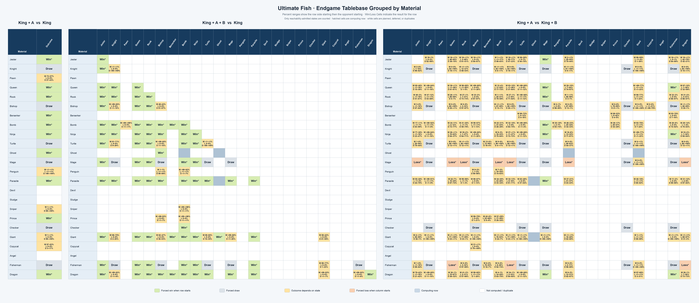

# Ultimate Fish tablebases

These tablebase classes are exact WDL/DTW retrograde solutions for the native
8x10 board. Position-only single-character classes use a dense 985,920-state
codec with both Kings and the named Ivory character on distinct anchor squares,
either side to move, and every model `moved=true`. The moved-state restriction
makes the class closed by excluding castling; the probe rejects state not
represented by that class.

The packed files store concrete worlds, including exact King/Jester identities
and Ghost squares. Public-information W/L/D for every row containing either
piece requires a separate uncapped observation-game solution under the
documented [`fresh-maximal-public-view-v2`](../docs/benchmarks/ultimate-information-tablebases.md)
convention, including the mover-private pre-decision legal-dot channel.
Concrete tables remain its exact transition/value oracle rather than being
treated as public-information results directly. Version-1 information results
are invalid and are never accepted as a fallback. An affected material is
omitted from the generated W/L/D table until its current observation-game
artifact is fully certified; retaining its concrete `.uftb` dependency does
not make its concrete outcomes publishable.

Diagonal hatching means the class is currently computing. The image is
generated exclusively from the canonical ledger below by
`python3 tools/plot_ultimate_tablebases.py`.

<!-- COMPUTATION_LEDGER_START -->
Ledger totals: **9 certified**, **186 preserving**, **5 computing**, **34 exact draws**, **240 planned**, **3 blocked**, and **147 deferred**; 624 unique material classes.

| Key | Class | Domain | File | Status | Indexed states | Result domain | First starts W / L / D | Second starts W / L / D | Reachable / unreachable (first; second) | Canonical storage |
| --- | --- | --- | --- | --- | ---: | --- | ---: | ---: | ---: | --- |
| `single:jester` | King+Jester vs King | single | `kjesterk.uftb` | **PRESERVING** | 985,920 | information v2 | 412,616 (80,344) / 0 / 0 | 3,272 / 414,344 / 75,344 | 412,616 / 80,344; 492,960 / 0 | S3 preservation pending |
| `single:knight` | King+Knight vs King | single | — | **DRAW** | — | insufficient material | 0 / 0 / 1 | 0 / 0 / 1 | closed-form draw | — |
| `single:pawn` | King+Pawn vs King | single | `kpawnk.uftb` | **PRESERVING** | 1,971,840 | concrete | 576,806 (101,696) / 0 / 217,258 (90,160) | 0 (83,616) / 459,272 / 352,872 (90,160) | 794,064 / 191,856; 812,144 / 173,776 | S3 preservation pending |
| `single:queen` | King+Queen vs King | single | `kqk.uftb` | **PRESERVING** | 985,920 | concrete | 306,404 (186,556) / 0 / 0 | 0 (41,808) / 413,304 / 37,848 | 306,404 / 186,556; 451,152 / 41,808 | S3 preservation pending |
| `single:rook` | King+Rook vs King | single | `krk.uftb` | **PRESERVING** | 985,920 | concrete | 361,648 (131,312) / 0 / 0 | 0 (41,808) / 414,300 / 36,852 | 361,648 / 131,312; 451,152 / 41,808 | S3 preservation pending |
| `single:bishop` | King+Bishop vs King | single | — | **DRAW** | — | insufficient material | 0 / 0 / 1 | 0 / 0 / 1 | closed-form draw | — |
| `single:berserker` | King+Berserker vs King | single | `kberserkerk.uftb` | **PRESERVING** | 9,859,200 | concrete | 1,468,376 (3,461,224) / 0 / 0 | 0 (418,080) / 4,143,200 / 368,320 | 1,468,376 / 3,461,224; 4,511,520 / 418,080 | S3 preservation pending |
| `single:bomb` | King+Bomb vs King | single | `kbombk.uftb` | **PRESERVING** | 985,920 | concrete | 394,988 (97,972) / 0 / 0 | 0 (41,808) / 448,600 (1,760) / 792 | 394,988 / 97,972; 449,392 / 43,568 | S3 preservation pending |
| `single:ninja` | King+Ninja vs King | single | `kninjak.uftb` | **PRESERVING** | 985,920 | concrete | 356,360 (136,600) / 0 / 0 | 0 (41,808) / 413,376 / 37,776 | 356,360 / 136,600; 451,152 / 41,808 | S3 preservation pending |
| `single:turtle` | King+Turtle vs King | single | — | **DRAW** | — | insufficient material | 0 / 0 / 1 | 0 / 0 / 1 | closed-form draw | — |
| `single:ghost` | King+Ghost vs King | single | `kghostk.uftb` | **PRESERVING** | 1,971,840 | information v2 | 863,768 (122,152) / 0 / 0 | 0 (83,616) / 826,992 (38,520) / 36,776 (16) | 863,768 / 122,152; 863,768 / 122,152 | S3 preservation pending |
| `single:mage` | King+Mage vs King | single | — | **DRAW** | — | insufficient material | 0 / 0 / 1 | 0 / 0 / 1 | closed-form draw | — |
| `single:penguin` | King+Penguin vs King | single | `kpenguink.uftb` | **PRESERVING** | 3,943,680 | concrete | 384 (48,064) / 192 / 489,112 (448,168) | 796 (43,568) / 1,760 / 527,180 (412,616) | 489,688 / 496,232; 529,736 / 456,184 | S3 preservation pending |
| `single:parasite` | King+Parasite vs King | single | `kparasitek.uftb` | **PRESERVING** | 985,920 | concrete | 412,616 (80,344) / 0 / 0 | 0 (41,808) / 451,120 / 32 | 412,616 / 80,344; 451,152 / 41,808 | S3 preservation pending |
| `single:devil` | King+Devil vs King | single | — | **DEFERRED** | — | concrete | — | — | — | — |
| `single:sludge` | King+Sludge vs King | single | — | **DEFERRED** | — | concrete | — | — | — | — |
| `single:sniper` | King+Sniper vs King | single | `ksniperk.uftb` | **PRESERVING** | 3,943,680 | concrete | 5,014 (194,552) / 0 / 872,222 (900,052) | 0 (167,232) / 1,210 (1,066) / 901,094 (901,238) | 877,236 / 1,094,604; 902,304 / 1,069,536 | S3 preservation pending |
| `single:prince` | King+Prince vs King | single | `kprincek.uftb` | **PRESERVING** | 1,971,840 | concrete | 867,040 (80,344) / 0 (38,536) / 0 | 0 (41,808) / 414,344 (492,944) / 36,808 (16) | 867,040 / 118,880; 451,152 / 534,768 | S3 preservation pending |
| `single:checker` | King+Checker vs King | single | — | **DRAW** | — | insufficient material | 0 / 0 / 1 | 0 / 0 / 1 | closed-form draw | — |
| `single:giant` | King+Giant vs King | single | `kgiantk.uftb` | **PRESERVING** | 985,920 | concrete | 3,300 (82,476) / 0 / 273,324 (133,860) | 0 (30,868) / 1,460 / 326,772 (133,860) | 276,624 / 216,336; 328,232 / 164,728 | S3 preservation pending |
| `single:copycat` | King+Copycat vs King | single | `kcopycatk.uftb` | **PRESERVING** | 985,920 | concrete | 372,224 (108,184) / 0 / 12,552 | 0 (40,776) / 374,136 / 78,048 | 384,776 / 108,184; 452,184 / 40,776 | S3 preservation pending |
| `single:angel` | King+Angel vs King | single | — | **DEFERRED** | — | concrete | — | — | — | — |
| `single:fisherman` | King+Fisherman vs King | single | — | **DRAW** | — | insufficient material | 0 / 0 / 1 | 0 / 0 / 1 | closed-form draw | — |
| `single:dragon` | King+Dragon vs King | single | `kdragonk.uftb` | **PRESERVING** | 985,920 | concrete | 364,756 (128,204) / 0 / 0 | 0 (41,808) / 414,164 / 36,988 | 364,756 / 128,204; 451,152 / 41,808 | S3 preservation pending |
| `same:jester+jester` | King+2 Jesters vs King | same | `kjesterjesterk.uftb` | **CERTIFIED** | 18,978,960 | information v2 | 7,259,568 (2,229,912) / 0 / 0 | 122,242 / 8,682,564 / 684,674 | 7,259,568 / 2,229,912; 9,489,480 / 0 | S3 raw sha256:31bfe84a VersionId lYyE49iRP0WafZ4oGBBkqBNAbUDrbhts; arbitrary sha256:5da56e0c VersionId y7GdR.MtNb_mLQ_nRgj9L.0r6yFCuZtM; certificate sha256:536632ab VersionId Z07XOZA77U_9fLhNKU_lL3dltu3fBrHh |
| `same:jester+knight` | King+Jester+Knight vs King | same | `kjesterknightk.uftb` | **PRESERVING** | 37,957,920 | information v2 | 14,798,084 (4,180,876) / 0 / 0 | 242,136 / 16,055,072 / 2,681,752 | 14,798,084 / 4,180,876; 18,978,960 / 0 | S3 preservation pending |
| `same:jester+pawn` | King+Jester+Pawn vs King | same | `kjesterpawnk.uftb` | **PLANNED** | 75,915,840 | concrete | — | — | — | — |
| `same:jester+queen` | King+Jester+Queen vs King | same | `kjesterqueenk.uftb` | **PRESERVING** | 37,957,920 | information v2 | 10,877,572 (8,101,388) / 0 / 0 | 611,994 / 17,307,456 / 1,059,510 | 10,877,572 / 8,101,388; 18,978,960 / 0 | S3 preservation pending |
| `same:jester+rook` | King+Jester+Rook vs King | same | `kjesterrookk.uftb` | **PRESERVING** | 37,957,920 | information v2 | 12,797,700 (6,181,260) / 0 / 0 | 425,372 / 17,360,968 / 1,192,620 | 12,797,700 / 6,181,260; 18,978,960 / 0 | S3 preservation pending |
| `same:jester+bishop` | King+Jester+Bishop vs King | same | `kjesterbishopk.uftb` | **PRESERVING** | 37,957,920 | information v2 | 13,965,588 (5,013,372) / 0 / 0 | 316,578 / 16,113,394 / 2,548,988 | 13,965,588 / 5,013,372; 18,978,960 / 0 | S3 preservation pending |
| `same:jester+berserker` | King+Jester+Berserker vs King | same | `kjesterberserkerk.uftb` | **PLANNED** | 379,579,200 | concrete | — | — | — | — |
| `same:jester+bomb` | King+Jester+Bomb vs King | same | `kjesterbombk.uftb` | **PRESERVING** | 37,957,920 | information v2 | 13,901,148 (5,077,812) / 0 / 0 | 309,574 / 17,331,368 / 1,338,018 | 13,901,148 / 5,077,812; 18,978,960 / 0 | S3 preservation pending |
| `same:jester+ninja` | King+Jester+Ninja vs King | same | `kjesterninjak.uftb` | **PRESERVING** | 37,957,920 | information v2 | 12,548,400 (6,430,560) / 0 / 0 | 446,484 / 17,313,736 / 1,218,740 | 12,548,400 / 6,430,560; 18,978,960 / 0 | S3 preservation pending |
| `same:jester+turtle` | King+Jester+Turtle vs King | same | `kjesterturtlek.uftb` | **PRESERVING** | 37,957,920 | information v2 | 15,158,912 (3,820,048) / 0 / 0 | 189,426 / 16,006,830 / 2,782,704 | 15,158,912 / 3,820,048; 18,978,960 / 0 | S3 preservation pending |
| `same:jester+ghost` | King+Jester+Ghost vs King | same | `kjesterghostk.uftb` | **BLOCKED** | 75,915,840 | information required | — | — | — | — |
| `same:jester+mage` | King+Jester+Mage vs King | same | `kjestermagek.uftb` | **PRESERVING** | 37,957,920 | information v2 | 15,885,716 (3,093,244) / 0 / 0 | 125,972 / 15,952,244 / 2,900,744 | 15,885,716 / 3,093,244; 18,978,960 / 0 | S3 preservation pending |
| `same:jester+penguin` | King+Jester+Penguin vs King | same | `kjesterpenguink.uftb` | **PLANNED** | 303,663,360 | concrete | — | — | — | — |
| `same:jester+parasite` | King+Jester+Parasite vs King | same | `kjesterparasitek.uftb` | **PRESERVING** | 37,957,920 | information v2 | 14,519,136 (4,459,824) / 0 / 0 | 247,372 / 17,365,128 / 1,366,460 | 14,519,136 / 4,459,824; 18,978,960 / 0 | S3 preservation pending |
| `same:jester+devil` | King+Jester+Devil vs King | same | — | **DEFERRED** | — | concrete | — | — | — | — |
| `same:jester+sludge` | King+Jester+Sludge vs King | same | — | **DEFERRED** | — | concrete | — | — | — | — |
| `same:jester+sniper` | King+Jester+Sniper vs King | same | `kjestersniperk.uftb` | **PLANNED** | 151,831,680 | concrete | — | — | — | — |
| `same:jester+prince` | King+Jester+Prince vs King | same | `kjesterprincek.uftb` | **PLANNED** | 75,915,840 | concrete | — | — | — | — |
| `same:jester+checker` | King+Jester+Checker vs King | same | `kjestercheckerk.uftb` | **PLANNED** | 151,831,680 | concrete | — | — | — | — |
| `same:jester+giant` | King+Jester+Giant vs King | same | `kjestergiantk.uftb` | **PRESERVING** | 37,957,920 | information v2 | 9,347,536 (3,939,164) / 0 / 0 (5,692,260) | 260,316 / 11,300,932 / 1,725,452 (5,692,260) | 9,347,536 / 9,631,424; 13,286,700 / 5,692,260 | S3 preservation pending |
| `same:jester+copycat` | King+Jester+Copycat vs King | same | `kcopycatjesterk.uftb` | **PLANNED** | 75,915,840 | concrete | — | — | — | — |
| `same:jester+angel` | King+Jester+Angel vs King | same | — | **DEFERRED** | — | concrete | — | — | — | — |
| `same:jester+fisherman` | King+Jester+Fisherman vs King | same | `kjesterfishermank.uftb` | **PRESERVING** | 37,957,920 | information v2 | 15,885,716 (3,093,244) / 0 / 0 | 125,972 / 15,952,244 / 2,900,744 | 15,885,716 / 3,093,244; 18,978,960 / 0 | S3 preservation pending |
| `same:jester+dragon` | King+Jester+Dragon vs King | same | `kjesterdragonk.uftb` | **PRESERVING** | 37,957,920 | information v2 | 12,877,956 (6,101,004) / 0 / 0 | 431,414 / 17,350,088 / 1,197,458 | 12,877,956 / 6,101,004; 18,978,960 / 0 | S3 preservation pending |
| `same:knight+knight` | King+2 Knights vs King | same | `kknightknightk.uftb` | **PRESERVING** | 18,978,960 | concrete | 360 (1,964,462) / 0 / 7,524,658 | 0 (804,804) / 68 / 8,684,608 | 7,525,018 / 1,964,462; 8,684,676 / 804,804 | S3 preservation pending |
| `same:knight+pawn` | King+Knight+Pawn vs King | same | `kknightpawnk.uftb` | **PLANNED** | 75,915,840 | concrete | — | — | — | — |
| `same:knight+queen` | King+Knight+Queen vs King | same | `kknightqueenk.uftb` | **PRESERVING** | 37,957,920 | concrete | 11,144,698 (7,834,262) / 0 / 0 | 0 (1,609,608) / 15,991,680 / 1,377,672 | 11,144,698 / 7,834,262; 17,369,352 / 1,609,608 | S3 preservation pending |
| `same:knight+rook` | King+Knight+Rook vs King | same | `kknightrookk.uftb` | **PRESERVING** | 37,957,920 | concrete | 13,069,652 (5,909,308) / 0 / 0 | 0 (1,609,608) / 16,041,948 / 1,327,404 | 13,069,652 / 5,909,308; 17,369,352 / 1,609,608 | S3 preservation pending |
| `same:knight+bishop` | King+Knight+Bishop vs King | same | `kknightbishopk.uftb` | **PRESERVING** | 37,957,920 | concrete | 14,199,500 (4,733,914) / 0 / 45,546 | 0 (1,609,608) / 14,751,040 / 2,618,312 | 14,245,046 / 4,733,914; 17,369,352 / 1,609,608 | S3 preservation pending |
| `same:knight+berserker` | King+Knight+Berserker vs King | same | `kknightberserkerk.uftb` | **PLANNED** | 379,579,200 | concrete | — | — | — | — |
| `same:knight+bomb` | King+Knight+Bomb vs King | same | `kknightbombk.uftb` | **PRESERVING** | 37,957,920 | concrete | 14,179,200 (4,799,760) / 0 / 0 | 0 (1,609,608) / 17,269,780 (67,760) / 31,812 | 14,179,200 / 4,799,760; 17,301,592 / 1,677,368 | S3 preservation pending |
| `same:knight+ninja` | King+Knight+Ninja vs King | same | `kknightninjak.uftb` | **PRESERVING** | 37,957,920 | concrete | 12,797,612 (6,181,348) / 0 / 0 | 0 (1,609,608) / 16,000,796 / 1,368,556 | 12,797,612 / 6,181,348; 17,369,352 / 1,609,608 | S3 preservation pending |
| `same:knight+turtle` | King+Knight+Turtle vs King | same | `kknightturtlek.uftb` | **PRESERVING** | 37,957,920 | concrete | 14,093,700 (3,538,608) / 0 / 1,346,652 | 0 (1,609,608) / 12,261,896 / 5,107,456 | 15,440,352 / 3,538,608; 17,369,352 / 1,609,608 | S3 preservation pending |
| `same:knight+ghost` | King+Knight+Ghost vs King | same | `kknightghostk.uftb` | **PLANNED** | 75,915,840 | concrete | — | — | — | — |
| `same:knight+mage` | King+Knight+Mage vs King | same | — | **DRAW** | — | insufficient material | 0 / 0 / 1 | 0 / 0 / 1 | closed-form draw | — |
| `same:knight+penguin` | King+Knight+Penguin vs King | same | `kknightpenguink.uftb` | **PLANNED** | 303,663,360 | concrete | — | — | — | — |
| `same:knight+parasite` | King+Knight+Parasite vs King | same | `kknightparasitek.uftb` | **PRESERVING** | 37,957,920 | concrete | 14,798,084 (4,180,876) / 0 / 0 | 0 (1,609,608) / 17,364,220 / 5,132 | 14,798,084 / 4,180,876; 17,369,352 / 1,609,608 | S3 preservation pending |
| `same:knight+devil` | King+Knight+Devil vs King | same | — | **DEFERRED** | — | concrete | — | — | — | — |
| `same:knight+sludge` | King+Knight+Sludge vs King | same | — | **DEFERRED** | — | concrete | — | — | — | — |
| `same:knight+sniper` | King+Knight+Sniper vs King | same | `kknightsniperk.uftb` | **PLANNED** | 151,831,680 | concrete | — | — | — | — |
| `same:knight+prince` | King+Knight+Prince vs King | same | `kknightprincek.uftb` | **PLANNED** | 75,915,840 | concrete | — | — | — | — |
| `same:knight+checker` | King+Knight+Checker vs King | same | `kknightcheckerk.uftb` | **PLANNED** | 151,831,680 | concrete | — | — | — | — |
| `same:knight+giant` | King+Knight+Giant vs King | same | `kknightgiantk.uftb` | **PRESERVING** | 37,957,920 | concrete | 9,415,136 (3,665,112) / 0 / 206,452 (5,692,260) | 0 (1,142,116) / 9,132,192 / 3,012,392 (5,692,260) | 9,621,588 / 9,357,372; 12,144,584 / 6,834,376 | S3 preservation pending |
| `same:knight+copycat` | King+Knight+Copycat vs King | same | `kcopycatknightk.uftb` | **PLANNED** | 75,915,840 | concrete | — | — | — | — |
| `same:knight+angel` | King+Knight+Angel vs King | same | — | **DEFERRED** | — | concrete | — | — | — | — |
| `same:knight+fisherman` | King+Knight+Fisherman vs King | same | — | **DRAW** | — | insufficient material | 0 / 0 / 1 | 0 / 0 / 1 | closed-form draw | — |
| `same:knight+dragon` | King+Knight+Dragon vs King | same | `kknightdragonk.uftb` | **PRESERVING** | 37,957,920 | concrete | 13,125,078 (5,853,878) / 0 / 4 | 0 (1,609,608) / 16,039,998 / 1,329,354 | 13,125,082 / 5,853,878; 17,369,352 / 1,609,608 | S3 preservation pending |
| `same:pawn+pawn` | King+2 Pawns vs King | same | `kpawnpawnk.uftb` | **PLANNED** | 75,915,840 | concrete | — | — | — | — |
| `same:pawn+queen` | King+Pawn+Queen vs King | same | `kpawnqueenk.uftb` | **PLANNED** | 75,915,840 | concrete | — | — | — | — |
| `same:pawn+rook` | King+Pawn+Rook vs King | same | `kpawnrookk.uftb` | **PLANNED** | 75,915,840 | concrete | — | — | — | — |
| `same:pawn+bishop` | King+Pawn+Bishop vs King | same | `kpawnbishopk.uftb` | **PLANNED** | 75,915,840 | concrete | — | — | — | — |
| `same:pawn+berserker` | King+Pawn+Berserker vs King | same | `kpawnberserkerk.uftb` | **PLANNED** | 759,158,400 | concrete | — | — | — | — |
| `same:pawn+bomb` | King+Pawn+Bomb vs King | same | `kpawnbombk.uftb` | **PRESERVING** | 75,915,840 | concrete | 26,783,928 (11,173,990) / 0 / 2 | 0 (3,219,216) / 31,088,884 (3,586,976) / 56,952 (5,892) | 26,783,930 / 11,173,990; 31,145,836 / 6,812,084 | S3 preservation pending |
| `same:pawn+ninja` | King+Pawn+Ninja vs King | same | `kpawnninjak.uftb` | **PLANNED** | 75,915,840 | concrete | — | — | — | — |
| `same:pawn+turtle` | King+Pawn+Turtle vs King | same | `kpawnturtlek.uftb` | **PLANNED** | 75,915,840 | concrete | — | — | — | — |
| `same:pawn+ghost` | King+Pawn+Ghost vs King | same | `kpawnghostk.uftb` | **PLANNED** | 151,831,680 | concrete | — | — | — | — |
| `same:pawn+mage` | King+Pawn+Mage vs King | same | `kpawnmagek.uftb` | **PLANNED** | 75,915,840 | concrete | — | — | — | — |
| `same:pawn+penguin` | King+Pawn+Penguin vs King | same | `kpawnpenguink.uftb` | **PLANNED** | 607,326,720 | concrete | — | — | — | — |
| `same:pawn+parasite` | King+Pawn+Parasite vs King | same | `kpawnparasitek.uftb` | **PLANNED** | 75,915,840 | concrete | — | — | — | — |
| `same:pawn+devil` | King+Pawn+Devil vs King | same | — | **DEFERRED** | — | concrete | — | — | — | — |
| `same:pawn+sludge` | King+Pawn+Sludge vs King | same | — | **DEFERRED** | — | concrete | — | — | — | — |
| `same:pawn+sniper` | King+Pawn+Sniper vs King | same | `kpawnsniperk.uftb` | **PLANNED** | 303,663,360 | concrete | — | — | — | — |
| `same:pawn+prince` | King+Pawn+Prince vs King | same | `kpawnprincek.uftb` | **PLANNED** | 151,831,680 | concrete | — | — | — | — |
| `same:pawn+checker` | King+Pawn+Checker vs King | same | `kpawncheckerk.uftb` | **PLANNED** | 303,663,360 | concrete | — | — | — | — |
| `same:pawn+giant` | King+Pawn+Giant vs King | same | `kpawngiantk.uftb` | **PLANNED** | 75,915,840 | concrete | — | — | — | — |
| `same:pawn+copycat` | King+Pawn+Copycat vs King | same | `kcopycatpawnk.uftb` | **PLANNED** | 151,831,680 | concrete | — | — | — | — |
| `same:pawn+angel` | King+Pawn+Angel vs King | same | — | **DEFERRED** | — | concrete | — | — | — | — |
| `same:pawn+fisherman` | King+Pawn+Fisherman vs King | same | `kpawnfishermank.uftb` | **PLANNED** | 75,915,840 | concrete | — | — | — | — |
| `same:pawn+dragon` | King+Pawn+Dragon vs King | same | `kpawndragonk.uftb` | **PLANNED** | 75,915,840 | concrete | — | — | — | — |
| `same:queen+queen` | King+2 Queens vs King | same | `kqueenqueenk.uftb` | **PRESERVING** | 18,978,960 | concrete | 3,991,466 (5,498,014) / 0 / 0 | 0 (804,804) / 8,560,812 / 123,864 | 3,991,466 / 5,498,014; 8,684,676 / 804,804 | S3 preservation pending |
| `same:queen+rook` | King+Queen+Rook vs King | same | `kqueenrookk.uftb` | **PRESERVING** | 37,957,920 | concrete | 9,474,332 (9,504,628) / 0 / 0 | 0 (1,609,608) / 17,251,240 / 118,112 | 9,474,332 / 9,504,628; 17,369,352 / 1,609,608 | S3 preservation pending |
| `same:queen+bishop` | King+Queen+Bishop vs King | same | `kqueenbishopk.uftb` | **PRESERVING** | 37,957,920 | concrete | 10,451,944 (8,527,016) / 0 / 0 | 0 (1,609,608) / 16,034,380 / 1,334,972 | 10,451,944 / 8,527,016; 17,369,352 / 1,609,608 | S3 preservation pending |
| `same:queen+berserker` | King+Queen+Berserker vs King | same | `kqueenberserkerk.uftb` | **PLANNED** | 379,579,200 | concrete | — | — | — | — |
| `same:queen+bomb` | King+Queen+Bomb vs King | same | `kqueenbombk.uftb` | **PRESERVING** | 37,957,920 | concrete | 10,388,902 (8,590,058) / 0 / 0 | 0 (1,609,608) / 17,201,128 (67,760) / 100,464 | 10,388,902 / 8,590,058; 17,301,592 / 1,677,368 | S3 preservation pending |
| `same:queen+ninja` | King+Queen+Ninja vs King | same | `kqueenninjak.uftb` | **PRESERVING** | 37,957,920 | concrete | 9,342,106 (9,636,854) / 0 / 0 | 0 (1,609,608) / 17,178,972 / 190,380 | 9,342,106 / 9,636,854; 17,369,352 / 1,609,608 | S3 preservation pending |
| `same:queen+turtle` | King+Queen+Turtle vs King | same | `kqueenturtlek.uftb` | **PRESERVING** | 37,957,920 | concrete | 11,369,834 (7,609,126) / 0 / 0 | 0 (1,609,608) / 15,954,050 / 1,415,302 | 11,369,834 / 7,609,126; 17,369,352 / 1,609,608 | S3 preservation pending |
| `same:queen+ghost` | King+Queen+Ghost vs King | same | `kqueenghostk.uftb` | **PLANNED** | 75,915,840 | concrete | — | — | — | — |
| `same:queen+mage` | King+Queen+Mage vs King | same | `kqueenmagek.uftb` | **PRESERVING** | 37,957,920 | concrete | 11,943,344 (7,035,616) / 0 / 0 | 0 (1,609,608) / 15,912,942 / 1,456,410 | 11,943,344 / 7,035,616; 17,369,352 / 1,609,608 | S3 preservation pending |
| `same:queen+penguin` | King+Queen+Penguin vs King | same | `kqueenpenguink.uftb` | **PLANNED** | 303,663,360 | concrete | — | — | — | — |
| `same:queen+parasite` | King+Queen+Parasite vs King | same | `kqueenparasitek.uftb` | **PRESERVING** | 37,957,920 | concrete | 10,877,572 (8,101,388) / 0 / 0 | 0 (1,609,608) / 17,307,456 / 61,896 | 10,877,572 / 8,101,388; 17,369,352 / 1,609,608 | S3 preservation pending |
| `same:queen+devil` | King+Queen+Devil vs King | same | — | **DEFERRED** | — | concrete | — | — | — | — |
| `same:queen+sludge` | King+Queen+Sludge vs King | same | — | **DEFERRED** | — | concrete | — | — | — | — |
| `same:queen+sniper` | King+Queen+Sniper vs King | same | `kqueensniperk.uftb` | **PLANNED** | 151,831,680 | concrete | — | — | — | — |
| `same:queen+prince` | King+Queen+Prince vs King | same | `kqueenprincek.uftb` | **PLANNED** | 75,915,840 | concrete | — | — | — | — |
| `same:queen+checker` | King+Queen+Checker vs King | same | `kqueencheckerk.uftb` | **PLANNED** | 151,831,680 | concrete | — | — | — | — |
| `same:queen+giant` | King+Queen+Giant vs King | same | `kqueengiantk.uftb` | **PRESERVING** | 37,957,920 | concrete | 7,071,014 (6,215,686) / 0 / 0 (5,692,260) | 0 (1,142,116) / 11,256,584 / 888,000 (5,692,260) | 7,071,014 / 11,907,946; 12,144,584 / 6,834,376 | S3 preservation pending |
| `same:queen+copycat` | King+Queen+Copycat vs King | same | `kcopycatqueenk.uftb` | **PLANNED** | 75,915,840 | concrete | — | — | — | — |
| `same:queen+angel` | King+Queen+Angel vs King | same | — | **DEFERRED** | — | concrete | — | — | — | — |
| `same:queen+fisherman` | King+Queen+Fisherman vs King | same | `kqueenfishermank.uftb` | **PRESERVING** | 37,957,920 | concrete | 11,943,344 (7,035,616) / 0 / 0 | 0 (1,609,608) / 15,912,942 / 1,456,410 | 11,943,344 / 7,035,616; 17,369,352 / 1,609,608 | S3 preservation pending |
| `same:queen+dragon` | King+Queen+Dragon vs King | same | `kqueendragonk.uftb` | **PRESERVING** | 37,957,920 | concrete | 9,653,298 (9,325,662) / 0 / 0 | 0 (1,609,608) / 17,238,014 / 131,338 | 9,653,298 / 9,325,662; 17,369,352 / 1,609,608 | S3 preservation pending |
| `same:rook+rook` | King+2 Rooks vs King | same | `krookrookk.uftb` | **PRESERVING** | 18,978,960 | concrete | 5,565,392 (3,924,088) / 0 / 0 | 0 (804,804) / 8,669,238 / 15,438 | 5,565,392 / 3,924,088; 8,684,676 / 804,804 | S3 preservation pending |
| `same:rook+bishop` | King+Rook+Bishop vs King | same | `krookbishopk.uftb` | **PRESERVING** | 37,957,920 | concrete | 12,371,072 (6,607,888) / 0 / 0 | 0 (1,609,608) / 16,100,204 / 1,269,148 | 12,371,072 / 6,607,888; 17,369,352 / 1,609,608 | S3 preservation pending |
| `same:rook+berserker` | King+Rook+Berserker vs King | same | `krookberserkerk.uftb` | **PLANNED** | 379,579,200 | concrete | — | — | — | — |
| `same:rook+bomb` | King+Rook+Bomb vs King | same | `krookbombk.uftb` | **PRESERVING** | 37,957,920 | concrete | 12,221,516 (6,757,444) / 0 / 0 | 0 (1,609,608) / 17,242,972 (67,760) / 58,620 | 12,221,516 / 6,757,444; 17,301,592 / 1,677,368 | S3 preservation pending |
| `same:rook+ninja` | King+Rook+Ninja vs King | same | `krookninjak.uftb` | **PRESERVING** | 37,957,920 | concrete | 11,008,382 (7,970,578) / 0 / 0 | 0 (1,609,608) / 17,271,872 / 97,480 | 11,008,382 / 7,970,578; 17,369,352 / 1,609,608 | S3 preservation pending |
| `same:rook+turtle` | King+Rook+Turtle vs King | same | `krookturtlek.uftb` | **PRESERVING** | 37,957,920 | concrete | 13,353,634 (5,625,326) / 0 / 0 | 0 (1,609,608) / 16,000,700 / 1,368,652 | 13,353,634 / 5,625,326; 17,369,352 / 1,609,608 | S3 preservation pending |
| `same:rook+ghost` | King+Rook+Ghost vs King | same | `krookghostk.uftb` | **PLANNED** | 75,915,840 | concrete | — | — | — | — |
| `same:rook+mage` | King+Rook+Mage vs King | same | `krookmagek.uftb` | **PRESERVING** | 37,957,920 | concrete | 14,027,524 (4,951,436) / 0 / 0 | 0 (1,609,608) / 15,950,608 / 1,418,744 | 14,027,524 / 4,951,436; 17,369,352 / 1,609,608 | S3 preservation pending |
| `same:rook+penguin` | King+Rook+Penguin vs King | same | `krookpenguink.uftb` | **PLANNED** | 303,663,360 | concrete | — | — | — | — |
| `same:rook+parasite` | King+Rook+Parasite vs King | same | `krookparasitek.uftb` | **PRESERVING** | 37,957,920 | concrete | 12,797,700 (6,181,260) / 0 / 0 | 0 (1,609,608) / 17,360,968 / 8,384 | 12,797,700 / 6,181,260; 17,369,352 / 1,609,608 | S3 preservation pending |
| `same:rook+devil` | King+Rook+Devil vs King | same | — | **DEFERRED** | — | concrete | — | — | — | — |
| `same:rook+sludge` | King+Rook+Sludge vs King | same | — | **DEFERRED** | — | concrete | — | — | — | — |
| `same:rook+sniper` | King+Rook+Sniper vs King | same | `krooksniperk.uftb` | **PLANNED** | 151,831,680 | concrete | — | — | — | — |
| `same:rook+prince` | King+Rook+Prince vs King | same | `krookprincek.uftb` | **PLANNED** | 75,915,840 | concrete | — | — | — | — |
| `same:rook+checker` | King+Rook+Checker vs King | same | `krookcheckerk.uftb` | **PLANNED** | 151,831,680 | concrete | — | — | — | — |
| `same:rook+giant` | King+Rook+Giant vs King | same | `krookgiantk.uftb` | **PRESERVING** | 37,957,920 | concrete | 8,246,894 (5,039,806) / 0 / 0 (5,692,260) | 0 (1,142,116) / 11,296,414 / 848,170 (5,692,260) | 8,246,894 / 10,732,066; 12,144,584 / 6,834,376 | S3 preservation pending |
| `same:rook+copycat` | King+Rook+Copycat vs King | same | `kcopycatrookk.uftb` | **PLANNED** | 75,915,840 | concrete | — | — | — | — |
| `same:rook+angel` | King+Rook+Angel vs King | same | — | **DEFERRED** | — | concrete | — | — | — | — |
| `same:rook+fisherman` | King+Rook+Fisherman vs King | same | `krookfishermank.uftb` | **PRESERVING** | 37,957,920 | concrete | 14,027,524 (4,951,436) / 0 / 0 | 0 (1,609,608) / 15,950,608 / 1,418,744 | 14,027,524 / 4,951,436; 17,369,352 / 1,609,608 | S3 preservation pending |
| `same:rook+dragon` | King+Rook+Dragon vs King | same | `krookdragonk.uftb` | **PRESERVING** | 37,957,920 | concrete | 11,413,200 (7,565,760) / 0 / 0 | 0 (1,609,608) / 17,325,054 / 44,298 | 11,413,200 / 7,565,760; 17,369,352 / 1,609,608 | S3 preservation pending |
| `same:bishop+bishop` | King+2 Bishops vs King | same | `kbishopbishopk.uftb` | **PRESERVING** | 18,978,960 | concrete | 3,306,336 (1,498,130) / 0 / 3,376,686 (1,308,328) | 0 (407,502) / 3,708,210 / 4,976,466 (397,302) | 6,683,022 / 2,806,458; 8,684,676 / 804,804 | S3 preservation pending |
| `same:bishop+berserker` | King+Bishop+Berserker vs King | same | `kbishopberserkerk.uftb` | **PLANNED** | 379,579,200 | concrete | — | — | — | — |
| `same:bishop+bomb` | King+Bishop+Bomb vs King | same | `kbishopbombk.uftb` | **PRESERVING** | 37,957,920 | concrete | 13,383,238 (5,595,722) / 0 / 0 | 0 (1,609,608) / 17,265,800 (67,760) / 35,792 | 13,383,238 / 5,595,722; 17,301,592 / 1,677,368 | S3 preservation pending |
| `same:bishop+ninja` | King+Bishop+Ninja vs King | same | `kbishopninjak.uftb` | **PRESERVING** | 37,957,920 | concrete | 12,053,584 (6,925,376) / 0 / 0 | 0 (1,609,608) / 16,048,930 / 1,320,422 | 12,053,584 / 6,925,376; 17,369,352 / 1,609,608 | S3 preservation pending |
| `same:bishop+turtle` | King+Bishop+Turtle vs King | same | `kbishopturtlek.uftb` | **PRESERVING** | 37,957,920 | concrete | 14,555,124 (4,380,964) / 0 / 42,872 | 0 (1,609,608) / 14,694,114 / 2,675,238 | 14,597,996 / 4,380,964; 17,369,352 / 1,609,608 | S3 preservation pending |
| `same:bishop+ghost` | King+Bishop+Ghost vs King | same | `kbishopghostk.uftb` | **CERTIFIED** | 75,915,840 | information v2 | 29,226,628 (8,731,292) / 0 / 0 | 0 (3,219,216) / 32,002,462 (1,482,452) / 1,252,606 (1,184) | 29,226,628 / 8,731,292; 33,255,068 / 4,702,852 | S3 info `7d645981…` / `zjggi0XmUDmp1Nvf1V3vI4m1F_HfJE6K` |
| `same:bishop+mage` | King+Bishop+Mage vs King | same | `kbishopmagek.uftb` | **PRESERVING** | 37,957,920 | concrete | 0 (3,693,788) / 0 / 15,285,172 | 0 (1,609,608) / 0 / 17,369,352 | 15,285,172 / 3,693,788; 17,369,352 / 1,609,608 | S3 preservation pending |
| `same:bishop+penguin` | King+Bishop+Penguin vs King | same | `kbishoppenguink.uftb` | **PRESERVING** | 303,663,360 | concrete | 168,786 (4,810,998) / 7,248 / 17,672,042 (15,298,846) | 29,018 (1,799,132) / 244,310 / 21,366,324 (14,519,136) | 17,848,076 / 20,109,844; 21,639,652 / 16,318,268 | S3 preservation pending |
| `same:bishop+parasite` | King+Bishop+Parasite vs King | same | `kbishopparasitek.uftb` | **PRESERVING** | 37,957,920 | concrete | 13,965,588 (5,013,372) / 0 / 0 | 0 (1,609,608) / 17,355,020 / 14,332 | 13,965,588 / 5,013,372; 17,369,352 / 1,609,608 | S3 preservation pending |
| `same:bishop+devil` | King+Bishop+Devil vs King | same | — | **DEFERRED** | — | concrete | — | — | — | — |
| `same:bishop+sludge` | King+Bishop+Sludge vs King | same | — | **DEFERRED** | — | concrete | — | — | — | — |
| `same:bishop+sniper` | King+Bishop+Sniper vs King | same | `kbishopsniperk.uftb` | **PLANNED** | 151,831,680 | concrete | — | — | — | — |
| `same:bishop+prince` | King+Bishop+Prince vs King | same | `kbishopprincek.uftb` | **PRESERVING** | 75,915,840 | concrete | 31,456,226 (5,013,372) / 0 (1,483,636) / 4,686 | 0 (1,609,608) / 16,113,394 (18,972,918) / 1,255,958 (6,042) | 31,460,912 / 6,497,008; 17,369,352 / 20,588,568 | S3 preservation pending |
| `same:bishop+checker` | King+Bishop+Checker vs King | same | `kbishopcheckerk.uftb` | **PLANNED** | 151,831,680 | concrete | — | — | — | — |
| `same:bishop+giant` | King+Bishop+Giant vs King | same | `kbishopgiantk.uftb` | **PRESERVING** | 37,957,920 | concrete | 5,668,664 (4,150,080) / 0 / 3,467,956 (5,692,260) | 0 (1,142,116) / 5,650,886 / 6,493,698 (5,692,260) | 9,136,620 / 9,842,340; 12,144,584 / 6,834,376 | S3 preservation pending |
| `same:bishop+copycat` | King+Bishop+Copycat vs King | same | `kcopycatbishopk.uftb` | **PLANNED** | 75,915,840 | concrete | — | — | — | — |
| `same:bishop+angel` | King+Bishop+Angel vs King | same | — | **DEFERRED** | — | concrete | — | — | — | — |
| `same:bishop+fisherman` | King+Bishop+Fisherman vs King | same | `kbishopfishermank.uftb` | **PRESERVING** | 37,957,920 | concrete | 0 (3,693,788) / 0 / 15,285,172 | 0 (1,609,608) / 0 / 17,369,352 | 15,285,172 / 3,693,788; 17,369,352 / 1,609,608 | S3 preservation pending |
| `same:bishop+dragon` | King+Bishop+Dragon vs King | same | `kbishopdragonk.uftb` | **PRESERVING** | 37,957,920 | concrete | 12,325,918 (6,653,042) / 0 / 0 | 0 (1,609,608) / 16,094,422 / 1,274,930 | 12,325,918 / 6,653,042; 17,369,352 / 1,609,608 | S3 preservation pending |
| `same:berserker+berserker` | King+2 Berserkers vs King | same | `kberserkerberserkerk.uftb` | **PLANNED** | 1,897,896,000 | concrete | — | — | — | — |
| `same:berserker+bomb` | King+Berserker+Bomb vs King | same | `kberserkerbombk.uftb` | **CERTIFIED** | 379,579,200 | concrete | 49,719,592 (140,070,008) / 0 / 0 | 0 (16,096,080) / 172,804,228 (677,600) / 211,692 | 49,719,592 / 140,070,008; 173,015,920 / 16,773,680 | S3 sha256:3addd3e3 VersionId wB7rq2TjG0O6HGb14C9Fq8G5zrsduq6u; certificate sha256:82e18a2b VersionId tulbqrZAz.5MooPj5XUWFjphdAB2Buvl |
| `same:berserker+ninja` | King+Berserker+Ninja vs King | same | `kberserkerninjak.uftb` | **PLANNED** | 379,579,200 | concrete | — | — | — | — |
| `same:berserker+turtle` | King+Berserker+Turtle vs King | same | `kberserkerturtlek.uftb` | **PLANNED** | 379,579,200 | concrete | — | — | — | — |
| `same:berserker+ghost` | King+Berserker+Ghost vs King | same | `kberserkerghostk.uftb` | **PLANNED** | 759,158,400 | concrete | — | — | — | — |
| `same:berserker+mage` | King+Berserker+Mage vs King | same | `kberserkermagek.uftb` | **PLANNED** | 379,579,200 | concrete | — | — | — | — |
| `same:berserker+penguin` | King+Berserker+Penguin vs King | same | `kberserkerpenguink.uftb` | **PLANNED** | 3,036,633,600 | concrete | — | — | — | — |
| `same:berserker+parasite` | King+Berserker+Parasite vs King | same | `kberserkerparasitek.uftb` | **PLANNED** | 379,579,200 | concrete | — | — | — | — |
| `same:berserker+devil` | King+Berserker+Devil vs King | same | — | **DEFERRED** | — | concrete | — | — | — | — |
| `same:berserker+sludge` | King+Berserker+Sludge vs King | same | — | **DEFERRED** | — | concrete | — | — | — | — |
| `same:berserker+sniper` | King+Berserker+Sniper vs King | same | `kberserkersniperk.uftb` | **PLANNED** | 1,518,316,800 | concrete | — | — | — | — |
| `same:berserker+prince` | King+Berserker+Prince vs King | same | `kberserkerprincek.uftb` | **PLANNED** | 759,158,400 | concrete | — | — | — | — |
| `same:berserker+checker` | King+Berserker+Checker vs King | same | `kberserkercheckerk.uftb` | **PLANNED** | 1,518,316,800 | concrete | — | — | — | — |
| `same:berserker+giant` | King+Berserker+Giant vs King | same | `kberserkergiantk.uftb` | **CERTIFIED** | 379,579,200 | concrete | 132,867,000 / 0 / 0 (56,922,600) | 0 (11,421,160) / 112,998,120 / 8,447,720 (56,922,600) | 132,867,000 / 56,922,600; 121,445,840 / 68,343,760 | S3 `8a1b1797…` / `EXkOI6JOaP.5gTfjFTSBYEfx9cfFBtS0` |
| `same:berserker+copycat` | King+Berserker+Copycat vs King | same | `kcopycatberserkerk.uftb` | **PLANNED** | 759,158,400 | concrete | — | — | — | — |
| `same:berserker+angel` | King+Berserker+Angel vs King | same | — | **DEFERRED** | — | concrete | — | — | — | — |
| `same:berserker+fisherman` | King+Berserker+Fisherman vs King | same | `kberserkerfishermank.uftb` | **PLANNED** | 379,579,200 | concrete | — | — | — | — |
| `same:berserker+dragon` | King+Berserker+Dragon vs King | same | `kberserkerdragonk.uftb` | **CERTIFIED** | 379,579,200 | concrete | 189,789,600 / 0 / 0 | 0 (16,096,080) / 173,452,674 / 240,846 | 189,789,600 / 0; 173,693,520 / 16,096,080 | S3 `bbbfcb3d…` / `ziGJ3OQj8DQorqRiy9uVx07S5uk5Bial` |
| `same:bomb+bomb` | King+2 Bombs vs King | same | `kbombbombk.uftb` | **PRESERVING** | 18,978,960 | concrete | 6,651,352 (2,838,050) / 0 (78) / 0 | 0 (804,804) / 8,582,770 (70,112) / 31,794 | 6,651,352 / 2,838,128; 8,614,564 / 874,916 | S3 preservation pending |
| `same:bomb+ninja` | King+Bomb+Ninja vs King | same | `kbombninjak.uftb` | **PRESERVING** | 37,957,920 | concrete | 12,012,790 (6,966,170) / 0 / 0 | 0 (1,609,608) / 17,219,704 (67,760) / 81,888 | 12,012,790 / 6,966,170; 17,301,592 / 1,677,368 | S3 preservation pending |
| `same:bomb+turtle` | King+Bomb+Turtle vs King | same | `kbombturtlek.uftb` | **PRESERVING** | 37,957,920 | concrete | 14,512,116 (4,466,844) / 0 / 0 | 0 (1,609,608) / 17,269,840 (67,760) / 31,752 | 14,512,116 / 4,466,844; 17,301,592 / 1,677,368 | S3 preservation pending |
| `same:bomb+ghost` | King+Bomb+Ghost vs King | same | `kbombghostk.uftb` | **COMPUTING** | 75,915,840 | information required | — | — | — | — |
| `same:bomb+mage` | King+Bomb+Mage vs King | same | `kbombmagek.uftb` | **PRESERVING** | 37,957,920 | concrete | 15,215,852 (3,763,108) / 0 / 0 | 0 (1,609,608) / 17,271,480 (67,760) / 30,112 | 15,215,852 / 3,763,108; 17,301,592 / 1,677,368 | S3 preservation pending |
| `same:bomb+penguin` | King+Bomb+Penguin vs King | same | `kbombpenguink.uftb` | **PRESERVING** | 303,663,360 | concrete | 17,706,778 (5,565,108) / 7,182 (918) / 53,716 (14,624,218) | 27,840 (1,799,520) / 19,930,438 (71,756) / 1,608,118 (14,520,248) | 17,767,676 / 20,190,244; 21,566,396 / 16,391,524 | S3 preservation pending |
| `same:bomb+parasite` | King+Bomb+Parasite vs King | same | `kbombparasitek.uftb` | **PRESERVING** | 37,957,920 | concrete | 13,901,148 (5,077,812) / 0 / 0 | 0 (1,609,608) / 17,263,608 (67,760) / 37,984 | 13,901,148 / 5,077,812; 17,301,592 / 1,677,368 | S3 preservation pending |
| `same:bomb+devil` | King+Bomb+Devil vs King | same | — | **DEFERRED** | — | concrete | — | — | — | — |
| `same:bomb+sludge` | King+Bomb+Sludge vs King | same | — | **DEFERRED** | — | concrete | — | — | — | — |
| `same:bomb+sniper` | King+Bomb+Sniper vs King | same | `kbombsniperk.uftb` | **PRESERVING** | 151,831,680 | concrete | 29,596,516 (46,319,320) / 0 / 2 (2) | 0 (6,438,432) / 34,536,086 (34,802,038) / 67,098 (72,186) | 29,596,518 / 46,319,322; 34,603,184 / 41,312,656 | S3 preservation pending |
| `same:bomb+prince` | King+Bomb+Prince vs King | same | `kbombprincek.uftb` | **PRESERVING** | 75,915,840 | concrete | 31,306,800 (5,077,812) / 0 (1,545,980) / 27,328 | 0 (1,609,608) / 17,263,608 (19,045,852) / 37,984 (868) | 31,334,128 / 6,623,792; 17,301,592 / 20,656,328 | S3 preservation pending |
| `same:bomb+checker` | King+Bomb+Checker vs King | same | `kbombcheckerk.uftb` | **PRESERVING** | 151,831,680 | concrete | 29,074,749 (9,725,859) / 0 (3,286,402) / 0 (33,828,830) | 0 (3,219,216) / 32,817,112 (10,068,704) / 57,398 (29,753,410) | 29,074,749 / 46,841,091; 32,874,510 / 43,041,330 | S3 preservation pending |
| `same:bomb+giant` | King+Bomb+Giant vs King | same | `kbombgiantk.uftb` | **PRESERVING** | 37,957,920 | concrete | 8,936,526 (4,350,174) / 0 / 0 (5,692,260) | 0 (1,142,116) / 12,067,988 (48,420) / 28,176 (5,692,260) | 8,936,526 / 10,042,434; 12,096,164 / 6,882,796 | S3 preservation pending |
| `same:bomb+copycat` | King+Bomb+Copycat vs King | same | `kcopycatbombk.uftb` | **PLANNED** | 75,915,840 | concrete | — | — | — | — |
| `same:bomb+angel` | King+Bomb+Angel vs King | same | — | **DEFERRED** | — | concrete | — | — | — | — |
| `same:bomb+fisherman` | King+Bomb+Fisherman vs King | same | `kbombfishermank.uftb` | **PRESERVING** | 37,957,920 | concrete | 15,215,852 (3,763,108) / 0 / 0 | 0 (1,609,608) / 17,271,480 (67,760) / 30,112 | 15,215,852 / 3,763,108; 17,301,592 / 1,677,368 | S3 preservation pending |
| `same:bomb+dragon` | King+Bomb+Dragon vs King | same | `kbombdragonk.uftb` | **PRESERVING** | 37,957,920 | concrete | 12,346,586 (6,632,374) / 0 / 0 | 0 (1,609,608) / 17,256,790 (67,760) / 44,802 | 12,346,586 / 6,632,374; 17,301,592 / 1,677,368 | S3 preservation pending |
| `same:ninja+ninja` | King+2 Ninjas vs King | same | `kninjaninjak.uftb` | **PRESERVING** | 18,978,960 | concrete | 5,424,306 (4,065,174) / 0 / 0 | 0 (804,804) / 8,609,904 / 74,772 | 5,424,306 / 4,065,174; 8,684,676 / 804,804 | S3 preservation pending |
| `same:ninja+turtle` | King+Ninja+Turtle vs King | same | `kninjaturtlek.uftb` | **PRESERVING** | 37,957,920 | concrete | 13,095,300 (5,883,660) / 0 / 0 | 0 (1,609,608) / 15,961,482 / 1,407,870 | 13,095,300 / 5,883,660; 17,369,352 / 1,609,608 | S3 preservation pending |
| `same:ninja+ghost` | King+Ninja+Ghost vs King | same | `kninjaghostk.uftb` | **PLANNED** | 75,915,840 | concrete | — | — | — | — |
| `same:ninja+mage` | King+Ninja+Mage vs King | same | `kninjamagek.uftb` | **PRESERVING** | 37,957,920 | concrete | 13,719,860 (5,259,100) / 0 / 0 | 0 (1,609,608) / 15,914,976 / 1,454,376 | 13,719,860 / 5,259,100; 17,369,352 / 1,609,608 | S3 preservation pending |
| `same:ninja+penguin` | King+Ninja+Penguin vs King | same | `kninjapenguink.uftb` | **PLANNED** | 303,663,360 | concrete | — | — | — | — |
| `same:ninja+parasite` | King+Ninja+Parasite vs King | same | `kninjaparasitek.uftb` | **PRESERVING** | 37,957,920 | concrete | 12,548,400 (6,430,560) / 0 / 0 | 0 (1,609,608) / 17,313,736 / 55,616 | 12,548,400 / 6,430,560; 17,369,352 / 1,609,608 | S3 preservation pending |
| `same:ninja+devil` | King+Ninja+Devil vs King | same | — | **DEFERRED** | — | concrete | — | — | — | — |
| `same:ninja+sludge` | King+Ninja+Sludge vs King | same | — | **DEFERRED** | — | concrete | — | — | — | — |
| `same:ninja+sniper` | King+Ninja+Sniper vs King | same | `kninjasniperk.uftb` | **PLANNED** | 151,831,680 | concrete | — | — | — | — |
| `same:ninja+prince` | King+Ninja+Prince vs King | same | `kninjaprincek.uftb` | **PLANNED** | 75,915,840 | concrete | — | — | — | — |
| `same:ninja+checker` | King+Ninja+Checker vs King | same | `kninjacheckerk.uftb` | **PLANNED** | 151,831,680 | concrete | — | — | — | — |
| `same:ninja+giant` | King+Ninja+Giant vs King | same | `kninjagiantk.uftb` | **PRESERVING** | 37,957,920 | concrete | 8,088,164 (5,198,536) / 0 / 0 (5,692,260) | 0 (1,142,116) / 11,260,640 / 883,944 (5,692,260) | 8,088,164 / 10,890,796; 12,144,584 / 6,834,376 | S3 preservation pending |
| `same:ninja+copycat` | King+Ninja+Copycat vs King | same | `kcopycatninjak.uftb` | **PLANNED** | 75,915,840 | concrete | — | — | — | — |
| `same:ninja+angel` | King+Ninja+Angel vs King | same | — | **DEFERRED** | — | concrete | — | — | — | — |
| `same:ninja+fisherman` | King+Ninja+Fisherman vs King | same | `kninjafishermank.uftb` | **PRESERVING** | 37,957,920 | concrete | 13,719,860 (5,259,100) / 0 / 0 | 0 (1,609,608) / 15,914,976 / 1,454,376 | 13,719,860 / 5,259,100; 17,369,352 / 1,609,608 | S3 preservation pending |
| `same:ninja+dragon` | King+Ninja+Dragon vs King | same | `kninjadragonk.uftb` | **PRESERVING** | 37,957,920 | concrete | 11,131,336 (7,847,624) / 0 / 0 | 0 (1,609,608) / 17,252,356 / 116,996 | 11,131,336 / 7,847,624; 17,369,352 / 1,609,608 | S3 preservation pending |
| `same:turtle+turtle` | King+2 Turtles vs King | same | `kturtleturtlek.uftb` | **PRESERVING** | 18,978,960 | concrete | 440 (1,578,876) / 0 / 7,910,164 | 0 (804,804) / 416 / 8,684,260 | 7,910,604 / 1,578,876; 8,684,676 / 804,804 | S3 preservation pending |
| `same:turtle+ghost` | King+Turtle+Ghost vs King | same | `kturtleghostk.uftb` | **PLANNED** | 75,915,840 | concrete | — | — | — | — |
| `same:turtle+mage` | King+Turtle+Mage vs King | same | — | **DRAW** | — | insufficient material | 0 / 0 / 1 | 0 / 0 / 1 | closed-form draw | — |
| `same:turtle+penguin` | King+Turtle+Penguin vs King | same | `kturtlepenguink.uftb` | **PLANNED** | 303,663,360 | concrete | — | — | — | — |
| `same:turtle+parasite` | King+Turtle+Parasite vs King | same | `kturtleparasitek.uftb` | **PRESERVING** | 37,957,920 | concrete | 15,158,912 (3,820,048) / 0 / 0 | 0 (1,609,608) / 17,364,876 / 4,476 | 15,158,912 / 3,820,048; 17,369,352 / 1,609,608 | S3 preservation pending |
| `same:turtle+devil` | King+Turtle+Devil vs King | same | — | **DEFERRED** | — | concrete | — | — | — | — |
| `same:turtle+sludge` | King+Turtle+Sludge vs King | same | — | **DEFERRED** | — | concrete | — | — | — | — |
| `same:turtle+sniper` | King+Turtle+Sniper vs King | same | `kturtlesniperk.uftb` | **PLANNED** | 151,831,680 | concrete | — | — | — | — |
| `same:turtle+prince` | King+Turtle+Prince vs King | same | `kturtleprincek.uftb` | **PLANNED** | 75,915,840 | concrete | — | — | — | — |
| `same:turtle+checker` | King+Turtle+Checker vs King | same | `kturtlecheckerk.uftb` | **PLANNED** | 151,831,680 | concrete | — | — | — | — |
| `same:turtle+giant` | King+Turtle+Giant vs King | same | `kturtlegiantk.uftb` | **PRESERVING** | 37,957,920 | concrete | 8,823,608 (3,504,624) / 0 / 958,468 (5,692,260) | 0 (1,142,116) / 7,851,670 / 4,292,914 (5,692,260) | 9,782,076 / 9,196,884; 12,144,584 / 6,834,376 | S3 preservation pending |
| `same:turtle+copycat` | King+Turtle+Copycat vs King | same | `kcopycatturtlek.uftb` | **PLANNED** | 75,915,840 | concrete | — | — | — | — |
| `same:turtle+angel` | King+Turtle+Angel vs King | same | — | **DEFERRED** | — | concrete | — | — | — | — |
| `same:turtle+fisherman` | King+Turtle+Fisherman vs King | same | — | **DRAW** | — | insufficient material | 0 / 0 / 1 | 0 / 0 / 1 | closed-form draw | — |
| `same:turtle+dragon` | King+Turtle+Dragon vs King | same | `kturtledragonk.uftb` | **PRESERVING** | 37,957,920 | concrete | 13,456,552 (5,522,408) / 0 / 0 | 0 (1,609,608) / 15,996,498 / 1,372,854 | 13,456,552 / 5,522,408; 17,369,352 / 1,609,608 | S3 preservation pending |
| `same:ghost+ghost` | King+2 Ghosts vs King | same | `kghostghostk.uftb` | **COMPUTING** | 75,915,840 | information required | — | — | — | — |
| `same:ghost+mage` | King+Ghost+Mage vs King | same | `kghostmagek.uftb` | **PLANNED** | 75,915,840 | information required | — | — | — | — |
| `same:ghost+penguin` | King+Ghost+Penguin vs King | same | `kghostpenguink.uftb` | **PLANNED** | 607,326,720 | concrete | — | — | — | — |
| `same:ghost+parasite` | King+Ghost+Parasite vs King | same | `kghostparasitek.uftb` | **COMPUTING** | 75,915,840 | information required | — | — | — | — |
| `same:ghost+devil` | King+Ghost+Devil vs King | same | — | **DEFERRED** | — | concrete | — | — | — | — |
| `same:ghost+sludge` | King+Ghost+Sludge vs King | same | — | **DEFERRED** | — | concrete | — | — | — | — |
| `same:ghost+sniper` | King+Ghost+Sniper vs King | same | `kghostsniperk.uftb` | **PLANNED** | 303,663,360 | concrete | — | — | — | — |
| `same:ghost+prince` | King+Ghost+Prince vs King | same | `kghostprincek.uftb` | **PLANNED** | 151,831,680 | concrete | — | — | — | — |
| `same:ghost+checker` | King+Ghost+Checker vs King | same | `kghostcheckerk.uftb` | **PLANNED** | 303,663,360 | concrete | — | — | — | — |
| `same:ghost+giant` | King+Ghost+Giant vs King | same | `kghostgiantk.uftb` | **CERTIFIED** | 75,915,840 | information v2 | 19,660,036 (6,913,364) / 0 / 0 (11,384,520) | 0 (2,284,232) / 22,395,792 (1,049,920) / 842,184 (11,385,792) | 19,660,036 / 18,297,884; 23,237,976 / 14,719,944 | S3 info `12e08614…` / `ipoEi8SHEt7PTaYiM0B2WjJEXiW.ZPS6` |
| `same:ghost+copycat` | King+Ghost+Copycat vs King | same | `kcopycatghostk.uftb` | **PLANNED** | 151,831,680 | concrete | — | — | — | — |
| `same:ghost+angel` | King+Ghost+Angel vs King | same | — | **DEFERRED** | — | concrete | — | — | — | — |
| `same:ghost+fisherman` | King+Ghost+Fisherman vs King | same | `kghostfishermank.uftb` | **PLANNED** | 75,915,840 | information required | — | — | — | — |
| `same:ghost+dragon` | King+Ghost+Dragon vs King | same | `kghostdragonk.uftb` | **PLANNED** | 75,915,840 | information required | — | — | — | — |
| `same:mage+mage` | King+2 Mages vs King | same | — | **DRAW** | — | insufficient material | 0 / 0 / 1 | 0 / 0 / 1 | closed-form draw | — |
| `same:mage+penguin` | King+Mage+Penguin vs King | same | `kmagepenguink.uftb` | **PLANNED** | 303,663,360 | concrete | — | — | — | — |
| `same:mage+parasite` | King+Mage+Parasite vs King | same | `kmageparasitek.uftb` | **PRESERVING** | 37,957,920 | concrete | 15,885,716 (3,093,244) / 0 / 0 | 0 (1,609,608) / 17,368,120 / 1,232 | 15,885,716 / 3,093,244; 17,369,352 / 1,609,608 | S3 preservation pending |
| `same:mage+devil` | King+Mage+Devil vs King | same | — | **DEFERRED** | — | concrete | — | — | — | — |
| `same:mage+sludge` | King+Mage+Sludge vs King | same | — | **DEFERRED** | — | concrete | — | — | — | — |
| `same:mage+sniper` | King+Mage+Sniper vs King | same | `kmagesniperk.uftb` | **PLANNED** | 151,831,680 | concrete | — | — | — | — |
| `same:mage+prince` | King+Mage+Prince vs King | same | `kmageprincek.uftb` | **PLANNED** | 75,915,840 | concrete | — | — | — | — |
| `same:mage+checker` | King+Mage+Checker vs King | same | `kmagecheckerk.uftb` | **PLANNED** | 151,831,680 | concrete | — | — | — | — |
| `same:mage+giant` | King+Mage+Giant vs King | same | `kmagegiantk.uftb` | **PRESERVING** | 37,957,920 | concrete | 9,344,454 (3,939,164) / 0 / 3,082 (5,692,260) | 0 (1,142,116) / 9,720,526 / 2,424,058 (5,692,260) | 9,347,536 / 9,631,424; 12,144,584 / 6,834,376 | S3 preservation pending |
| `same:mage+copycat` | King+Mage+Copycat vs King | same | — | **DEFERRED** | — | concrete | — | — | — | — |
| `same:mage+angel` | King+Mage+Angel vs King | same | — | **DEFERRED** | — | concrete | — | — | — | — |
| `same:mage+fisherman` | King+Mage+Fisherman vs King | same | — | **DRAW** | — | insufficient material | 0 / 0 / 1 | 0 / 0 / 1 | closed-form draw | — |
| `same:mage+dragon` | King+Mage+Dragon vs King | same | `kmagedragonk.uftb` | **PRESERVING** | 37,957,920 | concrete | 14,085,820 (4,893,140) / 0 / 0 | 0 (1,609,608) / 15,945,268 / 1,424,084 | 14,085,820 / 4,893,140; 17,369,352 / 1,609,608 | S3 preservation pending |
| `same:penguin+penguin` | King+2 Penguins vs King | same | `kpenguinpenguink.uftb` | **PLANNED** | 303,663,360 | concrete | — | — | — | — |
| `same:penguin+parasite` | King+Penguin+Parasite vs King | same | `kpenguinparasitek.uftb` | **PLANNED** | 303,663,360 | concrete | — | — | — | — |
| `same:penguin+devil` | King+Penguin+Devil vs King | same | — | **DEFERRED** | — | concrete | — | — | — | — |
| `same:penguin+sludge` | King+Penguin+Sludge vs King | same | — | **DEFERRED** | — | concrete | — | — | — | — |
| `same:penguin+sniper` | King+Penguin+Sniper vs King | same | `kpenguinsniperk.uftb` | **PLANNED** | 1,214,653,440 | concrete | — | — | — | — |
| `same:penguin+prince` | King+Penguin+Prince vs King | same | `kpenguinprincek.uftb` | **PLANNED** | 607,326,720 | concrete | — | — | — | — |
| `same:penguin+checker` | King+Penguin+Checker vs King | same | `kpenguincheckerk.uftb` | **PLANNED** | 1,214,653,440 | concrete | — | — | — | — |
| `same:penguin+giant` | King+Penguin+Giant vs King | same | `kpenguingiantk.uftb` | **PLANNED** | 303,663,360 | concrete | — | — | — | — |
| `same:penguin+copycat` | King+Penguin+Copycat vs King | same | — | **DEFERRED** | — | concrete | — | — | — | — |
| `same:penguin+angel` | King+Penguin+Angel vs King | same | — | **DEFERRED** | — | concrete | — | — | — | — |
| `same:penguin+fisherman` | King+Penguin+Fisherman vs King | same | `kpenguinfishermank.uftb` | **PLANNED** | 303,663,360 | concrete | — | — | — | — |
| `same:penguin+dragon` | King+Penguin+Dragon vs King | same | `kpenguindragonk.uftb` | **PLANNED** | 303,663,360 | concrete | — | — | — | — |
| `same:parasite+parasite` | King+2 Parasites vs King | same | `kparasiteparasitek.uftb` | **PRESERVING** | 18,978,960 | concrete | 7,259,568 (2,229,912) / 0 / 0 | 0 (804,804) / 8,682,564 / 2,112 | 7,259,568 / 2,229,912; 8,684,676 / 804,804 | S3 preservation pending |
| `same:parasite+devil` | King+Parasite+Devil vs King | same | — | **DEFERRED** | — | concrete | — | — | — | — |
| `same:parasite+sludge` | King+Parasite+Sludge vs King | same | — | **DEFERRED** | — | concrete | — | — | — | — |
| `same:parasite+sniper` | King+Parasite+Sniper vs King | same | `kparasitesniperk.uftb` | **PLANNED** | 151,831,680 | concrete | — | — | — | — |
| `same:parasite+prince` | King+Parasite+Prince vs King | same | `kparasiteprincek.uftb` | **PLANNED** | 75,915,840 | concrete | — | — | — | — |
| `same:parasite+checker` | King+Parasite+Checker vs King | same | `kparasitecheckerk.uftb` | **PLANNED** | 151,831,680 | concrete | — | — | — | — |
| `same:parasite+giant` | King+Parasite+Giant vs King | same | `kparasitegiantk.uftb` | **PRESERVING** | 37,957,920 | concrete | 9,347,536 (3,939,164) / 0 / 0 (5,692,260) | 0 (1,142,116) / 12,141,428 / 3,156 (5,692,260) | 9,347,536 / 9,631,424; 12,144,584 / 6,834,376 | S3 preservation pending |
| `same:parasite+copycat` | King+Parasite+Copycat vs King | same | `kcopycatparasitek.uftb` | **PLANNED** | 75,915,840 | concrete | — | — | — | — |
| `same:parasite+angel` | King+Parasite+Angel vs King | same | — | **DEFERRED** | — | concrete | — | — | — | — |
| `same:parasite+fisherman` | King+Parasite+Fisherman vs King | same | `kparasitefishermank.uftb` | **PRESERVING** | 37,957,920 | concrete | 15,885,716 (3,093,244) / 0 / 0 | 0 (1,609,608) / 17,368,120 / 1,232 | 15,885,716 / 3,093,244; 17,369,352 / 1,609,608 | S3 preservation pending |
| `same:parasite+dragon` | King+Parasite+Dragon vs King | same | `kparasitedragonk.uftb` | **PRESERVING** | 37,957,920 | concrete | 12,877,956 (6,101,004) / 0 / 0 | 0 (1,609,608) / 17,350,088 / 19,264 | 12,877,956 / 6,101,004; 17,369,352 / 1,609,608 | S3 preservation pending |
| `same:devil+devil` | King+2 Devils vs King | same | — | **DEFERRED** | — | concrete | — | — | — | — |
| `same:devil+sludge` | King+Devil+Sludge vs King | same | — | **DEFERRED** | — | concrete | — | — | — | — |
| `same:devil+sniper` | King+Devil+Sniper vs King | same | — | **DEFERRED** | — | concrete | — | — | — | — |
| `same:devil+prince` | King+Devil+Prince vs King | same | — | **DEFERRED** | — | concrete | — | — | — | — |
| `same:devil+checker` | King+Devil+Checker vs King | same | — | **DEFERRED** | — | concrete | — | — | — | — |
| `same:devil+giant` | King+Devil+Giant vs King | same | — | **DEFERRED** | — | concrete | — | — | — | — |
| `same:devil+copycat` | King+Devil+Copycat vs King | same | — | **DEFERRED** | — | concrete | — | — | — | — |
| `same:devil+angel` | King+Devil+Angel vs King | same | — | **DEFERRED** | — | concrete | — | — | — | — |
| `same:devil+fisherman` | King+Devil+Fisherman vs King | same | — | **DEFERRED** | — | concrete | — | — | — | — |
| `same:devil+dragon` | King+Devil+Dragon vs King | same | — | **DEFERRED** | — | concrete | — | — | — | — |
| `same:sludge+sludge` | King+2 Sludges vs King | same | — | **DEFERRED** | — | concrete | — | — | — | — |
| `same:sludge+sniper` | King+Sludge+Sniper vs King | same | — | **DEFERRED** | — | concrete | — | — | — | — |
| `same:sludge+prince` | King+Sludge+Prince vs King | same | — | **DEFERRED** | — | concrete | — | — | — | — |
| `same:sludge+checker` | King+Sludge+Checker vs King | same | — | **DEFERRED** | — | concrete | — | — | — | — |
| `same:sludge+giant` | King+Sludge+Giant vs King | same | — | **DEFERRED** | — | concrete | — | — | — | — |
| `same:sludge+copycat` | King+Sludge+Copycat vs King | same | — | **DEFERRED** | — | concrete | — | — | — | — |
| `same:sludge+angel` | King+Sludge+Angel vs King | same | — | **DEFERRED** | — | concrete | — | — | — | — |
| `same:sludge+fisherman` | King+Sludge+Fisherman vs King | same | — | **DEFERRED** | — | concrete | — | — | — | — |
| `same:sludge+dragon` | King+Sludge+Dragon vs King | same | — | **DEFERRED** | — | concrete | — | — | — | — |
| `same:sniper+sniper` | King+2 Snipers vs King | same | `ksnipersniperk.uftb` | **PLANNED** | 303,663,360 | concrete | — | — | — | — |
| `same:sniper+prince` | King+Sniper+Prince vs King | same | `ksniperprincek.uftb` | **PLANNED** | 303,663,360 | concrete | — | — | — | — |
| `same:sniper+checker` | King+Sniper+Checker vs King | same | `ksnipercheckerk.uftb` | **PLANNED** | 607,326,720 | concrete | — | — | — | — |
| `same:sniper+giant` | King+Sniper+Giant vs King | same | `ksnipergiantk.uftb` | **PLANNED** | 151,831,680 | concrete | — | — | — | — |
| `same:sniper+copycat` | King+Sniper+Copycat vs King | same | `kcopycatsniperk.uftb` | **PLANNED** | 303,663,360 | concrete | — | — | — | — |
| `same:sniper+angel` | King+Sniper+Angel vs King | same | — | **DEFERRED** | — | concrete | — | — | — | — |
| `same:sniper+fisherman` | King+Sniper+Fisherman vs King | same | `ksniperfishermank.uftb` | **PLANNED** | 151,831,680 | concrete | — | — | — | — |
| `same:sniper+dragon` | King+Sniper+Dragon vs King | same | `ksniperdragonk.uftb` | **PLANNED** | 151,831,680 | concrete | — | — | — | — |
| `same:prince+prince` | King+2 Princes vs King | same | `kprinceprincek.uftb` | **PLANNED** | 75,915,840 | concrete | — | — | — | — |
| `same:prince+checker` | King+Prince+Checker vs King | same | `kprincecheckerk.uftb` | **PLANNED** | 303,663,360 | concrete | — | — | — | — |
| `same:prince+giant` | King+Prince+Giant vs King | same | `kprincegiantk.uftb` | **PLANNED** | 75,915,840 | concrete | — | — | — | — |
| `same:prince+copycat` | King+Prince+Copycat vs King | same | `kcopycatprincek.uftb` | **PLANNED** | 151,831,680 | concrete | — | — | — | — |
| `same:prince+angel` | King+Prince+Angel vs King | same | — | **DEFERRED** | — | concrete | — | — | — | — |
| `same:prince+fisherman` | King+Prince+Fisherman vs King | same | `kprincefishermank.uftb` | **PLANNED** | 75,915,840 | concrete | — | — | — | — |
| `same:prince+dragon` | King+Prince+Dragon vs King | same | `kprincedragonk.uftb` | **PLANNED** | 75,915,840 | concrete | — | — | — | — |
| `same:checker+checker` | King+2 Checkers vs King | same | `kcheckercheckerk.uftb` | **PLANNED** | 303,663,360 | concrete | — | — | — | — |
| `same:checker+giant` | King+Checker+Giant vs King | same | `kcheckergiantk.uftb` | **PLANNED** | 151,831,680 | concrete | — | — | — | — |
| `same:checker+copycat` | King+Checker+Copycat vs King | same | `kcopycatcheckerk.uftb` | **PLANNED** | 303,663,360 | concrete | — | — | — | — |
| `same:checker+angel` | King+Checker+Angel vs King | same | — | **DEFERRED** | — | concrete | — | — | — | — |
| `same:checker+fisherman` | King+Checker+Fisherman vs King | same | `kcheckerfishermank.uftb` | **PLANNED** | 151,831,680 | concrete | — | — | — | — |
| `same:checker+dragon` | King+Checker+Dragon vs King | same | `kcheckerdragonk.uftb` | **PLANNED** | 151,831,680 | concrete | — | — | — | — |
| `same:giant+giant` | King+2 Giants vs King | same | `kgiantgiantk.uftb` | **PRESERVING** | 18,978,960 | concrete | 1,713,626 (1,555,208) / 0 / 1,196,498 (5,024,148) | 0 (389,094) / 1,722,850 / 2,353,388 (5,024,148) | 2,910,124 / 6,579,356; 4,076,238 / 5,413,242 | S3 preservation pending |
| `same:giant+copycat` | King+Giant+Copycat vs King | same | `kcopycatgiantk.uftb` | **PLANNED** | 75,915,840 | concrete | — | — | — | — |
| `same:giant+angel` | King+Giant+Angel vs King | same | — | **DEFERRED** | — | concrete | — | — | — | — |
| `same:giant+fisherman` | King+Giant+Fisherman vs King | same | `kgiantfishermank.uftb` | **PRESERVING** | 37,957,920 | concrete | 10,079,764 (3,097,480) / 0 / 109,456 (5,692,260) | 0 (1,142,116) / 9,407,898 / 2,736,686 (5,692,260) | 10,189,220 / 8,789,740; 12,144,584 / 6,834,376 | S3 preservation pending |
| `same:giant+dragon` | King+Giant+Dragon vs King | same | `kgiantdragonk.uftb` | **PRESERVING** | 37,957,920 | concrete | 8,445,404 (4,840,992) / 0 / 304 (5,692,260) | 0 (1,142,116) / 11,293,652 / 850,932 (5,692,260) | 8,445,708 / 10,533,252; 12,144,584 / 6,834,376 | S3 preservation pending |
| `same:copycat+copycat` | King+2 Copycats vs King | same | `kcopycatcopycatk.uftb` | **PLANNED** | 37,957,920 | concrete | — | — | — | — |
| `same:copycat+angel` | King+Copycat+Angel vs King | same | — | **DEFERRED** | — | concrete | — | — | — | — |
| `same:copycat+fisherman` | King+Copycat+Fisherman vs King | same | — | **DEFERRED** | — | concrete | — | — | — | — |
| `same:copycat+dragon` | King+Copycat+Dragon vs King | same | `kcopycatdragonk.uftb` | **PLANNED** | 75,915,840 | concrete | — | — | — | — |
| `same:angel+angel` | King+2 Angels vs King | same | — | **DEFERRED** | — | concrete | — | — | — | — |
| `same:angel+fisherman` | King+Angel+Fisherman vs King | same | — | **DEFERRED** | — | concrete | — | — | — | — |
| `same:angel+dragon` | King+Angel+Dragon vs King | same | — | **DEFERRED** | — | concrete | — | — | — | — |
| `same:fisherman+fisherman` | King+2 Fishermans vs King | same | — | **DRAW** | — | insufficient material | 0 / 0 / 1 | 0 / 0 / 1 | closed-form draw | — |
| `same:fisherman+dragon` | King+Fisherman+Dragon vs King | same | `kfishermandragonk.uftb` | **PRESERVING** | 37,957,920 | concrete | 14,085,816 (4,893,140) / 0 / 4 | 0 (1,609,608) / 15,945,260 / 1,424,092 | 14,085,820 / 4,893,140; 17,369,352 / 1,609,608 | S3 preservation pending |
| `same:dragon+dragon` | King+2 Dragons vs King | same | `kdragondragonk.uftb` | **PRESERVING** | 18,978,960 | concrete | 5,682,590 (3,806,890) / 0 / 0 | 0 (804,804) / 8,655,726 / 28,950 | 5,682,590 / 3,806,890; 8,684,676 / 804,804 | S3 preservation pending |
| `opposed:jester+jester` | King+Jester vs King+Jester | opposed | `kjesterkjester.uftb` | **PLANNED** | 37,957,920 | information required | — | — | — | — |
| `opposed:jester+knight` | King+Jester vs King+Knight | opposed | `kjesterkknight.uftb` | **PRESERVING** | 37,957,920 | information v2 | 2,898,404 (3,093,244) / 0 / 12,987,312 | 334,432 / 121,472 / 18,523,056 | 15,885,716 / 3,093,244; 18,978,960 / 0 | S3 preservation pending |
| `opposed:jester+pawn` | King+Jester vs King+Pawn | opposed | `kjesterkpawn.uftb` | **PLANNED** | 75,915,840 | concrete | — | — | — | — |
| `opposed:jester+queen` | King+Jester vs King+Queen | opposed | `kjesterkqueen.uftb` | **PRESERVING** | 37,957,920 | information v2 | 2,489,288 (3,093,244) / 7,339,356 / 6,057,072 | 16,116,718 / 2,682 / 2,859,560 | 15,885,716 / 3,093,244; 18,978,960 / 0 | S3 preservation pending |
| `opposed:jester+rook` | King+Jester vs King+Rook | opposed | `kjesterkrook.uftb` | **PRESERVING** | 37,957,920 | information v2 | 2,491,348 (3,093,244) / 518,380 / 12,875,988 | 9,387,182 / 4,634 / 9,587,144 | 15,885,716 / 3,093,244; 18,978,960 / 0 | S3 preservation pending |
| `opposed:jester+bishop` | King+Jester vs King+Bishop | opposed | `kjesterkbishop.uftb` | **PRESERVING** | 37,957,920 | information v2 | 2,506,936 (3,093,244) / 0 / 13,378,780 | 488,456 / 10,706 / 18,479,798 | 15,885,716 / 3,093,244; 18,978,960 / 0 | S3 preservation pending |
| `opposed:jester+berserker` | King+Jester vs King+Berserker | opposed | `kjesterkberserker.uftb` | **PLANNED** | 379,579,200 | concrete | — | — | — | — |
| `opposed:jester+bomb` | King+Jester vs King+Bomb | opposed | `kjesterkbomb.uftb` | **PRESERVING** | 37,957,920 | information v2 | 95,410 (3,152,980) / 160 (62,344) / 15,668,066 | 3,278,154 / 29,024 / 15,671,782 | 15,763,636 / 3,215,324; 18,978,960 / 0 | S3 preservation pending |
| `opposed:jester+ninja` | King+Jester vs King+Ninja | opposed | `kjesterkninja.uftb` | **PRESERVING** | 37,957,920 | information v2 | 2,499,692 (3,093,244) / 5,971,304 / 7,414,720 | 14,621,888 / 5,680 / 4,351,392 | 15,885,716 / 3,093,244; 18,978,960 / 0 | S3 preservation pending |
| `opposed:jester+turtle` | King+Jester vs King+Turtle | opposed | `kjesterkturtle.uftb` | **PRESERVING** | 37,957,920 | information v2 | 8,899,984 (3,093,244) / 0 / 6,985,732 | 264,054 / 5,356,036 / 13,358,870 | 15,885,716 / 3,093,244; 18,978,960 / 0 | S3 preservation pending |
| `opposed:jester+ghost` | King+Jester vs King+Ghost | opposed | `kjesterkghost.uftb` | **BLOCKED** | 75,915,840 | information required | — | — | — | — |
| `opposed:jester+mage` | King+Jester vs King+Mage | opposed | `kjesterkmage.uftb` | **PRESERVING** | 37,957,920 | information v2 | 15,885,716 (3,093,244) / 0 / 0 | 125,972 / 15,953,304 / 2,899,684 | 15,885,716 / 3,093,244; 18,978,960 / 0 | S3 preservation pending |
| `opposed:jester+penguin` | King+Jester vs King+Penguin | opposed | `kjesterkpenguin.uftb` | **PLANNED** | 303,663,360 | concrete | — | — | — | — |
| `opposed:jester+parasite` | King+Jester vs King+Parasite | opposed | `kjesterkparasite.uftb` | **PRESERVING** | 37,957,920 | information v2 | 256,428 (3,093,244) / 4,476,908 / 11,152,380 | 10,452,700 / 87,668 / 8,438,592 | 15,885,716 / 3,093,244; 18,978,960 / 0 | S3 preservation pending |
| `opposed:jester+devil` | King+Jester vs King+Devil | opposed | — | **DEFERRED** | — | concrete | — | — | — | — |
| `opposed:jester+sludge` | King+Jester vs King+Sludge | opposed | — | **DEFERRED** | — | concrete | — | — | — | — |
| `opposed:jester+sniper` | King+Jester vs King+Sniper | opposed | `kjesterksniper.uftb` | **PLANNED** | 151,831,680 | concrete | — | — | — | — |
| `opposed:jester+prince` | King+Jester vs King+Prince | opposed | `kjesterkprince.uftb` | **PLANNED** | 75,915,840 | concrete | — | — | — | — |
| `opposed:jester+checker` | King+Jester vs King+Checker | opposed | `kjesterkchecker.uftb` | **PLANNED** | 151,831,680 | concrete | — | — | — | — |
| `opposed:jester+giant` | King+Jester vs King+Giant | opposed | `kjesterkgiant.uftb` | **PRESERVING** | 37,957,920 | information v2 | 10,988,108 (2,193,308) / 32 / 105,252 (5,692,260) | 516,144 / 7,775,374 / 4,995,182 (5,692,260) | 11,093,392 / 7,885,568; 13,286,700 / 5,692,260 | S3 preservation pending |
| `opposed:jester+copycat` | King+Jester vs King+Copycat | opposed | `kcopycatkjester.uftb` | **PLANNED** | 75,915,840 | concrete | — | — | — | — |
| `opposed:jester+angel` | King+Jester vs King+Angel | opposed | — | **DEFERRED** | — | concrete | — | — | — | — |
| `opposed:jester+fisherman` | King+Jester vs King+Fisherman | opposed | `kjesterkfisherman.uftb` | **PRESERVING** | 37,957,920 | information v2 | 2,499,754 (3,093,244) / 0 / 13,385,962 | 125,972 / 11,842 / 18,841,146 | 15,885,716 / 3,093,244; 18,978,960 / 0 | S3 preservation pending |
| `opposed:jester+dragon` | King+Jester vs King+Dragon | opposed | `kjesterkdragon.uftb` | **PRESERVING** | 37,957,920 | information v2 | 2,493,996 (3,093,244) / 6,688,516 / 6,703,204 | 15,063,608 / 5,426 / 3,909,926 | 15,885,716 / 3,093,244; 18,978,960 / 0 | S3 preservation pending |
| `opposed:knight+knight` | King+Knight vs King+Knight | opposed | — | **DRAW** | — | insufficient material | 0 / 0 / 1 | 0 / 0 / 1 | closed-form draw | — |
| `opposed:knight+pawn` | King+Knight vs King+Pawn | opposed | `kknightkpawn.uftb` | **PLANNED** | 75,915,840 | concrete | — | — | — | — |
| `opposed:knight+queen` | King+Knight vs King+Queen | opposed | `kknightkqueen.uftb` | **PRESERVING** | 37,957,920 | concrete | 0 (2,808,960) / 13,559,860 / 2,610,140 | 11,888,556 (7,035,616) / 0 / 54,788 | 16,170,000 / 2,808,960; 11,943,344 / 7,035,616 | S3 preservation pending |
| `opposed:knight+rook` | King+Knight vs King+Rook | opposed | `kknightkrook.uftb` | **PRESERVING** | 37,957,920 | concrete | 16 (2,808,960) / 1,871,092 / 14,298,892 | 6,652,526 (4,951,436) / 4 / 7,374,994 | 16,170,000 / 2,808,960; 14,027,524 / 4,951,436 | S3 preservation pending |
| `opposed:knight+bishop` | King+Knight vs King+Bishop | opposed | — | **DRAW** | — | insufficient material | 0 / 0 / 1 | 0 / 0 / 1 | closed-form draw | — |
| `opposed:knight+berserker` | King+Knight vs King+Berserker | opposed | `kknightkberserker.uftb` | **PLANNED** | 379,579,200 | concrete | — | — | — | — |
| `opposed:knight+bomb` | King+Knight vs King+Bomb | opposed | `kknightkbomb.uftb` | **PRESERVING** | 37,957,920 | concrete | 264 (2,903,040) / 14,748,000 (62,768) / 1,264,888 | 15,062,940 (3,846,020) / 52 / 69,944 (4) | 16,013,152 / 2,965,808; 15,132,936 / 3,846,024 | S3 preservation pending |
| `opposed:knight+ninja` | King+Knight vs King+Ninja | opposed | `kknightkninja.uftb` | **PRESERVING** | 37,957,920 | concrete | 0 (2,808,960) / 13,522,364 / 2,647,636 | 13,657,124 (5,259,100) / 0 / 62,736 | 16,170,000 / 2,808,960; 13,719,860 / 5,259,100 | S3 preservation pending |
| `opposed:knight+turtle` | King+Knight vs King+Turtle | opposed | — | **DRAW** | — | insufficient material | 0 / 0 / 1 | 0 / 0 / 1 | closed-form draw | — |
| `opposed:knight+ghost` | King+Knight vs King+Ghost | opposed | `kknightkghost.uftb` | **PLANNED** | 75,915,840 | concrete | — | — | — | — |
| `opposed:knight+mage` | King+Knight vs King+Mage | opposed | — | **DRAW** | — | insufficient material | 0 / 0 / 1 | 0 / 0 / 1 | closed-form draw | — |
| `opposed:knight+penguin` | King+Knight vs King+Penguin | opposed | `kknightkpenguin.uftb` | **PLANNED** | 303,663,360 | concrete | — | — | — | — |
| `opposed:knight+parasite` | King+Knight vs King+Parasite | opposed | `kknightkparasite.uftb` | **PRESERVING** | 37,957,920 | concrete | 20 (2,808,960) / 14,791,096 / 1,378,884 | 15,817,696 (3,093,244) / 4 / 68,016 | 16,170,000 / 2,808,960; 15,885,716 / 3,093,244 | S3 preservation pending |
| `opposed:knight+devil` | King+Knight vs King+Devil | opposed | — | **DEFERRED** | — | concrete | — | — | — | — |
| `opposed:knight+sludge` | King+Knight vs King+Sludge | opposed | — | **DEFERRED** | — | concrete | — | — | — | — |
| `opposed:knight+sniper` | King+Knight vs King+Sniper | opposed | `kknightksniper.uftb` | **PLANNED** | 151,831,680 | concrete | — | — | — | — |
| `opposed:knight+prince` | King+Knight vs King+Prince | opposed | `kknightkprince.uftb` | **PLANNED** | 75,915,840 | concrete | — | — | — | — |
| `opposed:knight+checker` | King+Knight vs King+Checker | opposed | — | **DRAW** | — | insufficient material | 0 / 0 / 1 | 0 / 0 / 1 | closed-form draw | — |
| `opposed:knight+giant` | King+Knight vs King+Giant | opposed | `kknightkgiant.uftb` | **PRESERVING** | 37,957,920 | concrete | 0 (1,968,832) / 19,388 / 11,298,480 (5,692,260) | 37,892 (3,051,612) / 0 / 10,197,196 (5,692,260) | 11,317,868 / 7,661,092; 10,235,088 / 8,743,872 | S3 preservation pending |
| `opposed:knight+copycat` | King+Knight vs King+Copycat | opposed | `kcopycatkknight.uftb` | **PLANNED** | 75,915,840 | concrete | — | — | — | — |
| `opposed:knight+angel` | King+Knight vs King+Angel | opposed | — | **DEFERRED** | — | concrete | — | — | — | — |
| `opposed:knight+fisherman` | King+Knight vs King+Fisherman | opposed | — | **DRAW** | — | insufficient material | 0 / 0 / 1 | 0 / 0 / 1 | closed-form draw | — |
| `opposed:knight+dragon` | King+Knight vs King+Dragon | opposed | `kknightkdragon.uftb` | **PRESERVING** | 37,957,920 | concrete | 0 (2,808,960) / 13,805,686 / 2,364,314 | 14,041,436 (4,893,140) / 0 / 44,384 | 16,170,000 / 2,808,960; 14,085,820 / 4,893,140 | S3 preservation pending |
| `opposed:pawn+pawn` | King+Pawn vs King+Pawn | opposed | `kpawnkpawn.uftb` | **PLANNED** | 151,831,680 | concrete | — | — | — | — |
| `opposed:pawn+queen` | King+Pawn vs King+Queen | opposed | `kpawnkqueen.uftb` | **PLANNED** | 75,915,840 | concrete | — | — | — | — |
| `opposed:pawn+rook` | King+Pawn vs King+Rook | opposed | `kpawnkrook.uftb` | **PLANNED** | 75,915,840 | concrete | — | — | — | — |
| `opposed:pawn+bishop` | King+Pawn vs King+Bishop | opposed | `kpawnkbishop.uftb` | **PLANNED** | 75,915,840 | concrete | — | — | — | — |
| `opposed:pawn+berserker` | King+Pawn vs King+Berserker | opposed | `kpawnkberserker.uftb` | **PLANNED** | 759,158,400 | concrete | — | — | — | — |
| `opposed:pawn+bomb` | King+Pawn vs King+Bomb | opposed | `kpawnkbomb.uftb` | **PLANNED** | 75,915,840 | concrete | — | — | — | — |
| `opposed:pawn+ninja` | King+Pawn vs King+Ninja | opposed | `kpawnkninja.uftb` | **PLANNED** | 75,915,840 | concrete | — | — | — | — |
| `opposed:pawn+turtle` | King+Pawn vs King+Turtle | opposed | `kpawnkturtle.uftb` | **PLANNED** | 75,915,840 | concrete | — | — | — | — |
| `opposed:pawn+ghost` | King+Pawn vs King+Ghost | opposed | `kpawnkghost.uftb` | **PLANNED** | 151,831,680 | concrete | — | — | — | — |
| `opposed:pawn+mage` | King+Pawn vs King+Mage | opposed | `kpawnkmage.uftb` | **PLANNED** | 75,915,840 | concrete | — | — | — | — |
| `opposed:pawn+penguin` | King+Pawn vs King+Penguin | opposed | `kpawnkpenguin.uftb` | **PLANNED** | 607,326,720 | concrete | — | — | — | — |
| `opposed:pawn+parasite` | King+Pawn vs King+Parasite | opposed | `kpawnkparasite.uftb` | **PLANNED** | 75,915,840 | concrete | — | — | — | — |
| `opposed:pawn+devil` | King+Pawn vs King+Devil | opposed | — | **DEFERRED** | — | concrete | — | — | — | — |
| `opposed:pawn+sludge` | King+Pawn vs King+Sludge | opposed | — | **DEFERRED** | — | concrete | — | — | — | — |
| `opposed:pawn+sniper` | King+Pawn vs King+Sniper | opposed | `kpawnksniper.uftb` | **PLANNED** | 303,663,360 | concrete | — | — | — | — |
| `opposed:pawn+prince` | King+Pawn vs King+Prince | opposed | `kpawnkprince.uftb` | **PLANNED** | 151,831,680 | concrete | — | — | — | — |
| `opposed:pawn+checker` | King+Pawn vs King+Checker | opposed | `kpawnkchecker.uftb` | **PLANNED** | 303,663,360 | concrete | — | — | — | — |
| `opposed:pawn+giant` | King+Pawn vs King+Giant | opposed | `kpawnkgiant.uftb` | **PLANNED** | 75,915,840 | concrete | — | — | — | — |
| `opposed:pawn+copycat` | King+Pawn vs King+Copycat | opposed | `kcopycatkpawn.uftb` | **PLANNED** | 151,831,680 | concrete | — | — | — | — |
| `opposed:pawn+angel` | King+Pawn vs King+Angel | opposed | — | **DEFERRED** | — | concrete | — | — | — | — |
| `opposed:pawn+fisherman` | King+Pawn vs King+Fisherman | opposed | `kpawnkfisherman.uftb` | **PLANNED** | 75,915,840 | concrete | — | — | — | — |
| `opposed:pawn+dragon` | King+Pawn vs King+Dragon | opposed | `kpawnkdragon.uftb` | **PLANNED** | 75,915,840 | concrete | — | — | — | — |
| `opposed:queen+queen` | King+Queen vs King+Queen | opposed | `kqueenkqueen.uftb` | **PRESERVING** | 37,957,920 | concrete | 4,619,002 (7,035,616) / 47,930 / 7,276,412 | 4,619,002 (7,035,616) / 47,930 / 7,276,412 | 11,943,344 / 7,035,616; 11,943,344 / 7,035,616 | S3 preservation pending |
| `opposed:queen+rook` | King+Queen vs King+Rook | opposed | `kqueenkrook.uftb` | **PRESERVING** | 37,957,920 | concrete | 11,847,368 (7,035,616) / 24,998 / 70,978 | 3,696,724 (4,951,436) / 9,667,734 / 663,066 | 11,943,344 / 7,035,616; 14,027,524 / 4,951,436 | S3 preservation pending |
| `opposed:queen+bishop` | King+Queen vs King+Bishop | opposed | `kqueenkbishop.uftb` | **PRESERVING** | 37,957,920 | concrete | 11,915,826 (7,035,616) / 0 / 27,518 | 0 (3,693,788) / 12,200,676 / 3,084,496 | 11,943,344 / 7,035,616; 15,285,172 / 3,693,788 | S3 preservation pending |
| `opposed:queen+berserker` | King+Queen vs King+Berserker | opposed | `kqueenkberserker.uftb` | **PLANNED** | 379,579,200 | concrete | — | — | — | — |
| `opposed:queen+bomb` | King+Queen vs King+Bomb | opposed | `kqueenkbomb.uftb` | **PRESERVING** | 37,957,920 | concrete | 1,421,172 (7,353,252) / 1,282,090 (46,244) / 8,873,510 (2,692) | 3,611,678 (3,842,796) / 670,572 (528) / 10,850,686 (2,700) | 11,576,772 / 7,402,188; 15,132,936 / 3,846,024 | S3 preservation pending |
| `opposed:queen+ninja` | King+Queen vs King+Ninja | opposed | `kqueenkninja.uftb` | **PRESERVING** | 37,957,920 | concrete | 7,529,430 (7,035,616) / 9,456 / 4,404,458 | 3,622,556 (5,259,100) / 1,365,734 / 8,731,570 | 11,943,344 / 7,035,616; 13,719,860 / 5,259,100 | S3 preservation pending |
| `opposed:queen+turtle` | King+Queen vs King+Turtle | opposed | `kqueenkturtle.uftb` | **PRESERVING** | 37,957,920 | concrete | 11,943,312 (7,035,616) / 0 / 32 | 0 (2,397,164) / 14,534,402 / 2,047,394 | 11,943,344 / 7,035,616; 16,581,796 / 2,397,164 | S3 preservation pending |
| `opposed:queen+ghost` | King+Queen vs King+Ghost | opposed | `kqueenkghost.uftb` | **PLANNED** | 75,915,840 | concrete | — | — | — | — |
| `opposed:queen+mage` | King+Queen vs King+Mage | opposed | `kqueenkmage.uftb` | **PRESERVING** | 37,957,920 | concrete | 11,943,344 (7,035,616) / 0 / 0 | 0 (1,609,608) / 15,938,592 / 1,430,760 | 11,943,344 / 7,035,616; 17,369,352 / 1,609,608 | S3 preservation pending |
| `opposed:queen+penguin` | King+Queen vs King+Penguin | opposed | `kqueenkpenguin.uftb` | **PLANNED** | 303,663,360 | concrete | — | — | — | — |
| `opposed:queen+parasite` | King+Queen vs King+Parasite | opposed | `kqueenkparasite.uftb` | **PRESERVING** | 37,957,920 | concrete | 2,353,096 (7,035,616) / 794,236 / 8,796,012 | 3,740,612 (3,093,244) / 1,561,098 / 10,584,006 | 11,943,344 / 7,035,616; 15,885,716 / 3,093,244 | S3 preservation pending |
| `opposed:queen+devil` | King+Queen vs King+Devil | opposed | — | **DEFERRED** | — | concrete | — | — | — | — |
| `opposed:queen+sludge` | King+Queen vs King+Sludge | opposed | — | **DEFERRED** | — | concrete | — | — | — | — |
| `opposed:queen+sniper` | King+Queen vs King+Sniper | opposed | `kqueenksniper.uftb` | **PLANNED** | 151,831,680 | concrete | — | — | — | — |
| `opposed:queen+prince` | King+Queen vs King+Prince | opposed | `kqueenkprince.uftb` | **PLANNED** | 75,915,840 | concrete | — | — | — | — |
| `opposed:queen+checker` | King+Queen vs King+Checker | opposed | `kqueenkchecker.uftb` | **PLANNED** | 151,831,680 | concrete | — | — | — | — |
| `opposed:queen+giant` | King+Queen vs King+Giant | opposed | `kqueenkgiant.uftb` | **PRESERVING** | 37,957,920 | concrete | 8,452,246 (4,821,246) / 7,090 / 6,118 (5,692,260) | 20,818 (3,051,612) / 7,900,780 / 2,313,490 (5,692,260) | 8,465,454 / 10,513,506; 10,235,088 / 8,743,872 | S3 preservation pending |
| `opposed:queen+copycat` | King+Queen vs King+Copycat | opposed | `kcopycatkqueen.uftb` | **PLANNED** | 75,915,840 | concrete | — | — | — | — |
| `opposed:queen+angel` | King+Queen vs King+Angel | opposed | — | **DEFERRED** | — | concrete | — | — | — | — |
| `opposed:queen+fisherman` | King+Queen vs King+Fisherman | opposed | `kqueenkfisherman.uftb` | **PRESERVING** | 37,957,920 | concrete | 11,943,344 (7,035,616) / 0 / 0 | 0 (1,609,608) / 15,953,468 / 1,415,884 | 11,943,344 / 7,035,616; 17,369,352 / 1,609,608 | S3 preservation pending |
| `opposed:queen+dragon` | King+Queen vs King+Dragon | opposed | `kqueenkdragon.uftb` | **PRESERVING** | 37,957,920 | concrete | 7,965,806 (7,035,616) / 108,042 / 3,869,496 | 4,290,082 (4,893,140) / 1,437,880 / 8,357,858 | 11,943,344 / 7,035,616; 14,085,820 / 4,893,140 | S3 preservation pending |
| `opposed:rook+rook` | King+Rook vs King+Rook | opposed | `krookkrook.uftb` | **PRESERVING** | 37,957,920 | concrete | 3,748,496 (4,951,436) / 85,386 / 10,193,642 | 3,748,496 (4,951,436) / 85,386 / 10,193,642 | 14,027,524 / 4,951,436; 14,027,524 / 4,951,436 | S3 preservation pending |
| `opposed:rook+bishop` | King+Rook vs King+Bishop | opposed | `krookkbishop.uftb` | **PRESERVING** | 37,957,920 | concrete | 4,582,954 (4,951,436) / 0 / 9,444,570 | 0 (3,693,788) / 423,770 / 14,861,402 | 14,027,524 / 4,951,436; 15,285,172 / 3,693,788 | S3 preservation pending |
| `opposed:rook+berserker` | King+Rook vs King+Berserker | opposed | `krookkberserker.uftb` | **PLANNED** | 379,579,200 | concrete | — | — | — | — |
| `opposed:rook+bomb` | King+Rook vs King+Bomb | opposed | `krookkbomb.uftb` | **PRESERVING** | 37,957,920 | concrete | 91,214 (5,176,766) / 2,816,466 (54,846) / 10,838,228 (1,440) | 6,144,700 (3,844,836) / 15,106 (8) / 8,973,130 (1,180) | 13,745,908 / 5,233,052; 15,132,936 / 3,846,024 | S3 preservation pending |
| `opposed:rook+ninja` | King+Rook vs King+Ninja | opposed | `krookkninja.uftb` | **PRESERVING** | 37,957,920 | concrete | 3,833,886 (4,951,436) / 275,140 / 9,918,498 | 4,742,502 (5,259,100) / 131,520 / 8,845,838 | 14,027,524 / 4,951,436; 13,719,860 / 5,259,100 | S3 preservation pending |
| `opposed:rook+turtle` | King+Rook vs King+Turtle | opposed | `krookkturtle.uftb` | **PRESERVING** | 37,957,920 | concrete | 14,003,804 (4,951,436) / 4 / 23,716 | 4 (2,397,164) / 14,534,220 / 2,047,572 | 14,027,524 / 4,951,436; 16,581,796 / 2,397,164 | S3 preservation pending |
| `opposed:rook+ghost` | King+Rook vs King+Ghost | opposed | `krookkghost.uftb` | **PLANNED** | 75,915,840 | concrete | — | — | — | — |
| `opposed:rook+mage` | King+Rook vs King+Mage | opposed | `krookkmage.uftb` | **PRESERVING** | 37,957,920 | concrete | 14,027,524 (4,951,436) / 0 / 0 | 0 (1,609,608) / 15,952,876 / 1,416,476 | 14,027,524 / 4,951,436; 17,369,352 / 1,609,608 | S3 preservation pending |
| `opposed:rook+penguin` | King+Rook vs King+Penguin | opposed | `krookkpenguin.uftb` | **PLANNED** | 303,663,360 | concrete | — | — | — | — |
| `opposed:rook+parasite` | King+Rook vs King+Parasite | opposed | `krookkparasite.uftb` | **PRESERVING** | 37,957,920 | concrete | 100,882 (4,951,436) / 13,479,612 / 447,030 | 15,715,312 (3,093,244) / 17,690 / 152,714 | 14,027,524 / 4,951,436; 15,885,716 / 3,093,244 | S3 preservation pending |
| `opposed:rook+devil` | King+Rook vs King+Devil | opposed | — | **DEFERRED** | — | concrete | — | — | — | — |
| `opposed:rook+sludge` | King+Rook vs King+Sludge | opposed | — | **DEFERRED** | — | concrete | — | — | — | — |
| `opposed:rook+sniper` | King+Rook vs King+Sniper | opposed | `krookksniper.uftb` | **PLANNED** | 151,831,680 | concrete | — | — | — | — |
| `opposed:rook+prince` | King+Rook vs King+Prince | opposed | `krookkprince.uftb` | **PLANNED** | 75,915,840 | concrete | — | — | — | — |
| `opposed:rook+checker` | King+Rook vs King+Checker | opposed | `krookkchecker.uftb` | **PLANNED** | 151,831,680 | concrete | — | — | — | — |
| `opposed:rook+giant` | King+Rook vs King+Giant | opposed | `krookkgiant.uftb` | **PRESERVING** | 37,957,920 | concrete | 9,768,484 (3,443,644) / 13,856 / 60,716 (5,692,260) | 30,722 (3,051,612) / 7,888,652 / 2,315,714 (5,692,260) | 9,843,056 / 9,135,904; 10,235,088 / 8,743,872 | S3 preservation pending |
| `opposed:rook+copycat` | King+Rook vs King+Copycat | opposed | `kcopycatkrook.uftb` | **PLANNED** | 75,915,840 | concrete | — | — | — | — |
| `opposed:rook+angel` | King+Rook vs King+Angel | opposed | — | **DEFERRED** | — | concrete | — | — | — | — |
| `opposed:rook+fisherman` | King+Rook vs King+Fisherman | opposed | `krookkfisherman.uftb` | **PRESERVING** | 37,957,920 | concrete | 4,422,744 (4,951,436) / 0 / 9,604,780 | 0 (1,609,608) / 461,572 / 16,907,780 | 14,027,524 / 4,951,436; 17,369,352 / 1,609,608 | S3 preservation pending |
| `opposed:rook+dragon` | King+Rook vs King+Dragon | opposed | `krookkdragon.uftb` | **PRESERVING** | 37,957,920 | concrete | 4,376,160 (4,951,436) / 437,638 / 9,213,726 | 5,782,264 (4,893,140) / 324,630 / 7,978,926 | 14,027,524 / 4,951,436; 14,085,820 / 4,893,140 | S3 preservation pending |
| `opposed:bishop+bishop` | King+Bishop vs King+Bishop | opposed | — | **DRAW** | — | insufficient material | 0 / 0 / 1 | 0 / 0 / 1 | closed-form draw | — |
| `opposed:bishop+berserker` | King+Bishop vs King+Berserker | opposed | `kbishopkberserker.uftb` | **PLANNED** | 379,579,200 | concrete | — | — | — | — |
| `opposed:bishop+bomb` | King+Bishop vs King+Bomb | opposed | `kbishopkbomb.uftb` | **PRESERVING** | 37,957,920 | concrete | 116 (3,850,520) / 13,139,856 (59,240) / 1,928,028 (1,200) | 14,983,656 (3,845,632) / 24 (16) / 149,256 (376) | 15,068,000 / 3,910,960; 15,132,936 / 3,846,024 | S3 preservation pending |
| `opposed:bishop+ninja` | King+Bishop vs King+Ninja | opposed | `kbishopkninja.uftb` | **PRESERVING** | 37,957,920 | concrete | 0 (3,693,788) / 12,195,462 / 3,089,710 | 13,679,960 (5,259,100) / 0 / 39,900 | 15,285,172 / 3,693,788; 13,719,860 / 5,259,100 | S3 preservation pending |
| `opposed:bishop+turtle` | King+Bishop vs King+Turtle | opposed | — | **DRAW** | — | insufficient material | 0 / 0 / 1 | 0 / 0 / 1 | closed-form draw | — |
| `opposed:bishop+ghost` | King+Bishop vs King+Ghost | opposed | `kbishopkghost.uftb` | **PLANNED** | 75,915,840 | information required | — | — | — | — |
| `opposed:bishop+mage` | King+Bishop vs King+Mage | opposed | — | **DRAW** | — | insufficient material | 0 / 0 / 1 | 0 / 0 / 1 | closed-form draw | — |
| `opposed:bishop+penguin` | King+Bishop vs King+Penguin | opposed | `kbishopkpenguin.uftb` | **PRESERVING** | 303,663,360 | concrete | 327,680 (4,200,384) / 442,674 / 18,468,046 (14,519,136) | 1,918,710 (1,831,104) / 128,814 / 19,471,572 (14,607,720) | 19,238,400 / 18,719,520; 21,519,096 / 16,438,824 | S3 preservation pending |
| `opposed:bishop+parasite` | King+Bishop vs King+Parasite | opposed | `kbishopkparasite.uftb` | **PRESERVING** | 37,957,920 | concrete | 0 (3,693,788) / 13,243,670 / 2,041,502 | 15,738,520 (3,093,244) / 0 / 147,196 | 15,285,172 / 3,693,788; 15,885,716 / 3,093,244 | S3 preservation pending |
| `opposed:bishop+devil` | King+Bishop vs King+Devil | opposed | — | **DEFERRED** | — | concrete | — | — | — | — |
| `opposed:bishop+sludge` | King+Bishop vs King+Sludge | opposed | — | **DEFERRED** | — | concrete | — | — | — | — |
| `opposed:bishop+sniper` | King+Bishop vs King+Sniper | opposed | `kbishopksniper.uftb` | **PLANNED** | 151,831,680 | concrete | — | — | — | — |
| `opposed:bishop+prince` | King+Bishop vs King+Prince | opposed | `kbishopkprince.uftb` | **PRESERVING** | 75,915,840 | concrete | 0 (3,693,788) / 12,149,366 (18,668,874) / 3,135,806 (310,086) | 31,533,972 (3,093,244) / 0 (3,082,494) / 248,210 | 15,285,172 / 22,672,748; 31,782,182 / 6,175,738 | S3 preservation pending |
| `opposed:bishop+checker` | King+Bishop vs King+Checker | opposed | — | **DRAW** | — | insufficient material | 0 / 0 / 1 | 0 / 0 / 1 | closed-form draw | — |
| `opposed:bishop+giant` | King+Bishop vs King+Giant | opposed | `kbishopkgiant.uftb` | **PRESERVING** | 37,957,920 | concrete | 0 (2,519,718) / 15,910 / 10,751,072 (5,692,260) | 32,836 (3,051,612) / 0 / 10,202,252 (5,692,260) | 10,766,982 / 8,211,978; 10,235,088 / 8,743,872 | S3 preservation pending |
| `opposed:bishop+copycat` | King+Bishop vs King+Copycat | opposed | `kcopycatkbishop.uftb` | **PRESERVING** | 75,915,840 | concrete | 5,967,160 (8,221,984) / 0 / 22,327,336 (1,441,440) | 0 (7,021,104) / 36,168 / 29,459,208 (1,441,440) | 28,294,496 / 9,663,424; 29,495,376 / 8,462,544 | S3 preservation pending |
| `opposed:bishop+angel` | King+Bishop vs King+Angel | opposed | — | **DEFERRED** | — | concrete | — | — | — | — |
| `opposed:bishop+fisherman` | King+Bishop vs King+Fisherman | opposed | — | **DRAW** | — | insufficient material | 0 / 0 / 1 | 0 / 0 / 1 | closed-form draw | — |
| `opposed:bishop+dragon` | King+Bishop vs King+Dragon | opposed | `kbishopkdragon.uftb` | **PRESERVING** | 37,957,920 | concrete | 8 (3,693,788) / 12,191,210 / 3,093,954 | 13,981,252 (4,893,140) / 4 / 104,564 | 15,285,172 / 3,693,788; 14,085,820 / 4,893,140 | S3 preservation pending |
| `opposed:berserker+berserker` | King+Berserker vs King+Berserker | opposed | `kberserkerkberserker.uftb` | **PLANNED** | 3,795,792,000 | concrete | — | — | — | — |
| `opposed:berserker+bomb` | King+Berserker vs King+Bomb | opposed | `kberserkerkbomb.uftb` | **PLANNED** | 379,579,200 | concrete | — | — | — | — |
| `opposed:berserker+ninja` | King+Berserker vs King+Ninja | opposed | `kberserkerkninja.uftb` | **PLANNED** | 379,579,200 | concrete | — | — | — | — |
| `opposed:berserker+turtle` | King+Berserker vs King+Turtle | opposed | `kberserkerkturtle.uftb` | **CERTIFIED** | 379,579,200 | concrete | 182,804,400 / 0 / 6,985,200 | 23,971,640 / 136,166,764 / 29,651,196 | 189,789,600 / 0; 189,789,600 / 0 | S3 `bc27862a…` / `ewEfzR2SHgsWtETshq9OVYLiwhdNzvHh` |
| `opposed:berserker+ghost` | King+Berserker vs King+Ghost | opposed | `kberserkerkghost.uftb` | **PLANNED** | 759,158,400 | concrete | — | — | — | — |
| `opposed:berserker+mage` | King+Berserker vs King+Mage | opposed | `kberserkerkmage.uftb` | **PLANNED** | 379,579,200 | concrete | — | — | — | — |
| `opposed:berserker+penguin` | King+Berserker vs King+Penguin | opposed | `kberserkerkpenguin.uftb` | **PLANNED** | 3,036,633,600 | concrete | — | — | — | — |
| `opposed:berserker+parasite` | King+Berserker vs King+Parasite | opposed | `kberserkerkparasite.uftb` | **PLANNED** | 379,579,200 | concrete | — | — | — | — |
| `opposed:berserker+devil` | King+Berserker vs King+Devil | opposed | — | **DEFERRED** | — | concrete | — | — | — | — |
| `opposed:berserker+sludge` | King+Berserker vs King+Sludge | opposed | — | **DEFERRED** | — | concrete | — | — | — | — |
| `opposed:berserker+sniper` | King+Berserker vs King+Sniper | opposed | `kberserkerksniper.uftb` | **PLANNED** | 1,518,316,800 | concrete | — | — | — | — |
| `opposed:berserker+prince` | King+Berserker vs King+Prince | opposed | `kberserkerkprince.uftb` | **CERTIFIED** | 759,158,400 | concrete | 167,900,054 (99,668,756) / 14,340,720 (79,980,278) / 7,548,826 (10,140,566) | 154,091,338 / 192,750,518 (14,836,360) / 17,900,984 | 189,789,600 / 189,789,600; 364,742,840 / 14,836,360 | S3 `e4bbd8bb…` / `vp9jH5pdw2s8jBiiSTeI5WqtSfvHhytf` |
| `opposed:berserker+checker` | King+Berserker vs King+Checker | opposed | `kberserkerkchecker.uftb` | **PLANNED** | 1,518,316,800 | concrete | — | — | — | — |
| `opposed:berserker+giant` | King+Berserker vs King+Giant | opposed | `kberserkerkgiant.uftb` | **PLANNED** | 379,579,200 | concrete | — | — | — | — |
| `opposed:berserker+copycat` | King+Berserker vs King+Copycat | opposed | `kcopycatkberserker.uftb` | **PLANNED** | 759,158,400 | concrete | — | — | — | — |
| `opposed:berserker+angel` | King+Berserker vs King+Angel | opposed | — | **DEFERRED** | — | concrete | — | — | — | — |
| `opposed:berserker+fisherman` | King+Berserker vs King+Fisherman | opposed | `kberserkerkfisherman.uftb` | **CERTIFIED** | 379,579,200 | concrete | 176,403,092 / 0 / 13,386,508 | 16,096,080 / 143,592,952 / 30,100,568 | 189,789,600 / 0; 189,789,600 / 0 | S3 `4e28c28b…` / `ALz0nmRU6g9NnmsxX9Z.MF4WV2HOMY8F` |
| `opposed:berserker+dragon` | King+Berserker vs King+Dragon | opposed | `kberserkerkdragon.uftb` | **PLANNED** | 379,579,200 | concrete | — | — | — | — |
| `opposed:bomb+bomb` | King+Bomb vs King+Bomb | opposed | `kbombkbomb.uftb` | **PRESERVING** | 37,957,920 | concrete | 6,440,274 (3,841,414) / 4,746,170 (60,466) / 3,889,740 (896) | 6,440,274 (3,841,414) / 4,746,170 (60,466) / 3,889,740 (896) | 15,076,184 / 3,902,776; 15,076,184 / 3,902,776 | S3 preservation pending |
| `opposed:bomb+ninja` | King+Bomb vs King+Ninja | opposed | `kbombkninja.uftb` | **PRESERVING** | 37,957,920 | concrete | 4,900,960 (3,842,796) / 489,142 (528) / 9,742,834 (2,700) | 1,190,298 (5,421,572) / 2,177,708 (53,280) / 10,136,102 | 15,132,936 / 3,846,024; 13,504,108 / 5,474,852 | S3 preservation pending |
| `opposed:bomb+turtle` | King+Bomb vs King+Turtle | opposed | `kbombkturtle.uftb` | **PRESERVING** | 37,957,920 | concrete | 15,132,776 (3,845,820) / 0 (4) / 160 (200) | 0 (2,437,986) / 15,822,016 (64,838) / 654,120 | 15,132,936 / 3,846,024; 16,476,136 / 2,502,824 | S3 preservation pending |
| `opposed:bomb+ghost` | King+Bomb vs King+Ghost | opposed | `kbombkghost.uftb` | **BLOCKED** | 75,915,840 | information required | — | — | — | — |
| `opposed:bomb+mage` | King+Bomb vs King+Mage | opposed | `kbombkmage.uftb` | **PRESERVING** | 37,957,920 | concrete | 15,132,936 (3,846,024) / 0 / 0 | 0 (1,609,608) / 17,296,088 (67,760) / 5,504 | 15,132,936 / 3,846,024; 17,301,592 / 1,677,368 | S3 preservation pending |
| `opposed:bomb+penguin` | King+Bomb vs King+Penguin | opposed | `kbombkpenguin.uftb` | **PRESERVING** | 303,663,360 | concrete | 6,593,680 (4,340,536) / 406,090 (6,876) / 12,086,542 (14,524,196) | 1,559,586 (1,826,880) / 3,972,334 (31,726) / 15,915,376 (14,652,018) | 19,086,312 / 18,871,608; 21,447,296 / 16,510,624 | S3 preservation pending |
| `opposed:bomb+parasite` | King+Bomb vs King+Parasite | opposed | `kbombkparasite.uftb` | **PRESERVING** | 37,957,920 | concrete | 6,976,158 (3,842,796) / 3,007,200 (3,224) / 5,149,578 (4) | 5,374,364 (3,093,268) / 5,237,688 (59,260) / 5,211,320 (3,060) | 15,132,936 / 3,846,024; 15,823,372 / 3,155,588 | S3 preservation pending |
| `opposed:bomb+devil` | King+Bomb vs King+Devil | opposed | — | **DEFERRED** | — | concrete | — | — | — | — |
| `opposed:bomb+sludge` | King+Bomb vs King+Sludge | opposed | — | **DEFERRED** | — | concrete | — | — | — | — |
| `opposed:bomb+sniper` | King+Bomb vs King+Sniper | opposed | `kbombksniper.uftb` | **PLANNED** | 151,831,680 | concrete | — | — | — | — |
| `opposed:bomb+prince` | King+Bomb vs King+Prince | opposed | `kbombkprince.uftb` | **PRESERVING** | 75,915,840 | concrete | 5,503,540 (7,726,596) / 4,450,992 (10,145,276) / 5,178,404 (4,953,112) | 17,973,414 (3,162,508) / 5,324,652 (3,453,840) / 8,043,154 (352) | 15,132,936 / 22,824,984; 31,341,220 / 6,616,700 | S3 preservation pending |
| `opposed:bomb+checker` | King+Bomb vs King+Checker | opposed | `kbombkchecker.uftb` | **PLANNED** | 151,831,680 | concrete | — | — | — | — |
| `opposed:bomb+giant` | King+Bomb vs King+Giant | opposed | `kbombkgiant.uftb` | **PRESERVING** | 37,957,920 | concrete | 9,796,534 (2,726,186) / 19,520 / 744,452 (5,692,268) | 30,670 (3,121,728) / 7,645,810 (43,224) / 2,444,248 (5,693,280) | 10,560,506 / 8,418,454; 10,120,728 / 8,858,232 | S3 preservation pending |
| `opposed:bomb+copycat` | King+Bomb vs King+Copycat | opposed | `kcopycatkbomb.uftb` | **PLANNED** | 75,915,840 | concrete | — | — | — | — |
| `opposed:bomb+angel` | King+Bomb vs King+Angel | opposed | — | **DEFERRED** | — | concrete | — | — | — | — |
| `opposed:bomb+fisherman` | King+Bomb vs King+Fisherman | opposed | `kbombkfisherman.uftb` | **PRESERVING** | 37,957,920 | concrete | 3,883,058 (3,845,724) / 0 / 11,249,878 (300) | 0 (1,609,608) / 1,468,590 (42,504) / 15,833,002 (25,256) | 15,132,936 / 3,846,024; 17,301,592 / 1,677,368 | S3 preservation pending |
| `opposed:bomb+dragon` | King+Bomb vs King+Dragon | opposed | `kbombkdragon.uftb` | **PRESERVING** | 37,957,920 | concrete | 4,442,892 (3,843,440) / 116,256 (264) / 10,573,788 (2,320) | 510,846 (5,087,512) / 1,891,844 (54,248) / 11,433,310 (1,200) | 15,132,936 / 3,846,024; 13,836,000 / 5,142,960 | S3 preservation pending |
| `opposed:ninja+ninja` | King+Ninja vs King+Ninja | opposed | `kninjakninja.uftb` | **PRESERVING** | 37,957,920 | concrete | 3,731,190 (5,259,100) / 42,886 / 9,945,784 | 3,731,190 (5,259,100) / 42,886 / 9,945,784 | 13,719,860 / 5,259,100; 13,719,860 / 5,259,100 | S3 preservation pending |
| `opposed:ninja+turtle` | King+Ninja vs King+Turtle | opposed | `kninjakturtle.uftb` | **PRESERVING** | 37,957,920 | concrete | 13,719,744 (5,259,100) / 0 / 116 | 0 (2,397,164) / 14,534,186 / 2,047,610 | 13,719,860 / 5,259,100; 16,581,796 / 2,397,164 | S3 preservation pending |
| `opposed:ninja+ghost` | King+Ninja vs King+Ghost | opposed | `kninjakghost.uftb` | **PLANNED** | 75,915,840 | concrete | — | — | — | — |
| `opposed:ninja+mage` | King+Ninja vs King+Mage | opposed | `kninjakmage.uftb` | **PRESERVING** | 37,957,920 | concrete | 13,719,860 (5,259,100) / 0 / 0 | 0 (1,609,608) / 15,942,740 / 1,426,612 | 13,719,860 / 5,259,100; 17,369,352 / 1,609,608 | S3 preservation pending |
| `opposed:ninja+penguin` | King+Ninja vs King+Penguin | opposed | `kninjakpenguin.uftb` | **PLANNED** | 303,663,360 | concrete | — | — | — | — |
| `opposed:ninja+parasite` | King+Ninja vs King+Parasite | opposed | `kninjakparasite.uftb` | **PRESERVING** | 37,957,920 | concrete | 2,199,160 (5,259,100) / 1,828,856 / 9,691,844 | 5,070,022 (3,093,244) / 1,201,524 / 9,614,170 | 13,719,860 / 5,259,100; 15,885,716 / 3,093,244 | S3 preservation pending |
| `opposed:ninja+devil` | King+Ninja vs King+Devil | opposed | — | **DEFERRED** | — | concrete | — | — | — | — |
| `opposed:ninja+sludge` | King+Ninja vs King+Sludge | opposed | — | **DEFERRED** | — | concrete | — | — | — | — |
| `opposed:ninja+sniper` | King+Ninja vs King+Sniper | opposed | `kninjaksniper.uftb` | **PLANNED** | 151,831,680 | concrete | — | — | — | — |
| `opposed:ninja+prince` | King+Ninja vs King+Prince | opposed | `kninjakprince.uftb` | **PLANNED** | 75,915,840 | concrete | — | — | — | — |
| `opposed:ninja+checker` | King+Ninja vs King+Checker | opposed | `kninjakchecker.uftb` | **PLANNED** | 151,831,680 | concrete | — | — | — | — |
| `opposed:ninja+giant` | King+Ninja vs King+Giant | opposed | `kninjakgiant.uftb` | **PRESERVING** | 37,957,920 | concrete | 9,568,874 (3,695,184) / 13,504 / 9,138 (5,692,260) | 29,382 (3,051,612) / 7,890,026 / 2,315,680 (5,692,260) | 9,591,516 / 9,387,444; 10,235,088 / 8,743,872 | S3 preservation pending |
| `opposed:ninja+copycat` | King+Ninja vs King+Copycat | opposed | `kcopycatkninja.uftb` | **PLANNED** | 75,915,840 | concrete | — | — | — | — |
| `opposed:ninja+angel` | King+Ninja vs King+Angel | opposed | — | **DEFERRED** | — | concrete | — | — | — | — |
| `opposed:ninja+fisherman` | King+Ninja vs King+Fisherman | opposed | `kninjakfisherman.uftb` | **PRESERVING** | 37,957,920 | concrete | 13,719,860 (5,259,100) / 0 / 0 | 0 (1,609,608) / 15,953,476 / 1,415,876 | 13,719,860 / 5,259,100; 17,369,352 / 1,609,608 | S3 preservation pending |
| `opposed:ninja+dragon` | King+Ninja vs King+Dragon | opposed | `kninjakdragon.uftb` | **PRESERVING** | 37,957,920 | concrete | 4,589,520 (5,259,100) / 186,156 / 8,944,184 | 4,806,436 (4,893,140) / 276,566 / 9,002,818 | 13,719,860 / 5,259,100; 14,085,820 / 4,893,140 | S3 preservation pending |
| `opposed:turtle+turtle` | King+Turtle vs King+Turtle | opposed | — | **DRAW** | — | insufficient material | 0 / 0 / 1 | 0 / 0 / 1 | closed-form draw | — |
| `opposed:turtle+ghost` | King+Turtle vs King+Ghost | opposed | `kturtlekghost.uftb` | **PLANNED** | 75,915,840 | concrete | — | — | — | — |
| `opposed:turtle+mage` | King+Turtle vs King+Mage | opposed | — | **DRAW** | — | insufficient material | 0 / 0 / 1 | 0 / 0 / 1 | closed-form draw | — |
| `opposed:turtle+penguin` | King+Turtle vs King+Penguin | opposed | `kturtlekpenguin.uftb` | **PLANNED** | 303,663,360 | concrete | — | — | — | — |
| `opposed:turtle+parasite` | King+Turtle vs King+Parasite | opposed | `kturtlekparasite.uftb` | **PRESERVING** | 37,957,920 | concrete | 0 (2,397,164) / 7,602,610 / 8,979,186 | 9,995,776 (3,093,244) / 0 / 5,889,940 | 16,581,796 / 2,397,164; 15,885,716 / 3,093,244 | S3 preservation pending |
| `opposed:turtle+devil` | King+Turtle vs King+Devil | opposed | — | **DEFERRED** | — | concrete | — | — | — | — |
| `opposed:turtle+sludge` | King+Turtle vs King+Sludge | opposed | — | **DEFERRED** | — | concrete | — | — | — | — |
| `opposed:turtle+sniper` | King+Turtle vs King+Sniper | opposed | `kturtleksniper.uftb` | **PLANNED** | 151,831,680 | concrete | — | — | — | — |
| `opposed:turtle+prince` | King+Turtle vs King+Prince | opposed | `kturtlekprince.uftb` | **PLANNED** | 75,915,840 | concrete | — | — | — | — |
| `opposed:turtle+checker` | King+Turtle vs King+Checker | opposed | — | **DRAW** | — | insufficient material | 0 / 0 / 1 | 0 / 0 / 1 | closed-form draw | — |
| `opposed:turtle+giant` | King+Turtle vs King+Giant | opposed | `kturtlekgiant.uftb` | **PRESERVING** | 37,957,920 | concrete | 0 (1,705,440) / 24,002 / 11,557,258 (5,692,260) | 42,846 (3,051,612) / 4 / 10,192,238 (5,692,260) | 11,581,260 / 7,397,700; 10,235,088 / 8,743,872 | S3 preservation pending |
| `opposed:turtle+copycat` | King+Turtle vs King+Copycat | opposed | `kcopycatkturtle.uftb` | **PLANNED** | 75,915,840 | concrete | — | — | — | — |
| `opposed:turtle+angel` | King+Turtle vs King+Angel | opposed | — | **DEFERRED** | — | concrete | — | — | — | — |
| `opposed:turtle+fisherman` | King+Turtle vs King+Fisherman | opposed | — | **DRAW** | — | insufficient material | 0 / 0 / 1 | 0 / 0 / 1 | closed-form draw | — |
| `opposed:turtle+dragon` | King+Turtle vs King+Dragon | opposed | `kturtlekdragon.uftb` | **PRESERVING** | 37,957,920 | concrete | 0 (2,397,164) / 14,530,158 / 2,051,638 | 14,056,448 (4,893,140) / 0 / 29,372 | 16,581,796 / 2,397,164; 14,085,820 / 4,893,140 | S3 preservation pending |
| `opposed:ghost+ghost` | King+Ghost vs King+Ghost | opposed | `kghostkghost.uftb` | **PLANNED** | 151,831,680 | concrete | — | — | — | — |
| `opposed:ghost+mage` | King+Ghost vs King+Mage | opposed | `kghostkmage.uftb` | **PLANNED** | 75,915,840 | information required | — | — | — | — |
| `opposed:ghost+penguin` | King+Ghost vs King+Penguin | opposed | `kghostkpenguin.uftb` | **PLANNED** | 607,326,720 | concrete | — | — | — | — |
| `opposed:ghost+parasite` | King+Ghost vs King+Parasite | opposed | `kghostkparasite.uftb` | **COMPUTING** | 75,915,840 | information required | — | — | — | — |
| `opposed:ghost+devil` | King+Ghost vs King+Devil | opposed | — | **DEFERRED** | — | concrete | — | — | — | — |
| `opposed:ghost+sludge` | King+Ghost vs King+Sludge | opposed | — | **DEFERRED** | — | concrete | — | — | — | — |
| `opposed:ghost+sniper` | King+Ghost vs King+Sniper | opposed | `kghostksniper.uftb` | **PLANNED** | 303,663,360 | concrete | — | — | — | — |
| `opposed:ghost+prince` | King+Ghost vs King+Prince | opposed | `kghostkprince.uftb` | **PLANNED** | 151,831,680 | concrete | — | — | — | — |
| `opposed:ghost+checker` | King+Ghost vs King+Checker | opposed | `kghostkchecker.uftb` | **PLANNED** | 303,663,360 | concrete | — | — | — | concrete S3 `6166644c…` / `g2ZfdZC3PS4PAyhGElYcMa0TKWDoa4AZ`; information pending |
| `opposed:ghost+giant` | King+Ghost vs King+Giant | opposed | `kghostkgiant.uftb` | **COMPUTING** | 75,915,840 | information required | — | — | — | — |
| `opposed:ghost+copycat` | King+Ghost vs King+Copycat | opposed | `kcopycatkghost.uftb` | **PLANNED** | 151,831,680 | concrete | — | — | — | — |
| `opposed:ghost+angel` | King+Ghost vs King+Angel | opposed | — | **DEFERRED** | — | concrete | — | — | — | — |
| `opposed:ghost+fisherman` | King+Ghost vs King+Fisherman | opposed | `kghostkfisherman.uftb` | **PLANNED** | 75,915,840 | information required | — | — | — | — |
| `opposed:ghost+dragon` | King+Ghost vs King+Dragon | opposed | `kghostkdragon.uftb` | **PLANNED** | 75,915,840 | information required | — | — | — | — |
| `opposed:mage+mage` | King+Mage vs King+Mage | opposed | — | **DRAW** | — | insufficient material | 0 / 0 / 1 | 0 / 0 / 1 | closed-form draw | — |
| `opposed:mage+penguin` | King+Mage vs King+Penguin | opposed | `kmagekpenguin.uftb` | **PLANNED** | 303,663,360 | concrete | — | — | — | — |
| `opposed:mage+parasite` | King+Mage vs King+Parasite | opposed | `kmagekparasite.uftb` | **PRESERVING** | 37,957,920 | concrete | 0 (1,609,608) / 17,369,180 / 172 | 15,885,716 (3,093,244) / 0 / 0 | 17,369,352 / 1,609,608; 15,885,716 / 3,093,244 | S3 preservation pending |
| `opposed:mage+devil` | King+Mage vs King+Devil | opposed | — | **DEFERRED** | — | concrete | — | — | — | — |
| `opposed:mage+sludge` | King+Mage vs King+Sludge | opposed | — | **DEFERRED** | — | concrete | — | — | — | — |
| `opposed:mage+sniper` | King+Mage vs King+Sniper | opposed | `kmageksniper.uftb` | **PLANNED** | 151,831,680 | concrete | — | — | — | — |
| `opposed:mage+prince` | King+Mage vs King+Prince | opposed | `kmagekprince.uftb` | **PLANNED** | 75,915,840 | concrete | — | — | — | — |
| `opposed:mage+checker` | King+Mage vs King+Checker | opposed | — | **DRAW** | — | insufficient material | 0 / 0 / 1 | 0 / 0 / 1 | closed-form draw | — |
| `opposed:mage+giant` | King+Mage vs King+Giant | opposed | `kmagekgiant.uftb` | **PRESERVING** | 37,957,920 | concrete | 0 (1,142,116) / 11,618 / 12,132,966 (5,692,260) | 31,716 (3,051,612) / 0 / 10,203,372 (5,692,260) | 12,144,584 / 6,834,376; 10,235,088 / 8,743,872 | S3 preservation pending |
| `opposed:mage+copycat` | King+Mage vs King+Copycat | opposed | — | **DEFERRED** | — | concrete | — | — | — | — |
| `opposed:mage+angel` | King+Mage vs King+Angel | opposed | — | **DEFERRED** | — | concrete | — | — | — | — |
| `opposed:mage+fisherman` | King+Mage vs King+Fisherman | opposed | — | **DRAW** | — | insufficient material | 0 / 0 / 1 | 0 / 0 / 1 | closed-form draw | — |
| `opposed:mage+dragon` | King+Mage vs King+Dragon | opposed | `kmagekdragon.uftb` | **PRESERVING** | 37,957,920 | concrete | 0 (1,609,608) / 15,951,230 / 1,418,122 | 14,085,820 (4,893,140) / 0 / 0 | 17,369,352 / 1,609,608; 14,085,820 / 4,893,140 | S3 preservation pending |
| `opposed:penguin+penguin` | King+Penguin vs King+Penguin | opposed | `kpenguinkpenguin.uftb` | **PLANNED** | 607,326,720 | concrete | — | — | — | — |
| `opposed:penguin+parasite` | King+Penguin vs King+Parasite | opposed | `kpenguinkparasite.uftb` | **PLANNED** | 303,663,360 | concrete | — | — | — | — |
| `opposed:penguin+devil` | King+Penguin vs King+Devil | opposed | — | **DEFERRED** | — | concrete | — | — | — | — |
| `opposed:penguin+sludge` | King+Penguin vs King+Sludge | opposed | — | **DEFERRED** | — | concrete | — | — | — | — |
| `opposed:penguin+sniper` | King+Penguin vs King+Sniper | opposed | `kpenguinksniper.uftb` | **PLANNED** | 1,214,653,440 | concrete | — | — | — | — |
| `opposed:penguin+prince` | King+Penguin vs King+Prince | opposed | `kpenguinkprince.uftb` | **PLANNED** | 607,326,720 | concrete | — | — | — | — |
| `opposed:penguin+checker` | King+Penguin vs King+Checker | opposed | `kpenguinkchecker.uftb` | **PLANNED** | 1,214,653,440 | concrete | — | — | — | — |
| `opposed:penguin+giant` | King+Penguin vs King+Giant | opposed | `kpenguinkgiant.uftb` | **PLANNED** | 303,663,360 | concrete | — | — | — | — |
| `opposed:penguin+copycat` | King+Penguin vs King+Copycat | opposed | — | **DEFERRED** | — | concrete | — | — | — | — |
| `opposed:penguin+angel` | King+Penguin vs King+Angel | opposed | — | **DEFERRED** | — | concrete | — | — | — | — |
| `opposed:penguin+fisherman` | King+Penguin vs King+Fisherman | opposed | `kpenguinkfisherman.uftb` | **PLANNED** | 303,663,360 | concrete | — | — | — | — |
| `opposed:penguin+dragon` | King+Penguin vs King+Dragon | opposed | `kdragonkpenguin.uftb` | **PRESERVING** | 303,663,360 | concrete | 6,096,392 (5,578,528) / 112,646 / 11,651,218 (14,519,136) | 461,796 (1,813,288) / 931,680 (240) / 20,125,620 (14,625,296) | 17,860,256 / 20,097,664; 21,519,096 / 16,438,824 | S3 preservation pending |
| `opposed:parasite+parasite` | King+Parasite vs King+Parasite | opposed | `kparasitekparasite.uftb` | **PRESERVING** | 37,957,920 | concrete | 5,802,628 (3,093,244) / 3,262,986 / 6,820,102 | 5,802,628 (3,093,244) / 3,262,986 / 6,820,102 | 15,885,716 / 3,093,244; 15,885,716 / 3,093,244 | S3 preservation pending |
| `opposed:parasite+devil` | King+Parasite vs King+Devil | opposed | — | **DEFERRED** | — | concrete | — | — | — | — |
| `opposed:parasite+sludge` | King+Parasite vs King+Sludge | opposed | — | **DEFERRED** | — | concrete | — | — | — | — |
| `opposed:parasite+sniper` | King+Parasite vs King+Sniper | opposed | `kparasiteksniper.uftb` | **PLANNED** | 151,831,680 | concrete | — | — | — | — |
| `opposed:parasite+prince` | King+Parasite vs King+Prince | opposed | `kparasitekprince.uftb` | **PLANNED** | 75,915,840 | concrete | — | — | — | — |
| `opposed:parasite+checker` | King+Parasite vs King+Checker | opposed | `kparasitekchecker.uftb` | **PLANNED** | 151,831,680 | concrete | — | — | — | — |
| `opposed:parasite+giant` | King+Parasite vs King+Giant | opposed | `kparasitekgiant.uftb` | **PRESERVING** | 37,957,920 | concrete | 4,429,348 (2,193,308) / 22,222 / 6,641,822 (5,692,260) | 39,116 (3,051,612) / 1,811,896 / 8,384,076 (5,692,260) | 11,093,392 / 7,885,568; 10,235,088 / 8,743,872 | S3 preservation pending |
| `opposed:parasite+copycat` | King+Parasite vs King+Copycat | opposed | `kcopycatkparasite.uftb` | **PLANNED** | 75,915,840 | concrete | — | — | — | — |
| `opposed:parasite+angel` | King+Parasite vs King+Angel | opposed | — | **DEFERRED** | — | concrete | — | — | — | — |
| `opposed:parasite+fisherman` | King+Parasite vs King+Fisherman | opposed | `kfishermankparasite.uftb` | **PRESERVING** | 37,957,920 | concrete | 0 (1,609,608) / 314,868 / 17,054,484 | 1,742,400 (3,093,244) / 0 / 14,143,316 | 17,369,352 / 1,609,608; 15,885,716 / 3,093,244 | S3 preservation pending |
| `opposed:parasite+dragon` | King+Parasite vs King+Dragon | opposed | `kparasitekdragon.uftb` | **PRESERVING** | 37,957,920 | concrete | 4,898,546 (3,093,244) / 314,622 / 10,672,548 | 887,716 (4,893,140) / 1,657,392 / 11,540,712 | 15,885,716 / 3,093,244; 14,085,820 / 4,893,140 | S3 preservation pending |
| `opposed:devil+devil` | King+Devil vs King+Devil | opposed | — | **DEFERRED** | — | concrete | — | — | — | — |
| `opposed:devil+sludge` | King+Devil vs King+Sludge | opposed | — | **DEFERRED** | — | concrete | — | — | — | — |
| `opposed:devil+sniper` | King+Devil vs King+Sniper | opposed | — | **DEFERRED** | — | concrete | — | — | — | — |
| `opposed:devil+prince` | King+Devil vs King+Prince | opposed | — | **DEFERRED** | — | concrete | — | — | — | — |
| `opposed:devil+checker` | King+Devil vs King+Checker | opposed | — | **DEFERRED** | — | concrete | — | — | — | — |
| `opposed:devil+giant` | King+Devil vs King+Giant | opposed | — | **DEFERRED** | — | concrete | — | — | — | — |
| `opposed:devil+copycat` | King+Devil vs King+Copycat | opposed | — | **DEFERRED** | — | concrete | — | — | — | — |
| `opposed:devil+angel` | King+Devil vs King+Angel | opposed | — | **DEFERRED** | — | concrete | — | — | — | — |
| `opposed:devil+fisherman` | King+Devil vs King+Fisherman | opposed | — | **DEFERRED** | — | concrete | — | — | — | — |
| `opposed:devil+dragon` | King+Devil vs King+Dragon | opposed | — | **DEFERRED** | — | concrete | — | — | — | — |
| `opposed:sludge+sludge` | King+Sludge vs King+Sludge | opposed | — | **DEFERRED** | — | concrete | — | — | — | — |
| `opposed:sludge+sniper` | King+Sludge vs King+Sniper | opposed | — | **DEFERRED** | — | concrete | — | — | — | — |
| `opposed:sludge+prince` | King+Sludge vs King+Prince | opposed | — | **DEFERRED** | — | concrete | — | — | — | — |
| `opposed:sludge+checker` | King+Sludge vs King+Checker | opposed | — | **DEFERRED** | — | concrete | — | — | — | — |
| `opposed:sludge+giant` | King+Sludge vs King+Giant | opposed | — | **DEFERRED** | — | concrete | — | — | — | — |
| `opposed:sludge+copycat` | King+Sludge vs King+Copycat | opposed | — | **DEFERRED** | — | concrete | — | — | — | — |
| `opposed:sludge+angel` | King+Sludge vs King+Angel | opposed | — | **DEFERRED** | — | concrete | — | — | — | — |
| `opposed:sludge+fisherman` | King+Sludge vs King+Fisherman | opposed | — | **DEFERRED** | — | concrete | — | — | — | — |
| `opposed:sludge+dragon` | King+Sludge vs King+Dragon | opposed | — | **DEFERRED** | — | concrete | — | — | — | — |
| `opposed:sniper+sniper` | King+Sniper vs King+Sniper | opposed | `ksniperksniper.uftb` | **PLANNED** | 607,326,720 | concrete | — | — | — | — |
| `opposed:sniper+prince` | King+Sniper vs King+Prince | opposed | `ksniperkprince.uftb` | **PLANNED** | 303,663,360 | concrete | — | — | — | — |
| `opposed:sniper+checker` | King+Sniper vs King+Checker | opposed | `ksniperkchecker.uftb` | **PLANNED** | 607,326,720 | concrete | — | — | — | — |
| `opposed:sniper+giant` | King+Sniper vs King+Giant | opposed | `ksniperkgiant.uftb` | **PLANNED** | 151,831,680 | concrete | — | — | — | — |
| `opposed:sniper+copycat` | King+Sniper vs King+Copycat | opposed | `kcopycatksniper.uftb` | **PLANNED** | 303,663,360 | concrete | — | — | — | — |
| `opposed:sniper+angel` | King+Sniper vs King+Angel | opposed | — | **DEFERRED** | — | concrete | — | — | — | — |
| `opposed:sniper+fisherman` | King+Sniper vs King+Fisherman | opposed | `ksniperkfisherman.uftb` | **PLANNED** | 151,831,680 | concrete | — | — | — | — |
| `opposed:sniper+dragon` | King+Sniper vs King+Dragon | opposed | `ksniperkdragon.uftb` | **PLANNED** | 151,831,680 | concrete | — | — | — | — |
| `opposed:prince+prince` | King+Prince vs King+Prince | opposed | `kprincekprince.uftb` | **PLANNED** | 151,831,680 | concrete | — | — | — | — |
| `opposed:prince+checker` | King+Prince vs King+Checker | opposed | `kprincekchecker.uftb` | **PLANNED** | 303,663,360 | concrete | — | — | — | — |
| `opposed:prince+giant` | King+Prince vs King+Giant | opposed | `kprincekgiant.uftb` | **PLANNED** | 75,915,840 | concrete | — | — | — | — |
| `opposed:prince+copycat` | King+Prince vs King+Copycat | opposed | `kcopycatkprince.uftb` | **PLANNED** | 151,831,680 | concrete | — | — | — | — |
| `opposed:prince+angel` | King+Prince vs King+Angel | opposed | — | **DEFERRED** | — | concrete | — | — | — | — |
| `opposed:prince+fisherman` | King+Prince vs King+Fisherman | opposed | `kprincekfisherman.uftb` | **PLANNED** | 75,915,840 | concrete | — | — | — | — |
| `opposed:prince+dragon` | King+Prince vs King+Dragon | opposed | `kprincekdragon.uftb` | **PLANNED** | 75,915,840 | concrete | — | — | — | — |
| `opposed:checker+checker` | King+Checker vs King+Checker | opposed | — | **DRAW** | — | insufficient material | 0 / 0 / 1 | 0 / 0 / 1 | closed-form draw | — |
| `opposed:checker+giant` | King+Checker vs King+Giant | opposed | `kcheckerkgiant.uftb` | **PLANNED** | 151,831,680 | concrete | — | — | — | — |
| `opposed:checker+copycat` | King+Checker vs King+Copycat | opposed | `kcopycatkchecker.uftb` | **PLANNED** | 303,663,360 | concrete | — | — | — | — |
| `opposed:checker+angel` | King+Checker vs King+Angel | opposed | — | **DEFERRED** | — | concrete | — | — | — | — |
| `opposed:checker+fisherman` | King+Checker vs King+Fisherman | opposed | — | **DRAW** | — | insufficient material | 0 / 0 / 1 | 0 / 0 / 1 | closed-form draw | — |
| `opposed:checker+dragon` | King+Checker vs King+Dragon | opposed | `kcheckerkdragon.uftb` | **PLANNED** | 151,831,680 | concrete | — | — | — | — |
| `opposed:giant+giant` | King+Giant vs King+Giant | opposed | `kgiantkgiant.uftb` | **PRESERVING** | 37,957,920 | concrete | 35,570 (2,060,572) / 15,798 / 6,818,724 (10,048,296) | 34,000 (2,060,572) / 15,770 / 6,820,322 (10,048,296) | 6,870,092 / 12,108,868; 6,870,092 / 12,108,868 | S3 preservation pending |
| `opposed:giant+copycat` | King+Giant vs King+Copycat | opposed | `kcopycatkgiant.uftb` | **PLANNED** | 75,915,840 | concrete | — | — | — | — |
| `opposed:giant+angel` | King+Giant vs King+Angel | opposed | — | **DEFERRED** | — | concrete | — | — | — | — |
| `opposed:giant+fisherman` | King+Giant vs King+Fisherman | opposed | `kgiantkfisherman.uftb` | **PRESERVING** | 37,957,920 | concrete | 30,332 (3,051,612) / 0 / 10,204,756 (5,692,260) | 0 (1,313,848) / 12,816 / 11,960,036 (5,692,260) | 10,235,088 / 8,743,872; 11,972,852 / 7,006,108 | S3 preservation pending |
| `opposed:giant+dragon` | King+Giant vs King+Dragon | opposed | `kgiantkdragon.uftb` | **PRESERVING** | 37,957,920 | concrete | 31,726 (3,051,612) / 7,071,638 / 3,131,724 (5,692,260) | 9,668,900 (3,346,434) / 12,978 / 258,388 (5,692,260) | 10,235,088 / 8,743,872; 9,940,266 / 9,038,694 | S3 preservation pending |
| `opposed:copycat+copycat` | King+Copycat vs King+Copycat | opposed | `kcopycatkcopycat.uftb` | **PLANNED** | 75,915,840 | concrete | — | — | — | — |
| `opposed:copycat+angel` | King+Copycat vs King+Angel | opposed | — | **DEFERRED** | — | concrete | — | — | — | — |
| `opposed:copycat+fisherman` | King+Copycat vs King+Fisherman | opposed | — | **DEFERRED** | — | concrete | — | — | — | — |
| `opposed:copycat+dragon` | King+Copycat vs King+Dragon | opposed | `kcopycatkdragon.uftb` | **PLANNED** | 75,915,840 | concrete | — | — | — | — |
| `opposed:angel+angel` | King+Angel vs King+Angel | opposed | — | **DEFERRED** | — | concrete | — | — | — | — |
| `opposed:angel+fisherman` | King+Angel vs King+Fisherman | opposed | — | **DEFERRED** | — | concrete | — | — | — | — |
| `opposed:angel+dragon` | King+Angel vs King+Dragon | opposed | — | **DEFERRED** | — | concrete | — | — | — | — |
| `opposed:fisherman+fisherman` | King+Fisherman vs King+Fisherman | opposed | — | **DRAW** | — | insufficient material | 0 / 0 / 1 | 0 / 0 / 1 | closed-form draw | — |
| `opposed:fisherman+dragon` | King+Fisherman vs King+Dragon | opposed | `kfishermankdragon.uftb` | **PRESERVING** | 37,957,920 | concrete | 0 (1,609,608) / 15,953,310 / 1,416,042 | 14,085,820 (4,893,140) / 0 / 0 | 17,369,352 / 1,609,608; 14,085,820 / 4,893,140 | S3 preservation pending |
| `opposed:dragon+dragon` | King+Dragon vs King+Dragon | opposed | `kdragonkdragon.uftb` | **PRESERVING** | 37,957,920 | concrete | 3,622,924 (4,893,140) / 110,414 / 10,352,482 | 3,622,924 (4,893,140) / 110,414 / 10,352,482 | 14,085,820 / 4,893,140; 14,085,820 / 4,893,140 | S3 preservation pending |
<!-- COMPUTATION_LEDGER_END -->

## Certified result details

<!-- GENERATED_TABLE_START -->
| File | Class | In-class edges | First material owner starts W / L / D | Second material owner / bare King starts W / L / D | SHA-256 |
| --- | --- | ---: | ---: | ---: | --- |
| `kjesterk.uftb` | King+Jester vs King | 9,169,752 | 412,616 (80,344) / 0 / 0 | 3,272 / 414,344 / 75,344 | `3d896b07c0f7ee97da5aabefee6551c90732bbc200343a4af51a08b678e236aa` |
| `kpawnk.uftb` | King+Pawn vs King | 12,759,470 | 576,806 (101,696) / 0 / 217,258 (90,160) | 0 (83,616) / 459,272 / 352,872 (90,160) | `42a2cd002c3e1b9c15f78fa895f9a9e030e93ac2ddfd2f416c9301ba2a791844` |
| `kqk.uftb` | King+Queen vs King | 15,744,492 | 306,404 (186,556) / 0 / 0 | 0 (41,808) / 413,304 / 37,848 | `1d5d15c2a5ed93d06aa423d458c9a32b8b7854bafba4f6d15bb4e8fb6cdf1fd3` |
| `krk.uftb` | King+Rook vs King | 11,970,912 | 361,648 (131,312) / 0 / 0 | 0 (41,808) / 414,300 / 36,852 | `abeef6191dd9baa87918f74a379592dde9683be81675691e8d8e6550dcd1ce44` |
| `kberserkerk.uftb` | King+Berserker vs King | 92,321,028 | 1,468,376 (3,461,224) / 0 / 0 | 0 (418,080) / 4,143,200 / 368,320 | `f41245a06eb280136c458e6337ef4a588a0d5142b606413b92f84c248487e2b1` |
| `kbombk.uftb` | King+Bomb vs King | 9,827,604 | 394,988 (97,972) / 0 / 0 | 0 (41,808) / 448,600 (1,760) / 792 | `18e057c83faf940db1ad7404a39623a5db208724de892d604735576d7583ce2f` |
| `kninjak.uftb` | King+Ninja vs King | 12,610,592 | 356,360 (136,600) / 0 / 0 | 0 (41,808) / 413,376 / 37,776 | `4552403a54317cfdb3fee192ea4e7e80d33769ef956ee5b0c8f82548efb87776` |
| `kghostk.uftb` | King+Ghost vs King | 17,761,144 | 863,768 (122,152) / 0 / 0 | 0 (83,616) / 826,992 (38,520) / 36,776 (16) | `3be39c5ab2bfec00cb9dd500e26911bd145bcb1f4dde77fd2c84ef33d111fc31` |
| `kpenguink.uftb` | King+Penguin vs King | 9,874,656 | 384 (48,064) / 192 / 489,112 (448,168) | 796 (43,568) / 1,760 / 527,180 (412,616) | `7097ade2d86569ab5d5edf5b5700eaf0c5fa576f92d3510f523b2bf4625b7cbd` |
| `kparasitek.uftb` | King+Parasite vs King | 8,646,512 | 412,616 (80,344) / 0 / 0 | 0 (41,808) / 451,120 / 32 | `c53364f87ce4ff23372aa3565d279e9fadde706eb1aeca5695aecc1ea3e83047` |
| `ksniperk.uftb` | King+Sniper vs King | 24,180,908 | 5,014 (194,552) / 0 / 872,222 (900,052) | 0 (167,232) / 1,210 (1,066) / 901,094 (901,238) | `473022c95908a45eec7ac8aab7752482d30033cb24f66b65bdf329a7c49c49c5` |
| `kprincek.uftb` | King+Prince vs King | 14,324,280 | 867,040 (80,344) / 0 (38,536) / 0 | 0 (41,808) / 414,344 (492,944) / 36,808 (16) | `7bce11ab717f49e1e2b6e1e0844825139382fe324b2ad88a59b5fc027ba0e6c0` |
| `kgiantk.uftb` | King+Giant vs King | 4,747,504 | 3,300 (82,476) / 0 / 273,324 (133,860) | 0 (30,868) / 1,460 / 326,772 (133,860) | `eb52f2c08cf88e1e3682d0c72dfde191d9009e79779ad7eee23ca82fdcade591` |
| `kcopycatk.uftb` | King+Copycat vs King | 10,685,864 | 372,224 (108,184) / 0 / 12,552 | 0 (40,776) / 374,136 / 78,048 | `98dbd354da959fa923ed9b712c1bde7147f2039a9bcf50306cbdc2a9b3098aeb` |
| `kdragonk.uftb` | King+Dragon vs King | 11,904,156 | 364,756 (128,204) / 0 / 0 | 0 (41,808) / 414,164 / 36,988 | `28d3cbeba82d02611a48bf2d0a6a527d11ff4cd3049f04bf2b4b929a05ed86c6` |
| `kjesterbishopk.uftb` | King+Jester+Bishop vs King | 504,293,320 | 13,965,588 (5,013,372) / 0 / 0 | 316,578 / 16,113,394 / 2,548,988 | `5816410c814d49a27dac924a0f5beb1b792b61b742a2fc83f0411bf10d15eae0` |
| `kjesterbombk.uftb` | King+Jester+Bomb vs King | 512,779,944 | 13,901,148 (5,077,812) / 0 / 0 | 309,574 / 17,331,368 / 1,338,018 | `5fdb70947be34ad506f893291c4657a4b0f850e39672caae6e564a1df71486fb` |
| `kjesterdragonk.uftb` | King+Jester+Dragon vs King | 596,943,520 | 12,877,956 (6,101,004) / 0 / 0 | 431,414 / 17,350,088 / 1,197,458 | `3553fad7d75c3c428bbf0d9333801d57cb3dae0a99bc505ef1bf45de1f7cc017` |
| `kjesterfishermank.uftb` | King+Jester+Fisherman vs King | 796,241,336 | 15,885,716 (3,093,244) / 0 / 0 | 125,972 / 15,952,244 / 2,900,744 | `3f335332d457d184fc3a20b5ddddf2806911bb5e5bfd607872eb757a2a90a968` |
| `kjestergiantk.uftb` | King+Jester+Giant vs King | 259,948,596 | 9,347,536 (3,939,164) / 0 / 0 (5,692,260) | 260,316 / 11,300,932 / 1,725,452 (5,692,260) | `9cee141bd1bc8cd2e0427a95d6b96683e24e5096d2bafce7390750918a5eb1f8` |
| `kjesterkbishop.uftb` | King+Jester vs King+Bishop | 489,530,528 | 2,506,936 (3,093,244) / 0 / 13,378,780 | 488,456 / 10,706 / 18,479,798 | `698f617b02ec063f481f57dac1b3677e7d9db618ca006dac59a3105c872dfd43` |
| `kjesterkbomb.uftb` | King+Jester vs King+Bomb | 494,687,920 | 95,410 (3,152,980) / 160 (62,344) / 15,668,066 | 3,278,154 / 29,024 / 15,671,782 | `b01b14d0a5d920e9c519c1c9a310882c7aec263c8a7aa71c2abbefb3202dc8cb` |
| `kjesterkdragon.uftb` | King+Jester vs King+Dragon | 573,650,240 | 2,493,996 (3,093,244) / 6,688,516 / 6,703,204 | 15,063,608 / 5,426 / 3,909,926 | `55477de8dd1263ab734582dea3409af5409fa704bf35088d4ab4300beee7a5fb` |
| `kjesterkfisherman.uftb` | King+Jester vs King+Fisherman | 723,303,740 | 2,499,754 (3,093,244) / 0 / 13,385,962 | 125,972 / 11,842 / 18,841,146 | `ce378df3a2be9b6fe0dcb82098a88abc7067ed1cde02821ca744af46dc461df0` |
| `kjesterkgiant.uftb` | King+Jester vs King+Giant | 265,285,348 | 10,988,108 (2,193,308) / 32 / 105,252 (5,692,260) | 516,144 / 7,775,374 / 4,995,182 (5,692,260) | `67a539cfcbeeb53837a6b7c07c497aed513aa9d12260a7588213eee783a204e6` |
| `kjesterkknight.uftb` | King+Jester vs King+Knight | 432,640,208 | 2,898,404 (3,093,244) / 0 / 12,987,312 | 334,432 / 121,472 / 18,523,056 | `cf6d15681c176ff90cd7c862187b5d1ab4db217c6b00468f032f57c817155d69` |
| `kjesterkmage.uftb` | King+Jester vs King+Mage | 364,406,212 | 15,885,716 (3,093,244) / 0 / 0 | 125,972 / 15,953,304 / 2,899,684 | `705b00311fc61e20615b79e13472b96cf7705f8e80227303877ec0445326d274` |
| `kjesterknightk.uftb` | King+Jester+Knight vs King | 441,170,696 | 14,798,084 (4,180,876) / 0 / 0 | 242,136 / 16,055,072 / 2,681,752 | `4d9e7cd0ad349ef4ddc10f214ba3d5e63000d551b307a4e0e5266ee3950de9e6` |
| `kjesterkninja.uftb` | King+Jester vs King+Ninja | 602,269,760 | 2,499,692 (3,093,244) / 5,971,304 / 7,414,720 | 14,621,888 / 5,680 / 4,351,392 | `7255da99637afb9a015c284056b4be3431d602c6c0febddb7fd439157170a55b` |
| `kjesterkparasite.uftb` | King+Jester vs King+Parasite | 450,905,824 | 256,428 (3,093,244) / 4,476,908 / 11,152,380 | 10,452,700 / 87,668 / 8,438,592 | `45f0f26f182a2e231455df61931cf49d6a54d9b36f9be0e1fd9fd87117a7fd18` |
| `kjesterkqueen.uftb` | King+Jester vs King+Queen | 712,427,800 | 2,489,288 (3,093,244) / 7,339,356 / 6,057,072 | 16,116,718 / 2,682 / 2,859,560 | `1345e2b73a1978a6569821a379c236415997ff3b9cdb108563c982f458d88600` |
| `kjesterkrook.uftb` | King+Jester vs King+Rook | 571,417,768 | 2,491,348 (3,093,244) / 518,380 / 12,875,988 | 9,387,182 / 4,634 / 9,587,144 | `ba1a6ecd7e71b6e3fbe1bff9a1576c0d4a9d0cc2f241aefd48ea519959ef984d` |
| `kjesterkturtle.uftb` | King+Jester vs King+Turtle | 402,759,128 | 8,899,984 (3,093,244) / 0 / 6,985,732 | 264,054 / 5,356,036 / 13,358,870 | `7216f1e140c32fc3ed69addce02b651f64ec3fef5173f7b0c11259fcc38ccebd` |
| `kjestermagek.uftb` | King+Jester+Mage vs King | 386,478,416 | 15,885,716 (3,093,244) / 0 / 0 | 125,972 / 15,952,244 / 2,900,744 | `9d48c76c568315e9ff533fe3d518f1c7fe528c421891b65b1e171657f2ed7c09` |
| `kjesterninjak.uftb` | King+Jester+Ninja vs King | 629,742,840 | 12,548,400 (6,430,560) / 0 / 0 | 446,484 / 17,313,736 / 1,218,740 | `33431727e988e9c2f48dc0f22e3418072fc8c6f741290b037fd1a5e28b0bbf97` |
| `kjesterparasitek.uftb` | King+Jester+Parasite vs King | 462,590,064 | 14,519,136 (4,459,824) / 0 / 0 | 247,372 / 17,365,128 / 1,366,460 | `50d5e2a3a35f7746b27395ebeb922dd9583b10800b59a6870c18750416ac5630` |
| `kjesterqueenk.uftb` | King+Jester+Queen vs King | 751,025,764 | 10,877,572 (8,101,388) / 0 / 0 | 611,994 / 17,307,456 / 1,059,510 | `b1e938905b645a70b2a2de433eb0ea12dc1374ad0bdef79738f115b65adfcb74` |
| `kjesterrookk.uftb` | King+Jester+Rook vs King | 595,252,940 | 12,797,700 (6,181,260) / 0 / 0 | 425,372 / 17,360,968 / 1,192,620 | `9e485cf5516add2e833527fbce24374380f444322b0db1e5a41e687bda500c82` |
| `kjesterturtlek.uftb` | King+Jester+Turtle vs King | 409,044,272 | 15,158,912 (3,820,048) / 0 / 0 | 189,426 / 16,006,830 / 2,782,704 | `496ab5eb6012ff5500b54b6589d153710839563621cbb4340e6f69534a0d3067` |
| `kknightknightk.uftb` | King+2 Knights vs King | 196,460,680 | 360 (1,964,462) / 0 / 7,524,658 | 0 (804,804) / 68 / 8,684,608 | `5c95ba0ed74d95e4d2c2fa4d1a98c1dddb121a9d11406853c75d4d5e1ba15138` |
| `kknightqueenk.uftb` | King+Knight+Queen vs King | 674,814,946 | 11,144,698 (7,834,262) / 0 / 0 | 0 (1,609,608) / 15,991,680 / 1,377,672 | `5a2143cee6221564e0acaf53e5d0f5fd764f2997445fc8bbc490deb79c5693ba` |
| `kknightkqueen.uftb` | King+Knight vs King+Queen | 616,478,182 | 0 (2,808,960) / 13,559,860 / 2,610,140 | 11,888,556 (7,035,616) / 0 / 54,788 | `c708a791064b0b9f45bd506b3cfc1657912890dd1fb080533d311db6c3418750` |
| `kknightrookk.uftb` | King+Knight+Rook vs King | 533,160,532 | 13,069,652 (5,909,308) / 0 / 0 | 0 (1,609,608) / 16,041,948 / 1,327,404 | `04513bc582ac66c262ce0a50aadc7dc4a103cf281b5ae66aa06a73fd4a78d457` |
| `kknightkrook.uftb` | King+Knight vs King+Rook | 497,289,662 | 16 (2,808,960) / 1,871,092 / 14,298,892 | 6,652,526 (4,951,436) / 4 / 7,374,994 | `4f1655eb31c7a335de951bcc217a2e01b777872b2fc867fead6d42ed3f255da8` |
| `kknightbishopk.uftb` | King+Knight+Bishop vs King | 450,616,302 | 14,199,500 (4,733,914) / 0 / 45,546 | 0 (1,609,608) / 14,751,040 / 2,618,312 | `e78a30ba8605cccbbc3c9198dd717843ef80115905b7ea05b03f130756d54f48` |
| `kknightbombk.uftb` | King+Knight+Bomb vs King | 457,027,800 | 14,179,200 (4,799,760) / 0 / 0 | 0 (1,609,608) / 17,269,780 (67,760) / 31,812 | `6c1e33d2b92fe411485a2370fb18621c86d5e26de45a3deb053f0a4547312d72` |
| `kknightkbomb.uftb` | King+Knight vs King+Bomb | 431,449,080 | 264 (2,903,040) / 14,748,000 (62,768) / 1,264,888 | 15,062,940 (3,846,020) / 52 / 69,944 (4) | `64f63059b0d87f4b28bf8d30c0a1c3354ed42441fd6b84c6a1be26263aa9afde` |
| `kknightninjak.uftb` | King+Knight+Ninja vs King | 564,591,464 | 12,797,612 (6,181,348) / 0 / 0 | 0 (1,609,608) / 16,000,796 / 1,368,556 | `ecb39a6f313de06083df9552b6b46e291fdfda4f04c4536744096eea5615a3fa` |
| `kknightkninja.uftb` | King+Knight vs King+Ninja | 524,358,488 | 0 (2,808,960) / 13,522,364 / 2,647,636 | 13,657,124 (5,259,100) / 0 / 62,736 | `c72d856b445ae577e4394e9b0fe4ec3589a3c0fd55bd991d037a709bad688e78` |
| `kknightturtlek.uftb` | King+Knight+Turtle vs King | 363,952,568 | 14,093,700 (3,538,608) / 0 / 1,346,652 | 0 (1,609,608) / 12,261,896 / 5,107,456 | `e51001e72d79078c3da96de0dab87d8752d5f7496621b4b3812f82624107c5df` |
| `kknightparasitek.uftb` | King+Knight+Parasite vs King | 412,737,272 | 14,798,084 (4,180,876) / 0 / 0 | 0 (1,609,608) / 17,364,220 / 5,132 | `80703fb82f8caf5589e4e3d07bec5f6b4ce78dec12ce44d7a7f7e07d5e127246` |
| `kknightkparasite.uftb` | King+Knight vs King+Parasite | 396,499,600 | 20 (2,808,960) / 14,791,096 / 1,378,884 | 15,817,696 (3,093,244) / 4 / 68,016 | `c9c65bc38098b46e30464eabc4816c9d4e68c498b0876c7dca2df59103257c04` |
| `kknightgiantk.uftb` | King+Knight+Giant vs King | 228,702,604 | 9,415,136 (3,665,112) / 0 / 206,452 (5,692,260) | 0 (1,142,116) / 9,132,192 / 3,012,392 (5,692,260) | `2aecb1ceed4793a173c917fda61cb26bd622bf4dfec8e66d61c0e837f5cba541` |
| `kknightkgiant.uftb` | King+Knight vs King+Giant | 215,826,804 | 0 (1,968,832) / 19,388 / 11,298,480 (5,692,260) | 37,892 (3,051,612) / 0 / 10,197,196 (5,692,260) | `c3c8ceb56c11bbd52c3316e8dbb786e4fbe573382b6190b0e2596bf49ffda8fc` |
| `kknightdragonk.uftb` | King+Knight+Dragon vs King | 534,668,038 | 13,125,078 (5,853,878) / 0 / 4 | 0 (1,609,608) / 16,039,998 / 1,329,354 | `5a186985b6ca6e024562e2a0cff6dbe34003e30903761bae751400135abeb01c` |
| `kknightkdragon.uftb` | King+Knight vs King+Dragon | 498,929,176 | 0 (2,808,960) / 13,805,686 / 2,364,314 | 14,041,436 (4,893,140) / 0 / 44,384 | `22a14009f6d4f456eddcb659d3a5c1d99170ff4c706a517b786357abaecddabb` |
| `kqueenqueenk.uftb` | King+2 Queens vs King | 480,508,116 | 3,991,466 (5,498,014) / 0 / 0 | 0 (804,804) / 8,560,812 / 123,864 | `953ef23458f3681680b5d58736d854930218e59dea4961d8ddec5632108f1b21` |
| `kqueenkqueen.uftb` | King+Queen vs King+Queen | 701,876,100 | 4,619,002 (7,035,616) / 47,930 / 7,276,412 | 4,619,002 (7,035,616) / 47,930 / 7,276,412 | `41421585773f70182648370f85b441f6bb7ad39a43a1d9926b249a3c4f435fe1` |
| `kqueenrookk.uftb` | King+Queen+Rook vs King | 816,632,332 | 9,474,332 (9,504,628) / 0 / 0 | 0 (1,609,608) / 17,251,240 / 118,112 | `8674db75197f632ee8a9a0740b3569a49082929879fbd79ea70fe30efd10eaea` |
| `kqueenkrook.uftb` | King+Queen vs King+Rook | 656,954,204 | 11,847,368 (7,035,616) / 24,998 / 70,978 | 3,696,724 (4,951,436) / 9,667,734 / 663,066 | `e3616069bee07342fda4eed31660b8504ca8c0ac149038c8bbc35e10beb89a90` |
| `kqueenbishopk.uftb` | King+Queen+Bishop vs King | 732,953,056 | 10,451,944 (8,527,016) / 0 / 0 | 0 (1,609,608) / 16,034,380 / 1,334,972 | `8ce01962e4b7dde87d17de918bfe89ce50337bd353de2cd19ec8c2b99739774e` |
| `kqueenkbishop.uftb` | King+Queen vs King+Bishop | 633,491,052 | 11,915,826 (7,035,616) / 0 / 27,518 | 0 (3,693,788) / 12,200,676 / 3,084,496 | `3cb84ad6176d504554d46a67b62a03853d8590e6940ed9d66a6e983e0e2594f6` |
| `kqueenbombk.uftb` | King+Queen+Bomb vs King | 738,060,636 | 10,388,902 (8,590,058) / 0 / 0 | 0 (1,609,608) / 17,201,128 (67,760) / 100,464 | `a75bcbfedb3e5fc4f35d711e81b50db0b23d93ef232bdf1ee5b15c44787cf5d9` |
| `kqueenkbomb.uftb` | King+Queen vs King+Bomb | 629,403,948 | 1,421,172 (7,353,252) / 1,282,090 (46,244) / 8,873,510 (2,692) | 3,611,678 (3,842,796) / 670,572 (528) / 10,850,686 (2,700) | `7317a875224cf62e25de4b51c3bcabb3720fce8c0ebdab45e1db2cd2f4db9330` |
| `kqueenninjak.uftb` | King+Queen+Ninja vs King | 849,027,988 | 9,342,106 (9,636,854) / 0 / 0 | 0 (1,609,608) / 17,178,972 / 190,380 | `d9b0d5151b48d5137566ed0a0d7364af0122b1b68adfcc6d946afc9a31881f74` |
| `kqueenkninja.uftb` | King+Queen vs King+Ninja | 672,276,532 | 7,529,430 (7,035,616) / 9,456 / 4,404,458 | 3,622,556 (5,259,100) / 1,365,734 / 8,731,570 | `d406e996eabed529e140e6e31c93a5841561e412ce0350f8e36d169f0ddc8e4c` |
| `kqueenturtlek.uftb` | King+Queen+Turtle vs King | 644,511,080 | 11,369,834 (7,609,126) / 0 / 0 | 0 (1,609,608) / 15,954,050 / 1,415,302 | `c2a325eccaf941235c632d386beac95de4cdcc22b2005511b80e538f3353f39a` |
| `kqueenkturtle.uftb` | King+Queen vs King+Turtle | 606,531,770 | 11,943,312 (7,035,616) / 0 / 32 | 0 (2,397,164) / 14,534,402 / 2,047,394 | `353627128552df82c4eece2999e8e6805a11b29a418078c7f4f255f5e0ec55fe` |
| `kqueenmagek.uftb` | King+Queen+Mage vs King | 623,307,860 | 11,943,344 (7,035,616) / 0 / 0 | 0 (1,609,608) / 15,912,942 / 1,456,410 | `de3e8f1a0b0d1d5f216c8be8d4ab9efccf8a7a09a4c803175a4e6651c451a22e` |
| `kqueenkmage.uftb` | King+Queen vs King+Mage | 600,512,500 | 11,943,344 (7,035,616) / 0 / 0 | 0 (1,609,608) / 15,938,592 / 1,430,760 | `88a74961c77c7da83eded1c1d716037ffbe71a46746849651c3a308141d4b2f4` |
| `kqueenparasitek.uftb` | King+Queen+Parasite vs King | 694,110,316 | 10,877,572 (8,101,388) / 0 / 0 | 0 (1,609,608) / 17,307,456 / 61,896 | `6a29b00ab2a1edd510e94e67d5ca70d6da108b15bc9d9a3edd54b547d2b8327c` |
| `kqueenkparasite.uftb` | King+Queen vs King+Parasite | 622,639,914 | 2,353,096 (7,035,616) / 794,236 / 8,796,012 | 3,740,612 (3,093,244) / 1,561,098 / 10,584,006 | `f088d7d7937b6efed0cc69eec38fda1448bbb0351d135b9fb07027a9ad578d39` |
| `kqueengiantk.uftb` | King+Queen+Giant vs King | 411,446,456 | 7,071,014 (6,215,686) / 0 / 0 (5,692,260) | 0 (1,142,116) / 11,256,584 / 888,000 (5,692,260) | `b1e6c719cd0a03774e09c3bb700b63e54f1b6ad940780498c0d5ae3169302d85` |
| `kqueenkgiant.uftb` | King+Queen vs King+Giant | 358,244,540 | 8,452,246 (4,821,246) / 7,090 / 6,118 (5,692,260) | 20,818 (3,051,612) / 7,900,780 / 2,313,490 (5,692,260) | `e9ce180e7176f25be6857375977f5c4f56fc5b5b5805fa1c60a22e6a15510baa` |
| `kqueenfishermank.uftb` | King+Queen+Fisherman vs King | 998,335,056 | 11,943,344 (7,035,616) / 0 / 0 | 0 (1,609,608) / 15,912,942 / 1,456,410 | `d8999ba65bae1875637e5cc4e5b7ad857bb178533a7f41751cbdadce731f1c38` |
| `kqueenkfisherman.uftb` | King+Queen vs King+Fisherman | 870,038,166 | 11,943,344 (7,035,616) / 0 / 0 | 0 (1,609,608) / 15,953,468 / 1,415,884 | `c321eebe57da1b0b119a42001f06b98d1353528567fc9c6dffcd09b95c27e3b2` |
| `kqueendragonk.uftb` | King+Queen+Dragon vs King | 819,198,846 | 9,653,298 (9,325,662) / 0 / 0 | 0 (1,609,608) / 17,238,014 / 131,338 | `59dbc00aeff1770fdae48bb5ebeb6db85c4318e17d95f1fa531cc4fcf4c9f32e` |
| `kqueenkdragon.uftb` | King+Queen vs King+Dragon | 661,400,078 | 7,965,806 (7,035,616) / 108,042 / 3,869,496 | 4,290,082 (4,893,140) / 1,437,880 / 8,357,858 | `c4cf5caf8667b03528602cfa24f1b35e13bd1d038c5791fb028196965988d7cd` |
| `krookrookk.uftb` | King+2 Rooks vs King | 336,683,762 | 5,565,392 (3,924,088) / 0 / 0 | 0 (804,804) / 8,669,238 / 15,438 | `6ad45d2181b8bb5e7780e8bb87b654970778d108405c43d21c06954ed287a635` |
| `krookkrook.uftb` | King+Rook vs King+Rook | 574,799,708 | 3,748,496 (4,951,436) / 85,386 / 10,193,642 | 3,748,496 (4,951,436) / 85,386 / 10,193,642 | `74424fbc58c6b6e837780bed913ada2eb256cdcaf27fb53162c4b84e1e9d763e` |
| `krookbishopk.uftb` | King+Rook+Bishop vs King | 591,300,396 | 12,371,072 (6,607,888) / 0 / 0 | 0 (1,609,608) / 16,100,204 / 1,269,148 | `0c5930e4043e0581648739b7d5fc499ce18daec8d18e19f04836f27ca49cc2ad` |
| `krookkbishop.uftb` | King+Rook vs King+Bishop | 530,190,084 | 4,582,954 (4,951,436) / 0 / 9,444,570 | 0 (3,693,788) / 423,770 / 14,861,402 | `ce2f769cedcf748f0cf45fb78eb7f642c5df51e01f2aad7263a65238ab82bc56` |
| `krookbombk.uftb` | King+Rook+Bomb vs King | 596,543,578 | 12,221,516 (6,757,444) / 0 / 0 | 0 (1,609,608) / 17,242,972 (67,760) / 58,620 | `6af34f7ec80a32ea17a32a38a3ce217e620a3883a5d637e7077706c1b5260443` |
| `krookkbomb.uftb` | King+Rook vs King+Bomb | 529,230,264 | 91,214 (5,176,766) / 2,816,466 (54,846) / 10,838,228 (1,440) | 6,144,700 (3,844,836) / 15,106 (8) / 8,973,130 (1,180) | `8c427bef832972b822da38aedd9c2acbb86fe8f4e1a615c84644cf0e729f5121` |
| `krookninjak.uftb` | King+Rook+Ninja vs King | 705,763,068 | 11,008,382 (7,970,578) / 0 / 0 | 0 (1,609,608) / 17,271,872 / 97,480 | `a19e735be310cbf8caa6e8397d8202d134c16a51f9f5de486c3f4f56583584ea` |
| `krookkninja.uftb` | King+Rook vs King+Ninja | 597,070,432 | 3,833,886 (4,951,436) / 275,140 / 9,918,498 | 4,742,502 (5,259,100) / 131,520 / 8,845,838 | `f3b3c7caa225f800a73cdb302dec38601f02bd805700a1cbb001b41844b23492` |
| `krookturtlek.uftb` | King+Rook+Turtle vs King | 503,391,432 | 13,353,634 (5,625,326) / 0 / 0 | 0 (1,609,608) / 16,000,700 / 1,368,652 | `e2752a01a8c10a08344f8aa51373a2913a5c0175b48a476baccb907e7fc77526` |
| `krookkturtle.uftb` | King+Rook vs King+Turtle | 480,007,102 | 14,003,804 (4,951,436) / 4 / 23,716 | 4 (2,397,164) / 14,534,220 / 2,047,572 | `9250b5addb8e8b775422b8eb5d562337847f03ea08fe21cc660e2b7849045819` |
| `krookmagek.uftb` | King+Rook+Mage vs King | 482,774,292 | 14,027,524 (4,951,436) / 0 / 0 | 0 (1,609,608) / 15,950,608 / 1,418,744 | `b1704edd22b133cf0e3b036a69990353ce923d10f524aa3802d2ce54d03326ca` |
| `krookkmage.uftb` | King+Rook vs King+Mage | 462,063,112 | 14,027,524 (4,951,436) / 0 / 0 | 0 (1,609,608) / 15,952,876 / 1,416,476 | `f7f3e7b23902188d6c0e47673f8c59b483656de94486fa52a0affcb6ced4abd7` |
| `krookparasitek.uftb` | King+Rook+Parasite vs King | 552,591,676 | 12,797,700 (6,181,260) / 0 / 0 | 0 (1,609,608) / 17,360,968 / 8,384 | `91ca9a8f1a35291a384b84a2813e29433b331cb354039cd992d860cad7ac3c19` |
| `krookkparasite.uftb` | King+Rook vs King+Parasite | 508,640,722 | 100,882 (4,951,436) / 13,479,612 / 447,030 | 15,715,312 (3,093,244) / 17,690 / 152,714 | `05d30182c25ad00379ab4e5c1d51223cb108ee133c30d00efc89faa012e9aed2` |
| `krookgiantk.uftb` | King+Rook+Giant vs King | 321,003,062 | 8,246,894 (5,039,806) / 0 / 0 (5,692,260) | 0 (1,142,116) / 11,296,414 / 848,170 (5,692,260) | `36b212cd1ac7cc12ad2773453e30d9baef52b691488e5ffe777698708b8d0bc6` |
| `krookkgiant.uftb` | King+Rook vs King+Giant | 287,592,138 | 9,768,484 (3,443,644) / 13,856 / 60,716 (5,692,260) | 30,722 (3,051,612) / 7,888,652 / 2,315,714 (5,692,260) | `82ef14d4804794e0aba2a3d0faec6441e261f5200546f726f28e50bc1bbc72d6` |
| `krookfishermank.uftb` | King+Rook+Fisherman vs King | 857,801,488 | 14,027,524 (4,951,436) / 0 / 0 | 0 (1,609,608) / 15,950,608 / 1,418,744 | `093944252b6b71ad34c31a006493a6bb6ab46fef02238e6f1d4714dacf0e6707` |
| `krookkfisherman.uftb` | King+Rook vs King+Fisherman | 778,458,154 | 4,422,744 (4,951,436) / 0 / 9,604,780 | 0 (1,609,608) / 461,572 / 16,907,780 | `bd7c952e4779e7b9fd1e035dc1e9eabcd2202c51f0e96b0dfbe38bdd20b713a9` |
| `krookdragonk.uftb` | King+Rook+Dragon vs King | 676,425,340 | 11,413,200 (7,565,760) / 0 / 0 | 0 (1,609,608) / 17,325,054 / 44,298 | `7705efb335912c0ed7c8f7dd7c1ac63ea6cce8f353ce5f8f4799d8a09aa4f70c` |
| `krookkdragon.uftb` | King+Rook vs King+Dragon | 579,444,158 | 4,376,160 (4,951,436) / 437,638 / 9,213,726 | 5,782,264 (4,893,140) / 324,630 / 7,978,926 | `59d1e0f5d1a560efbd24fde36c9d5d6947e64ec50509b5500b56cff1b28644d8` |
| `kbishopbishopk.uftb` | King+2 Bishops vs King | 130,467,458 | 3,306,336 (1,498,130) / 0 / 3,376,686 (1,308,328) | 0 (407,502) / 3,708,210 / 4,976,466 (397,302) | `18ee411f10c1c62e365b9e30359a1403f5d34e827bcc5509f20d8c0e73ded490` |
| `kbishopbombk.uftb` | King+Bishop+Bomb vs King | 514,356,290 | 13,383,238 (5,595,722) / 0 / 0 | 0 (1,609,608) / 17,265,800 (67,760) / 35,792 | `7551d93b34162827fa0b35578b4c6a4d9acd181bddcaa31582ab1361756764b1` |
| `kbishopkbomb.uftb` | King+Bishop vs King+Bomb | 471,646,156 | 116 (3,850,520) / 13,139,856 (59,240) / 1,928,028 (1,200) | 14,983,656 (3,845,632) / 24 (16) / 149,256 (376) | `8f3edd16e534811b61a4dcd792f2bb7a26e7c6f43fb0397c9c3696de56d0ddbe` |
| `kbishopninjak.uftb` | King+Bishop+Ninja vs King | 622,467,416 | 12,053,584 (6,925,376) / 0 / 0 | 0 (1,609,608) / 16,048,930 / 1,320,422 | `25afeb53b8ab30386bf683f20c1769220d7e3b1c1356e543c60f1f260ad58985` |
| `kbishopkninja.uftb` | King+Bishop vs King+Ninja | 554,408,596 | 0 (3,693,788) / 12,195,462 / 3,089,710 | 13,679,960 (5,259,100) / 0 / 39,900 | `cd948abb01bd00c51ffdf0c4aebb46394b4f3052e6b86073c8b4e327fa813f22` |
| `kbishopturtlek.uftb` | King+Bishop+Turtle vs King | 421,326,784 | 14,555,124 (4,380,964) / 0 / 42,872 | 0 (1,609,608) / 14,694,114 / 2,675,238 | `356dc50f942ccd939ea3a1364b4481691b4abf9bb4338c65fef015b567bea827` |
| `kbishopmagek.uftb` | King+Bishop+Mage vs King | 400,784,944 | 0 (3,693,788) / 0 / 15,285,172 | 0 (1,609,608) / 0 / 17,369,352 | `4b32c84e4e56475370f5439dcd28b75a743e86531c8f27c4b652d47b722b767a` |
| `kbishopparasitek.uftb` | King+Bishop+Parasite vs King | 470,086,096 | 13,965,588 (5,013,372) / 0 / 0 | 0 (1,609,608) / 17,355,020 / 14,332 | `f47108fdea572a895b49d0e1ac7f94e342f0029a753a7aa3cd99217ae4d275fb` |
| `kbishopkparasite.uftb` | King+Bishop vs King+Parasite | 442,566,648 | 0 (3,693,788) / 13,243,670 / 2,041,502 | 15,738,520 (3,093,244) / 0 / 147,196 | `4974a88a0665613f8097467df8bf39c67a1048046963e7be6f0cbbd802e879b0` |
| `kbishopgiantk.uftb` | King+Bishop+Giant vs King | 263,060,894 | 5,668,664 (4,150,080) / 0 / 3,467,956 (5,692,260) | 0 (1,142,116) / 5,650,886 / 6,493,698 (5,692,260) | `f7bed858352d77238adb64d894d2e2ce4bc716703aa4354fa16f288708bd658c` |
| `kbishopkgiant.uftb` | King+Bishop vs King+Giant | 242,856,394 | 0 (2,519,718) / 15,910 / 10,751,072 (5,692,260) | 32,836 (3,051,612) / 0 / 10,202,252 (5,692,260) | `0693144e84471959edad34705a14dbef0685df3b60bc6d83960b904001133bb2` |
| `kbishopfishermank.uftb` | King+Bishop+Fisherman vs King | 775,812,140 | 0 (3,693,788) / 0 / 15,285,172 | 0 (1,609,608) / 0 / 17,369,352 | `3e2b9df328f5ae439a9d4559b83e5d7d80ae35c07004c9f3f6abccff7cc254f3` |
| `kbishopdragonk.uftb` | King+Bishop+Dragon vs King | 592,268,962 | 12,325,918 (6,653,042) / 0 / 0 | 0 (1,609,608) / 16,094,422 / 1,274,930 | `e5441c998ebc7f4ef1a7be2079a7919b96a2e02238a21ccd4b0e342925bfc6fd` |
| `kbishopkdragon.uftb` | King+Bishop vs King+Dragon | 531,451,376 | 8 (3,693,788) / 12,191,210 / 3,093,954 | 13,981,252 (4,893,140) / 4 / 104,564 | `8c0fba9b456b74d6784bd9b48932a1ccabf44237792ee57413bfbf55a95d2be0` |
| `kbombbombk.uftb` | King+2 Bombs vs King | 260,111,166 | 6,651,352 (2,838,050) / 0 (78) / 0 | 0 (804,804) / 8,582,770 (70,112) / 31,794 | `3007861257e32343194410f89e6c446a904086162f15481d46d7a5337404a4ab` |
| `kbombkbomb.uftb` | King+Bomb vs King+Bomb | 477,943,752 | 6,440,274 (3,841,414) / 4,746,170 (60,466) / 3,889,740 (896) | 6,440,274 (3,841,414) / 4,746,170 (60,466) / 3,889,740 (896) | `c32ed66d65ba864590c1539a383f2e74d703d9e0b7a221226bf91bde30816736` |
| `kbombninjak.uftb` | King+Bomb+Ninja vs King | 628,229,260 | 12,012,790 (6,966,170) / 0 / 0 | 0 (1,609,608) / 17,219,704 (67,760) / 81,888 | `6b3ae1d52b88034772c3ecc8d59303dfe2b66c23f199d70b1613060f8f0017f6` |
| `kbombkninja.uftb` | King+Bomb vs King+Ninja | 554,146,022 | 4,900,960 (3,842,796) / 489,142 (528) / 9,742,834 (2,700) | 1,190,298 (5,421,572) / 2,177,708 (53,280) / 10,136,102 | `3c4bbaa19cd78e42cc8d5f74c14ba98052ae381c0b705123357a11fd364ca9d5` |
| `kbombturtlek.uftb` | King+Bomb+Turtle vs King | 427,769,788 | 14,512,116 (4,466,844) / 0 / 0 | 0 (1,609,608) / 17,269,840 (67,760) / 31,752 | `ee4dca71935ad3215f55f9647542ca737f86a6b092ef36923ae7662032b827de` |
| `kbombkturtle.uftb` | King+Bomb vs King+Turtle | 411,556,236 | 15,132,776 (3,845,820) / 0 (4) / 160 (200) | 0 (2,437,986) / 15,822,016 (64,838) / 654,120 | `b3ed8e16f550dc7325b87bf02578d8b949f758f070a7c7e98cddfd741c107f91` |
| `kbombmagek.uftb` | King+Bomb+Mage vs King | 407,442,416 | 15,215,852 (3,763,108) / 0 / 0 | 0 (1,609,608) / 17,271,480 (67,760) / 30,112 | `17d8e361f33ffa0b7e2ea366d9a68711ea96a2115aab8fd4de09b55800f412af` |
| `kbombkmage.uftb` | King+Bomb vs King+Mage | 387,466,920 | 15,132,936 (3,846,024) / 0 / 0 | 0 (1,609,608) / 17,296,088 (67,760) / 5,504 | `a7469c100c45ef088a63fb7016ea648a2b93e8ed3793054d83961f364e92fbe3` |
| `kbombparasitek.uftb` | King+Bomb+Parasite vs King | 476,419,868 | 13,901,148 (5,077,812) / 0 / 0 | 0 (1,609,608) / 17,263,608 (67,760) / 37,984 | `2af30741c6d6e9892aac5bd68b397454f3e351f0e459d04c274e47a7f80d9a30` |
| `kbombkparasite.uftb` | King+Bomb vs King+Parasite | 447,255,924 | 6,976,158 (3,842,796) / 3,007,200 (3,224) / 5,149,578 (4) | 5,374,364 (3,093,268) / 5,237,688 (59,260) / 5,211,320 (3,060) | `bc300fdbcb2945fd8fe494f09337a39f28fe7f6c41debac8535a7b124fca3d5f` |
| `kbombgiantk.uftb` | King+Bomb+Giant vs King | 273,239,456 | 8,936,526 (4,350,174) / 0 / 0 (5,692,260) | 0 (1,142,116) / 12,067,988 (48,420) / 28,176 (5,692,260) | `50ad69316185c89f66f3f15d61ce3f6f969419eea73b5dbd331cc6d831cbae5e` |
| `kbombkgiant.uftb` | King+Bomb vs King+Giant | 249,537,360 | 9,796,534 (2,726,186) / 19,520 / 744,452 (5,692,268) | 30,670 (3,121,728) / 7,645,810 (43,224) / 2,444,248 (5,693,280) | `b504391775e091cd8ca49bca0763e9359262ad794a7f9b6cd79d80d66a6fb9f1` |
| `kbombfishermank.uftb` | King+Bomb+Fisherman vs King | 781,013,976 | 15,215,852 (3,763,108) / 0 / 0 | 0 (1,609,608) / 17,271,480 (67,760) / 30,112 | `c35a204b36baf78a0c823f857b370adeb4a22a2aa1b7eb159cface00da7e5b6b` |
| `kbombkfisherman.uftb` | King+Bomb vs King+Fisherman | 729,381,942 | 3,883,058 (3,845,724) / 0 / 11,249,878 (300) | 0 (1,609,608) / 1,468,590 (42,504) / 15,833,002 (25,256) | `afdd6e53d8f69c864f9c4dd29d44082319d434640b52157181cf078a31ddbf72` |
| `kbombdragonk.uftb` | King+Bomb+Dragon vs King | 598,544,858 | 12,346,586 (6,632,374) / 0 / 0 | 0 (1,609,608) / 17,256,790 (67,760) / 44,802 | `062163e51a367a6558d6cf520594ea40fcf3ba1f4d1572ea4a8eb62bcbd2f9ff` |
| `kbombkdragon.uftb` | King+Bomb vs King+Dragon | 531,583,888 | 4,442,892 (3,843,440) / 116,256 (264) / 10,573,788 (2,320) | 510,846 (5,087,512) / 1,891,844 (54,248) / 11,433,310 (1,200) | `6b1c65f252af9e836c6ccf51a368baaca815bffeeb2d1efca8034cf8c85a900e` |
| `kninjaninjak.uftb` | King+2 Ninjas vs King | 368,966,508 | 5,424,306 (4,065,174) / 0 / 0 | 0 (804,804) / 8,609,904 / 74,772 | `18fd0757d22df706de52658fc16ff2448be7ddb042e4c84b5561983c1031d6c8` |
| `kninjakninja.uftb` | King+Ninja vs King+Ninja | 616,537,904 | 3,731,190 (5,259,100) / 42,886 / 9,945,784 | 3,731,190 (5,259,100) / 42,886 / 9,945,784 | `f6decd9288f45723c055e89e2af71dee4a02865fbaea5b8256952131cfe74898` |
| `kninjaturtlek.uftb` | King+Ninja+Turtle vs King | 534,851,632 | 13,095,300 (5,883,660) / 0 / 0 | 0 (1,609,608) / 15,961,482 / 1,407,870 | `d74dad4d2f24688128956f8a6953f18bfadd5db0d3662844c3e8c99d0f888326` |
| `kninjakturtle.uftb` | King+Ninja vs King+Turtle | 508,867,664 | 13,719,744 (5,259,100) / 0 / 116 | 0 (2,397,164) / 14,534,186 / 2,047,610 | `5aa6d5de8a796b51006eccdaddb13ed8054a9339bc05c05371069365d7358a1a` |
| `kninjamagek.uftb` | King+Ninja+Mage vs King | 513,941,200 | 13,719,860 (5,259,100) / 0 / 0 | 0 (1,609,608) / 15,914,976 / 1,454,376 | `47d3661b0f889b224609320c39b595ceb0acd7bf96b4842f41c73118ee7c50a9` |
| `kninjakmage.uftb` | King+Ninja vs King+Mage | 492,922,356 | 13,719,860 (5,259,100) / 0 / 0 | 0 (1,609,608) / 15,942,740 / 1,426,612 | `8686c7bcc2093ef3812ced89ef620f6f01a876a72b8b928aae23fce957f510be` |
| `kninjaparasitek.uftb` | King+Ninja+Parasite vs King | 584,118,216 | 12,548,400 (6,430,560) / 0 / 0 | 0 (1,609,608) / 17,313,736 / 55,616 | `c37a2962c07c0e6317ff0db96a1e742c97a63259fe708a80f9423b013d857a60` |
| `kninjakparasite.uftb` | King+Ninja vs King+Parasite | 535,099,432 | 2,199,160 (5,259,100) / 1,828,856 / 9,691,844 | 5,070,022 (3,093,244) / 1,201,524 / 9,614,170 | `3b3eec23f0e5f96eb845c436bf35aabc5eda9b870d96411981f7e8023e5e6c6e` |
| `kninjagiantk.uftb` | King+Ninja+Giant vs King | 344,953,212 | 8,088,164 (5,198,536) / 0 / 0 (5,692,260) | 0 (1,142,116) / 11,260,640 / 883,944 (5,692,260) | `b43c74ea48ece9cbba5c344193b2db26044735da0f7a32f70b86f734206fb1df` |
| `kninjakgiant.uftb` | King+Ninja vs King+Giant | 306,835,628 | 9,568,874 (3,695,184) / 13,504 / 9,138 (5,692,260) | 29,382 (3,051,612) / 7,890,026 / 2,315,680 (5,692,260) | `3a41d7ff3cd4906c814bf8e6bd3af56ec30079cbdd4e43b8ed7c523edff4225b` |
| `kninjafishermank.uftb` | King+Ninja+Fisherman vs King | 888,968,396 | 13,719,860 (5,259,100) / 0 / 0 | 0 (1,609,608) / 15,914,976 / 1,454,376 | `2adcd8f6d511a359b43a9dbb89650b0e2492d338d6d98538208796a182df0763` |
| `kninjakfisherman.uftb` | King+Ninja vs King+Fisherman | 803,024,716 | 13,719,860 (5,259,100) / 0 / 0 | 0 (1,609,608) / 15,953,476 / 1,415,876 | `de5c29df362dc35024077e4dcd380fffe6836e469d863e3871a7a1b52549be09` |
| `kninjadragonk.uftb` | King+Ninja+Dragon vs King | 707,856,384 | 11,131,336 (7,847,624) / 0 / 0 | 0 (1,609,608) / 17,252,356 / 116,996 | `de0501b3bef6a6abf8fc81c478c31af9a6c3f71f28d313473de954dc62beb52c` |
| `kninjakdragon.uftb` | King+Ninja vs King+Dragon | 599,564,588 | 4,589,520 (5,259,100) / 186,156 / 8,944,184 | 4,806,436 (4,893,140) / 276,566 / 9,002,818 | `b95ef8b87226cdbcbd0181443086fd4bb55033760d1e3cbc4fff0512141bdf5e` |
| `kturtleturtlek.uftb` | King+2 Turtles vs King | 167,494,620 | 440 (1,578,876) / 0 / 7,910,164 | 0 (804,804) / 416 / 8,684,260 | `bbb146a2f252eaf0eb40d23e49d0ddda56de183fb202c515ff64a0fd172037b1` |
| `kturtleparasitek.uftb` | King+Turtle+Parasite vs King | 383,586,096 | 15,158,912 (3,820,048) / 0 / 0 | 0 (1,609,608) / 17,364,876 / 4,476 | `eecd62d724dc6c09c12d13d3170a88c951b884bb7c6fed5c522c6085a763a0ae` |
| `kturtlekparasite.uftb` | King+Turtle vs King+Parasite | 373,105,856 | 0 (2,397,164) / 7,602,610 / 8,979,186 | 9,995,776 (3,093,244) / 0 / 5,889,940 | `7e174a2eaa35113df49bbd5b8dd89e16eac9359a96e93b9032d7c1622de8d878` |
| `kturtlegiantk.uftb` | King+Turtle+Giant vs King | 210,345,328 | 8,823,608 (3,504,624) / 0 / 958,468 (5,692,260) | 0 (1,142,116) / 7,851,670 / 4,292,914 (5,692,260) | `f84a9bc0224441dbb0d78d0fac8fbad6a92ff7159cc9bab1772ccece4f03911a` |
| `kturtlekgiant.uftb` | King+Turtle vs King+Giant | 201,853,704 | 0 (1,705,440) / 24,002 / 11,557,258 (5,692,260) | 42,846 (3,051,612) / 4 / 10,192,238 (5,692,260) | `08adee4b8b5903dac5038a2d70abed1be2b75773f1ae0b64d5d432d63ef21cc6` |
| `kturtledragonk.uftb` | King+Turtle+Dragon vs King | 505,144,192 | 13,456,552 (5,522,408) / 0 / 0 | 0 (1,609,608) / 15,996,498 / 1,372,854 | `5a40d96d2a1f2747a0e246d52add88cd99496a7a6d3e796fc1e11c0bec5a4f36` |
| `kturtlekdragon.uftb` | King+Turtle vs King+Dragon | 481,941,236 | 0 (2,397,164) / 14,530,158 / 2,051,638 | 14,056,448 (4,893,140) / 0 / 29,372 | `15fd11a4865807c48c1d47b508b5073f78efdf12332b34ab8ff7fd062d567fca` |
| `kmageparasitek.uftb` | King+Mage+Parasite vs King | 363,306,160 | 15,885,716 (3,093,244) / 0 / 0 | 0 (1,609,608) / 17,368,120 / 1,232 | `d3d34227988697a1416e50aba326819bd14915ff18f9e5794846c477488ab076` |
| `kmagekparasite.uftb` | King+Mage vs King+Parasite | 344,453,172 | 0 (1,609,608) / 17,369,180 / 172 | 15,885,716 (3,093,244) / 0 / 0 | `7d8638ada4d6e2fb5314afc7b87bf25a4013f149b76525f44ba561a55cf147aa` |
| `kmagegiantk.uftb` | King+Mage+Giant vs King | 212,650,924 | 9,344,454 (3,939,164) / 0 / 3,082 (5,692,260) | 0 (1,142,116) / 9,720,526 / 2,424,058 (5,692,260) | `84c017bbc31770a08feee5bc2c35d57783594af5b11916178076314a963ffb22` |
| `kmagekgiant.uftb` | King+Mage vs King+Giant | 182,439,080 | 0 (1,142,116) / 11,618 / 12,132,966 (5,692,260) | 31,716 (3,051,612) / 0 / 10,203,372 (5,692,260) | `c456f597bd6c281aa69b447da488e97cc9b7f274bc8ecba4e243ad676f66b959` |
| `kmagedragonk.uftb` | King+Mage+Dragon vs King | 484,234,160 | 14,085,820 (4,893,140) / 0 / 0 | 0 (1,609,608) / 15,945,268 / 1,424,084 | `d3733f70585208428185796973f80c171dc0f6b83adcc9923f46832f6fb73150` |
| `kmagekdragon.uftb` | King+Mage vs King+Dragon | 463,581,276 | 0 (1,609,608) / 15,951,230 / 1,418,122 | 14,085,820 (4,893,140) / 0 / 0 | `37521b0c37cfcd7cfb313f0532649eb0e9d4007a15c6d2524d34295b0c3790ae` |
| `kparasiteparasitek.uftb` | King+2 Parasites vs King | 216,128,928 | 7,259,568 (2,229,912) / 0 / 0 | 0 (804,804) / 8,682,564 / 2,112 | `000efc03710b9ed9771056a3c2d6490803739a163475094580fe499b39527e70` |
| `kparasitekparasite.uftb` | King+Parasite vs King+Parasite | 412,490,816 | 5,802,628 (3,093,244) / 3,262,986 / 6,820,102 | 5,802,628 (3,093,244) / 3,262,986 / 6,820,102 | `3d8117f1323b75f1b183355ca1eff44c122b40b7647d65ca24135c13be30169e` |
| `kparasitegiantk.uftb` | King+Parasite+Giant vs King | 243,180,684 | 9,347,536 (3,939,164) / 0 / 0 (5,692,260) | 0 (1,142,116) / 12,141,428 / 3,156 (5,692,260) | `7b0536386bd6b8525b9054578edba1331f8daabadb6089a555e05001572b926a` |
| `kparasitekgiant.uftb` | King+Parasite vs King+Giant | 227,572,076 | 4,429,348 (2,193,308) / 22,222 / 6,641,822 (5,692,260) | 39,116 (3,051,612) / 1,811,896 / 8,384,076 (5,692,260) | `93b215613d5bd0322ec937aac8f875aa62f4642d913a6f5bf5c43abe0461d434` |
| `kparasitefishermank.uftb` | King+Parasite+Fisherman vs King | 738,333,356 | 15,885,716 (3,093,244) / 0 / 0 | 0 (1,609,608) / 17,368,120 / 1,232 | `6b18865fd3c4e670c68a7ad5845239dece0fabbcbb3fad83c456018b5e274a03` |
| `kfishermankparasite.uftb` | King+Fisherman vs King+Parasite | 703,350,700 | 0 (1,609,608) / 314,868 / 17,054,484 | 1,742,400 (3,093,244) / 0 / 14,143,316 | `6032d4e60931298ce7fc31341cde1318a4fdcd19604c29a1a260a577d0f4c389` |
| `kparasitedragonk.uftb` | King+Parasite+Dragon vs King | 554,255,912 | 12,877,956 (6,101,004) / 0 / 0 | 0 (1,609,608) / 17,350,088 / 19,264 | `2b91e50eb9ff938d3f0419b34bff35c5496b5c1ee077949f09a46bb4d8090ca2` |
| `kparasitekdragon.uftb` | King+Parasite vs King+Dragon | 510,498,792 | 4,898,546 (3,093,244) / 314,622 / 10,672,548 | 887,716 (4,893,140) / 1,657,392 / 11,540,712 | `5259021302823eed33bf757a63b2c32caf8f07a45ad619e0fa9ab52af20df75e` |
| `kgiantgiantk.uftb` | King+2 Giants vs King | 62,426,868 | 1,713,626 (1,555,208) / 0 / 1,196,498 (5,024,148) | 0 (389,094) / 1,722,850 / 2,353,388 (5,024,148) | `1c737dec95c4c28c2127edf5bf190aa000687d95d19360175b9aa8c561906b59` |
| `kgiantkgiant.uftb` | King+Giant vs King+Giant | 117,385,888 | 35,570 (2,060,572) / 15,798 / 6,818,724 (10,048,296) | 34,000 (2,060,572) / 15,770 / 6,820,322 (10,048,296) | `d5503ba4bfd875b28958d3ffc5f7a6c5b77ebe0cd9b952a37dd7923126df4302` |
| `kgiantfishermank.uftb` | King+Giant+Fisherman vs King | 441,838,754 | 10,079,764 (3,097,480) / 0 / 109,456 (5,692,260) | 0 (1,142,116) / 9,407,898 / 2,736,686 (5,692,260) | `d6322a6a99b4876cb25e05b88317a7b32cd762065c54c9415bfbd3ce01127ffe` |
| `kgiantkfisherman.uftb` | King+Giant vs King+Fisherman | 398,427,880 | 30,332 (3,051,612) / 0 / 10,204,756 (5,692,260) | 0 (1,313,848) / 12,816 / 11,960,036 (5,692,260) | `2e999ecfec7aa2dd0f604edc406ec77e79f39a5251f13a65065181486522a64d` |
| `kgiantdragonk.uftb` | King+Giant+Dragon vs King | 319,145,998 | 8,445,404 (4,840,992) / 0 / 304 (5,692,260) | 0 (1,142,116) / 11,293,652 / 850,932 (5,692,260) | `12c16784095c23ca9aefd21ebb6322477be1659d36001e459b534d9713af9fab` |
| `kgiantkdragon.uftb` | King+Giant vs King+Dragon | 286,479,206 | 31,726 (3,051,612) / 7,071,638 / 3,131,724 (5,692,260) | 9,668,900 (3,346,434) / 12,978 / 258,388 (5,692,260) | `bf638c7b6b3082eb9c9899a67c6e3a7cb25dfd80ac2a7ba251b184fc0edc4a80` |
| `kfishermandragonk.uftb` | King+Fisherman+Dragon vs King | 859,261,356 | 14,085,816 (4,893,140) / 0 / 4 | 0 (1,609,608) / 15,945,260 / 1,424,092 | `0c860c29d234c4d0cb13106abe1fb3fb0281697533d8b6e1eb5c90cb9ea19f70` |
| `kfishermankdragon.uftb` | King+Fisherman vs King+Dragon | 782,325,302 | 0 (1,609,608) / 15,953,310 / 1,416,042 | 14,085,820 (4,893,140) / 0 / 0 | `949f749c991ae2901b0cc9bad4acb8fababef28a5e3e4b62e483211a1d467c41` |
| `kdragondragonk.uftb` | King+2 Dragons vs King | 338,720,772 | 5,682,590 (3,806,890) / 0 / 0 | 0 (804,804) / 8,655,726 / 28,950 | `fcbd96c4751483c15c31577d3850fd3270ddaac00d7a96fe5495a60f49ede102` |
| `kdragonkdragon.uftb` | King+Dragon vs King+Dragon | 580,885,096 | 3,622,924 (4,893,140) / 110,414 / 10,352,482 | 3,622,924 (4,893,140) / 110,414 / 10,352,482 | `a8740a9fc8683cd75bcd319081c544e1067796ad37b401a2259f2c6799847b56` |
| `kbombpenguink.uftb` | King+Bomb+Penguin vs King | 571,189,358 | 17,706,778 (5,565,108) / 7,182 (918) / 53,716 (14,624,218) | 27,840 (1,799,520) / 19,930,438 (71,756) / 1,608,118 (14,520,248) | `82cf3af9f6175786884628b9c0c30942abe3be0659d74996cc160c1b469c3319` |
| `kbombprincek.uftb` | King+Bomb+Prince vs King | 678,856,408 | 31,306,800 (5,077,812) / 0 (1,545,980) / 27,328 | 0 (1,609,608) / 17,263,608 (19,045,852) / 37,984 (868) | `74b48061b11795d274bcbb421019558cedc9fb1decb422c967020c9a8f9f827e` |
| `kpawnbombk.uftb` | King+Pawn+Bomb vs King | 779,725,448 | 26,783,928 (11,173,990) / 0 / 2 | 0 (3,219,216) / 31,088,884 (3,586,976) / 56,952 (5,892) | `804da1e2b87eac100ac6101ea2fe10fc2e83adeb8d0e4f50143f3a89719f3684` |
| `kbombcheckerk.uftb` | King+Bomb+Checker vs King | 818,127,549 | 29,074,749 (9,725,859) / 0 (3,286,402) / 0 (33,828,830) | 0 (3,219,216) / 32,817,112 (10,068,704) / 57,398 (29,753,410) | `013330f8184618b0d536da4a4e9417c8fbc1b49fcaab2a1842266e8246b7ad52` |
| `kbombsniperk.uftb` | King+Bomb+Sniper vs King | 1,509,762,618 | 29,596,516 (46,319,320) / 0 / 2 (2) | 0 (6,438,432) / 34,536,086 (34,802,038) / 67,098 (72,186) | `be04af3e927cf0a34219b0bd2b3663e659da16c86be7775ee8afb05d55150b9e` |
| `kberserkerbombk.uftb` | King+Berserker+Bomb vs King | 11,931,939,740 | 49,719,592 (140,070,008) / 0 / 0 | 0 (16,096,080) / 172,804,228 (677,600) / 211,692 | `b05efd1d29f32bd1647ee78672a7b5acd3468729a0b262e4370754a74216c1f6` |
| `kberserkerdragonk.uftb` | King+Berserker+Dragon vs King | 12,793,936,358 | 189,789,600 / 0 / 0 | 0 (16,096,080) / 173,452,674 / 240,846 | `df2ca64b8c46824d99b938ded4b9fb190f54ca590349359da758684302839c84` |
| `kberserkergiantk.uftb` | King+Berserker+Giant vs King | 7,257,357,620 | 132,867,000 / 0 / 0 (56,922,600) | 0 (11,421,160) / 112,998,120 / 8,447,720 (56,922,600) | `ffa499e631d5a245dc289e5b728c89d1fd241b642037c740bd263869ebe21235` |
| `kberserkerkfisherman.uftb` | King+Berserker vs King+Fisherman | 11,740,317,882 | 176,403,092 / 0 / 13,386,508 | 16,096,080 / 143,592,952 / 30,100,568 | `31d4fccb2fa110188d7fd20ba5b6493ba30428e20b9dce5305121c4f4fffd560` |
| `kberserkerkprince.uftb` | King+Berserker vs King+Prince | 11,434,096,778 | 167,900,054 (99,668,756) / 14,340,720 (79,980,278) / 7,548,826 (10,140,566) | 154,091,338 / 192,750,518 (14,836,360) / 17,900,984 | `5cffc0d8c782f6d28801d9cfc9cd3e8da77ac2710720ddc0e37c7e7885a476a2` |
| `kberserkerkturtle.uftb` | King+Berserker vs King+Turtle | 10,143,227,932 | 182,804,400 / 0 / 6,985,200 | 23,971,640 / 136,166,764 / 29,651,196 | `7b38de854d35a8d8b94bb2ddae3edf69202ce5cbd8d3a58f329b3d12b5f977c1` |
| `kbishopghostk.uftb` | King+Bishop+Ghost vs King | 958,964,780 | 29,226,628 (8,731,292) / 0 / 0 | 0 (3,219,216) / 32,002,462 (1,482,452) / 1,252,606 (1,184) | `61bc4f9865d4c217868da670e27e16e9a493f31ca15ae6a68f91469b8c48dcf2` |
| `kbishopkpenguin.uftb` | King+Bishop vs King+Penguin | 548,610,928 | 327,680 (4,200,384) / 442,674 / 18,468,046 (14,519,136) | 1,918,710 (1,831,104) / 128,814 / 19,471,572 (14,607,720) | `cc50f8a92e10f18e5d2f5b4c42fb298f7e70e49cb4723bb193491b97d0b7afee` |
| `kbishopkprince.uftb` | King+Bishop vs King+Prince | 648,044,796 | 0 (3,693,788) / 12,149,366 (18,668,874) / 3,135,806 (310,086) | 31,533,972 (3,093,244) / 0 (3,082,494) / 248,210 | `e3e2ae7d3c017eeaf0b0365b7bc1114170d0b076ea55dbc83ff66ebbbf318fb9` |
| `kbishoppenguink.uftb` | King+Bishop+Penguin vs King | 563,484,664 | 168,786 (4,810,998) / 7,248 / 17,672,042 (15,298,846) | 29,018 (1,799,132) / 244,310 / 21,366,324 (14,519,136) | `df5acdf459387330ee9ca968f694076fe4f282665f63d4d0ad33ab5167a878ad` |
| `kbishopprincek.uftb` | King+Bishop+Prince vs King | 673,430,482 | 31,456,226 (5,013,372) / 0 (1,483,636) / 4,686 | 0 (1,609,608) / 16,113,394 (18,972,918) / 1,255,958 (6,042) | `bdfb6056b073a1c261379d0e2d56ffdc30f3422cf6ed5de00a912cfe3a117116` |
| `kbombkpenguin.uftb` | King+Bomb vs King+Penguin | 555,642,912 | 6,593,680 (4,340,536) / 406,090 (6,876) / 12,086,542 (14,524,196) | 1,559,586 (1,826,880) / 3,972,334 (31,726) / 15,915,376 (14,652,018) | `9a13b1b54eccfab965fd7babc812a6368d557e7d28e3479d80bd6b6a5fb10f6c` |
| `kbombkprince.uftb` | King+Bomb vs King+Prince | 648,908,976 | 5,503,540 (7,726,596) / 4,450,992 (10,145,276) / 5,178,404 (4,953,112) | 17,973,414 (3,162,508) / 5,324,652 (3,453,840) / 8,043,154 (352) | `cd220ce57a5db672809cf550f82f9d06f2195e60a001f6fe2e6c5186fabf8b94` |
| `kghostgiantk.uftb` | King+Ghost+Giant vs King | 497,645,576 | 19,660,036 (6,913,364) / 0 / 0 (11,384,520) | 0 (2,284,232) / 22,395,792 (1,049,920) / 842,184 (11,385,792) | `5261c5a3d62f8711e2d6e007b89788701a7cdd2ab2afda0edea5607514e4c793` |
| `kcopycatkbishop.uftb` | King+Copycat vs King+Bishop | 967,403,928 | 5,967,160 (8,221,984) / 0 / 22,327,336 (1,441,440) | 0 (7,021,104) / 36,168 / 29,459,208 (1,441,440) | `80879aedce245b17492c375236d447dfc011a96d56bbf749797ab398603dd8a7` |
| `kdragonkpenguin.uftb` | King+Dragon vs King+Penguin | 637,574,400 | 6,096,392 (5,578,528) / 112,646 / 11,651,218 (14,519,136) | 461,796 (1,813,288) / 931,680 (240) / 20,125,620 (14,625,296) | `aa757f14399a8eaa8cb1d48ff449dcafca186c94672a130f91fea5448eaddb65` |
<!-- GENERATED_TABLE_END -->

Each W / L / D cell is from the perspective of the side to move named by its
column. Parentheses separate unreachable dense-index states and exclude them
from the preceding result count. They are proven causal impossibilities, not a
claim that every unparenthesized state is reachable from a particular Ranked
deployment. A missing parenthesized value means that outcome's certified
unreachable bucket is zero; it never means the reachability pass was skipped.
For example, all 492,960 bare-King-to-move records in `K+Jester vs K` pass the
necessary-reachability audit, and `3,272 + 414,344 + 75,344 = 492,960`.
The private legal-dot partition changes their public-information outcomes, not
their reachability classification. Every generated row has a SHA-bound
native audit using the same royal-safety simulation as move legality: at an
ordinary turn boundary, the previous mover cannot have left its real King
threatened unless that side still owns a live Jester. The audit is
outcome-independent and includes indirect royal kills through Bomb chains and
other character effects. Stateful audits union that condition by state identity
with recovered causal failures such as impossible promotion squares, Sniper
cooldown/turn parity, an active Penguin aura with no
frozen model, an impossible forced-action turn, or a turn that could not survive
the frozen lone enemy King. A Jester exemption is color-specific; the 41,808
concrete bare-King-side wins in `kjesterk` remain reachability-admitted because
the previous mover owns the Jester. Under the information game only 3,272 are
uniformly forceable wins; 38,536 become draws rather than unreachable records.

Stored concrete objects use packed format version 4 (or v5 when a character has a second
linked/material model): a two-bit WDL plane, one-byte DTW
plane, and a sparse exact exception stream for distances of 255 or more. This
is 37.5% smaller than the former 16-bit records before entropy coding. Every file
was validated after retrograde propagation by
regenerating all legal successors and checking the Bellman equations for every
state. Giant anchor tuples whose 2x2 footprint is off-board or overlaps a King
are explicit draw sentinels and can never be produced by the probe.

The state dimensions preserve Ghost visibility, Sniper cooldown, both Prince
action phases, Pawn moved state, and the Penguin's inactive/active exact
geometry-derived freeze aura. Penguins have no native cooldown. Pawn
promotions cross-probe the exact Queen table. A double-step
en-passant marker is quotient-equivalent here because no opposing Pawn exists
to use it.
Copycat is one deployable character with two board models. The K+Copycat-v-K
and K+Copycat-v-K+Bishop classes index it as one compound piece: the linked
half is reconstructed at the exact horizontal mirror of the selected half
rather than storing arbitrary clone coordinates. The next expansion applies
that same explicitly requested unsplit-start simplification to 36 sufficient
K+K+2 Copycat material classes. Each pair has one indexed Copycat anchor and a
derived linked clone. Copycat+Copycat uses two such linked pairs and folds the
same-team pair exchange. Singleton Copycats and independently displaced halves
remain outside this planning domain. Both orientations of Copycat with Penguin,
Mage, or Fisherman are skipped because those pieces can split the linked pair
within the class; no out-of-domain successor is silently scored as a draw.

`tools/plan_ultimate_tablebases.py` defines the supported codecs and estimated
storage for the expansion; the ledger above is authoritative for operational
status and artifact identity. The planner applies horizontal-reflection
canonicalization and budgets separate two-bit WDL and byte DTW planes. S3
stores content-addressed compressed archives while certificates retain the
logical-table SHA and byte extent. The planner treats entropy compression as extra margin,
not as a speculative assumption when enforcing the original 10 GiB target.
The explicitly requested K+Copycat-v-K+Bishop and K+Dragon-v-K+Penguin tables
use a narrow documented exception, capped at 160 MiB beyond that target.

Production tables are generated by the committed AWS runners with piece-tagged,
resumable checkpoints. After generation,
`tools/audit_ultimate_tablebase_reachability.py` records the
native turn-boundary audit against each immutable table SHA-256 before
`tools/update_ultimate_tablebase_readme.py --full` rebuilds this summary. The
final publication pass additionally uses
`--concrete-certificates RESTORED_CERTIFICATES --require-certified-compression`.
That mode accepts sizes only from content-addressed, versioned-S3 certificates
whose HEAD, fresh download, full SHA-256, and archive restore checks passed,
and binds each compressed byte count back to the logical table SHA and extent.
Lone Bishop, Knight, Turtle, Mage, Checker, and Fisherman classes need no file
because the recovered native insufficient-material rule makes each an immediate
draw. Devil, Sludge, and Angel are deferred dynamic-spawn families rather than
insufficient-material claims.

Of the 182 possible stateless K+K+2 material classes, 160 have exact results and the
remaining 22 are omitted as immediate insufficient-material draws. The 22
omitted classes are King+Knight+Mage, King+Knight+Fisherman, King+Turtle+Mage,
King+Turtle+Fisherman, King+Mage+Mage, King+Mage+Fisherman, and
King+Fisherman+Fisherman versus a bare King, plus King+Knight versus
King+Knight, Bishop, Turtle, Mage, or Fisherman; King+Bishop versus
King+Bishop, Turtle, Mage, or Fisherman; King+Turtle versus King+Turtle, Mage,
or Fisherman; King+Mage versus King+Mage or Fisherman; and King+Fisherman
versus King+Fisherman.

The original 10 GiB budget admits 29 stateful classes: K+Bomb+Ghost,
K+Bomb+Penguin, K+Bomb+Prince, K+Pawn+Bomb, K+Bomb+Checker, K+Bomb+Sniper,
K+Berserker+Bomb, K+Bishop+Ghost, K+Bishop versus K+Ghost, K+Bishop versus
K+Penguin, K+Bishop versus K+Prince, K+Bishop+Penguin, K+Bishop+Prince,
K+Bomb versus K+Ghost, K+Bomb versus K+Penguin, K+Bomb versus K+Prince,
K+Ghost+Dragon, K+Ghost+Fisherman, K+Ghost+Ghost, K+Ghost+Giant, K+Ghost
versus K+Dragon, K+Ghost versus K+Fisherman, K+Ghost versus K+Giant,
K+Ghost versus K+Mage, K+Ghost versus K+Parasite, K+Ghost+Mage,
K+Ghost+Parasite, K+Jester+Ghost, and K+Jester versus K+Ghost. The narrow
approved overrun adds K+Copycat versus K+Bishop and K+Dragon versus K+Penguin.

The AWS expansion inventory separately contains all 232 closed stateful
K+K+2 classes (87,872,584,800 packed bytes) plus 36 unsplit-Copycat classes
(6,784,978,200 packed bytes), for 268 supported classes and 94,657,563,000
packed bytes. Its promotion dependency waves are 226 classes / 85,832,346,600
bytes without Pawns, 40 classes / 8,540,532,000 bytes with one
Pawn, and 2 classes / 284,684,400 bytes with two Pawns. Pawn waves depend on
the complete preceding wave; in particular, Copycat+Pawn depends on the
mirror-domain Copycat+Queen table.

The remaining 90 sufficient K+K+2 material classes containing Devil, Sludge,
or Angel are explicitly deferred by current scope. Minion spawning, persistent
Goop, and Angel host/Halo graphs require larger dynamic codecs; no symbolic
solver work or completeness claim is made for them. This deferred set also
includes Copycat paired with one of those three families.

## Computation operations

The computation ledger at the top of this document is the only authoritative
class-status inventory. It contains all 624 unique material cells shown by the
plot: 24 single-character classes, 300 unordered same-team pairs, and 300
unordered opposing pairs. Its `Indexed states` column is the exact dense codec
size where a supported codec exists. For a certified row, the two result cells
and the explicit admitted/unreachable totals are the latest exact
reachability-aware values. `information v2` means the values came from the
uncapped observation game; `information required` means a concrete dependency
must not be presented as a public result.

Statuses have strict meanings:

- **CERTIFIED**: exact W/L/D and reachability values are available and the
  storage column names their versioned-S3 preservation binding.
- **PRESERVING**: the result and reachability certificate are exact, but the
  versioned-S3 binding has not yet been recorded in this ledger. Do not
  recompute it; finish or recover its preservation drill.
- **COMPUTING**: an authenticated current-model run is active or resumable;
  the plot renders the cell with diagonal hatching. A prior local result is not
  shown as current while this status is set.
- **DRAW**: the native insufficient-material rule closes the entire class
  without a table file.
- **PLANNED**: the class is supported but no current result is certified or
  running.
- **BLOCKED**: intervention is required; quiet progress is never classified as
  blocked.
- **DEFERRED**: excluded from this campaign. This covers Devil/Minion,
  Sludge/Goop, and Angel/Halo dynamic-spawn families, plus the six Copycat
  pairings with Penguin, Mage, or Fisherman that can split its linked mirror.

S3 is the canonical data store. The repository contains code, the ledger, and
the plot, not production table payloads. Every deletion requires a
content-addressed object in a versioned bucket plus HEAD, fresh version-pinned
download, full-SHA, and archive-stream restore certificates. A computation
must consult the ledger before staging; **CERTIFIED**, **COMPUTING**, and
**DRAW** rows must never be launched as new work. Checkpoints and uncertified
scratch remain resumable and are not deleted merely because a job is quiet.

The 217 legacy local payload files (10,936,783,935 physical bytes) were removed
after preservation under
`legacy-local-tablebases/v1/snapshots/sha256/e296deebc6d0f4ef2c53e14eab86fd1c2bbc9954a6051ffca5ce7b9623b08263/`.
The archive SHA-256 is `e296deebc6d0f4ef2c53e14eab86fd1c2bbc9954a6051ffca5ce7b9623b08263`
and its S3 VersionId is `YTpSbC_DShKsF8QwShKRSIBUVf8PH0VJ`. The separate
certificate SHA-256 is
`1232600dfdc1be8be002701245e6523bfde8334dd4594c8241429a88b5cd825d`
with VersionId `5hp3sJXKSZLcNwkzKEcs8AXrYuGea3RY`; its local and fresh
version-pinned archive stream checks both authenticated every file with zero
residual.

The AWS supervisor reports both CPU-set reservations and measured consumption.
For every continuously active systemd unit it differences cumulative
`CPUUsageNSec` across polls and records the sample interval, CPU-time delta,
average busy vCPUs, and utilization of the unit's allocated CPU set. Host
totals report measured busy vCPUs and percentage of physical vCPU capacity.
CPU-time samples are retained in supervisor state and included in regular
reports, but do not create five-minute change notifications by themselves.
Overlapping CPU sets remain a resource warning even when sampled utilization
is low; new jobs must use a disjoint idle set or a different host.

Update current statuses with
`python3 tools/update_ultimate_tablebase_ledger.py --set-status FILE=STATUS`
and require
`python3 tools/update_ultimate_tablebase_ledger.py --check-launch FILE`
before staging new work (`--resume` requires an existing **COMPUTING** row).
and regenerate the checked-in plot with
`python3 tools/plot_ultimate_tablebases.py`. The plot reads this README only;
it neither scans local payloads nor guesses completion from filenames.
